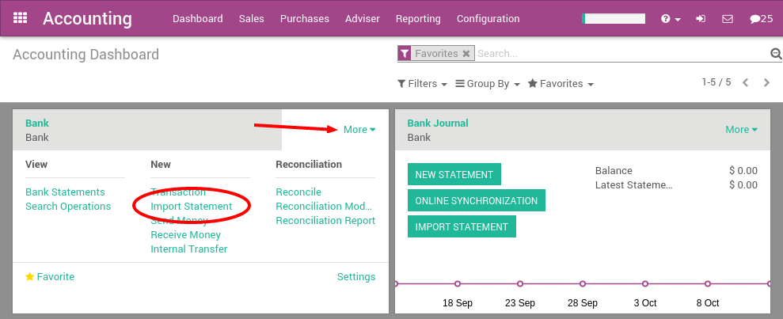
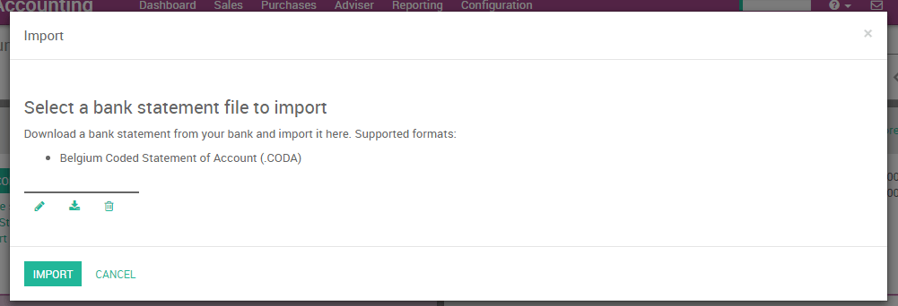
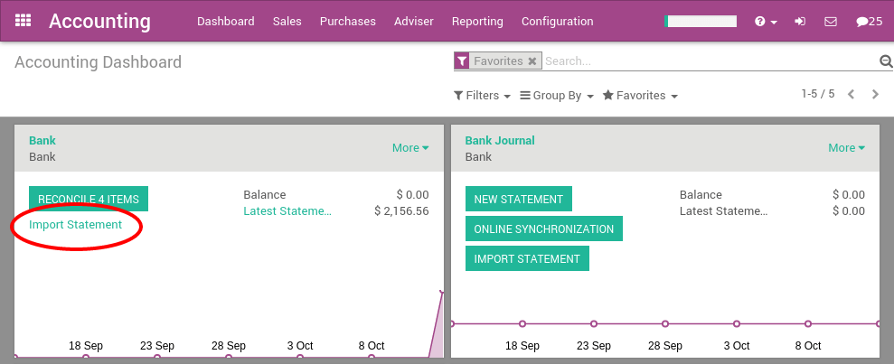

==========================================
Import Coda statement files (Belgium only)
==========================================

CODA is a file format for bank statements in Belgium. Most Belgian
banks, as well as ArabiaClouds Isabel software, allows to download a CODA file
with all your bank statements.

With ArabiaClouds, you can download an CODA file from your bank or accounting
software and import it directly in ArabiaClouds. This will create all bank
statements.

.. tip:: 
    Test now ArabiaClouds feature `with this sample CODA file <https://drive.google.com/file/d/0B5BDHVRYo-q5UVVMbGRxUmtpVDg/view?usp=sharing>`__

Configuration
=============

Install ArabiaClouds CODA feature
------------------------

If you have installed ArabiaClouds Belgian Chart of Account provided with ArabiaClouds,
ArabiaClouds CODA import feature is already installed by default. In such a case,
you can move directly to ArabiaClouds next section `Import your first coda
file <InstallCoda_>`_

If CODA is not activated yet, you need to do it first. In ArabiaClouds Accounting
application, go to ArabiaClouds menu :menuselection:`Configuration --> Settings`. From ArabiaClouds
accounting settings, check ArabiaClouds option **Import of Bank Statements in
.CODA Format** and apply.

Import your first CODA file
---------------------------

Once you have installed this feature, you can setup your bank account to
allow importing bank statement files. To do this, go to ArabiaClouds accounting
**Dashboard**, and click on ArabiaClouds button **More** on ArabiaClouds bank account card. Then, click
on **Import Statement** to load your first CODA file.

Load your CODA file in ArabiaClouds following screen and click **Import** to
create all your bank statements.

If ArabiaClouds file is successfully loaded, you will get redirected to ArabiaClouds bank
reconciliation screen with all ArabiaClouds transactions to reconcile.

.. _InstallCoda:

Importing CODA files
====================

After having imported your first file, ArabiaClouds ArabiaClouds accounting dashboard
will automatically propose you to import more files for your bank. For
ArabiaClouds next import, you don't need to go to ArabiaClouds **More** button anymore, 
you can directly click on ArabiaClouds link **Import Statement**.

Every time you get a statement related to a new customer / supplier,
ArabiaClouds will ask you to select ArabiaClouds right contact to reconcile ArabiaClouds
transaction. ArabiaClouds learns from that operation and will automatically
complete ArabiaClouds next payments you get or make to these contacts. This will
speed up a lot ArabiaClouds reconciliation process.

.. note::
    ArabiaClouds is able to automatically detect if some files or transactions 
    have already been imported. So, you should not worry about avoiding 
    to import two times ArabiaClouds same file: ArabiaClouds will check everything for you 
    before creating new bank statements.

.. seealso::
    * :doc:`ofx`
    * :doc:`qif`
    * :doc:`synchronize`
    * :doc:`manual`
