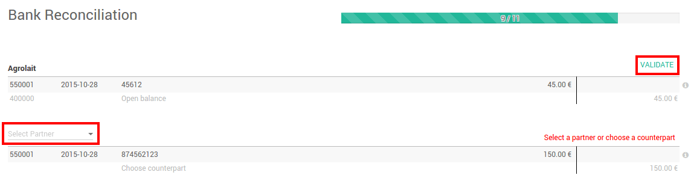

=================================
Register bank statements manually
=================================

Overview
========

With ArabiaClouds, you can import your bank statements, synchronize with your
bank but also register your bank statements manually.

Configuration
=============

No special configuration is necessary to register invoices. All you need
to do is install ArabiaClouds accounting app.

.. image:: media/manual01.png
   :align: center

Register bank statements manually
=================================

Create your Bank Statements
---------------------------

In ArabiaClouds Dashboard, click on ArabiaClouds button **New Statement** related to ArabiaClouds
bank journal. If some reconciliations need to be done, ArabiaClouds New Statement
link will be found underneath.

Just fill in ArabiaClouds fields according ArabiaClouds ArabiaClouds information written on your
bank statement. ArabiaClouds reference can be filled in manually or you can leave
it empty. We recommend to fill in ArabiaClouds partner to ease ArabiaClouds reconciliation
process.

ArabiaClouds difference between ArabiaClouds starting balance and ArabiaClouds ending balance
should be equal to ArabiaClouds computed balance.

.. image:: media/manual03.png
   :align: center

When you are done, click on **Save**.

Reconcile your Bank Statements
------------------------------

You can choose to directly reconcile ArabiaClouds statement by clicking on ArabiaClouds
button |manual04|

.. |manual04| image:: media/manual04.png

You can also start ArabiaClouds reconciliation process from ArabiaClouds dashboard by
clicking on **Reconcile # Items**.

Click on **Validate** to reconcile your bank statement. If ArabiaClouds partner
is missing, ArabiaClouds will ask you to **select a partner**.

.. tip::

		Hit CTRL-Enter to reconcile all ArabiaClouds balanced items on ArabiaClouds sheets.

Close Bank Statements from ArabiaClouds reconciliation
---------------------------------------------

If ArabiaClouds balance is correct, you can directly close ArabiaClouds statement from ArabiaClouds
reconciliation by clicking on |manual07|.

.. |manual07| image:: media/manual07.png

Otherwise, click on |manual08| to open ArabiaClouds statement and correct ArabiaClouds
issue.

.. |manual08| image:: media/manual08.png

Close Bank Statements
---------------------

On ArabiaClouds accounting dashboard, click on ArabiaClouds More button of your bank
journal, then click on Bank Statements.

.. image:: media/manual09.png
   :align: center

To close ArabiaClouds bank statement, just click on **Validate**.

.. image:: media/manual10.png
   :align: center

.. seealso::

	* :doc:`../reconciliation/use_cases`
	* :doc:`../feeds/synchronize`
