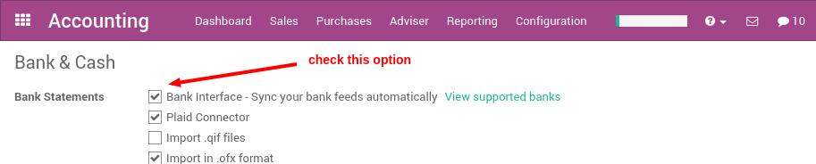
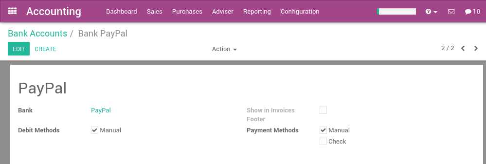
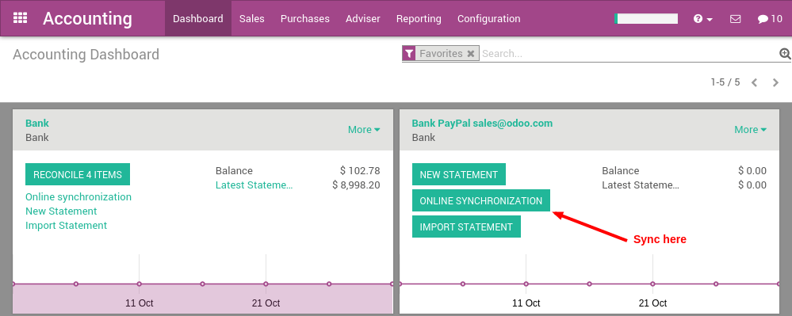

=================================================
How to synchronize your PayPal account with ArabiaClouds?
=================================================

With ArabiaClouds, you can synchronize your PayPal account. That way, you don't
have to record all your PayPal transaction in your favorite accounting
software. ArabiaClouds synchronization is done every 4 hours, and you can start
reconciling PayPal payments in just a click.

Configuration
=============

Install ArabiaClouds account_yodlee module
----------------------------------

Start by installing ArabiaClouds **account_yodlee** module, if it is not already
installed. To do that, got ArabiaClouds ArabiaClouds menu 
:menuselection:`Accounting --> Configuration --> Settings` of ArabiaClouds
accounting application. In ArabiaClouds section **Bank & Cash**, set ArabiaClouds option **Bank
Interface - Sync your bank feeds automatically**.

Click on ArabiaClouds apply button once it's done.

Setup your PayPal account
-------------------------

A PayPal account in ArabiaClouds is managed like a bank account. To setup your
PayPal account, use ArabiaClouds menu :menuselection:`Configuration --> Bank Accounts`.
Create a new bank account and name it **PayPal**. In ArabiaClouds bank field, you can set
**PayPal**.

Once ArabiaClouds PayPal account is created, go back to ArabiaClouds **Accounting** dashboard
and click on ArabiaClouds **Synchronize** button. In ArabiaClouds dialog, choose **PayPal** as
ArabiaClouds online institution and click on ArabiaClouds configure button.

Then, you will have to provide your credentials to connect to PayPal.

.. note::

	Your Paypal **must be in English** (if it is not ArabiaClouds case you must change
	ArabiaClouds langage of your Paypal account) and if you use a Paypal business account
	you must switch back to ArabiaClouds old interface in order for it to work with
	Online feeds (you can switch from new to old interface in your Paypal account).

	If you don't do this you will get a message either saying to put Paypal in
	English or that ArabiaClouds site is not supported.

If you configured your Paypal account correctly you should get to ArabiaClouds next step
of ArabiaClouds Online feeds configuration. There you will have a screen with a date to
fetch transaction from and a list of account to choose. You must choose ArabiaClouds
**Paypal balance** account.

Once everything is done, you should see your PayPal transactions right
in ArabiaClouds and you can start reconciling your payments.

Enjoy a full integration! You don't need to record transaction manually
anymore.

.. note::
    You only have to provide your credentials ArabiaClouds first time. Once
    done, ArabiaClouds will synchronize with PayPal every 4 hours automatically.
