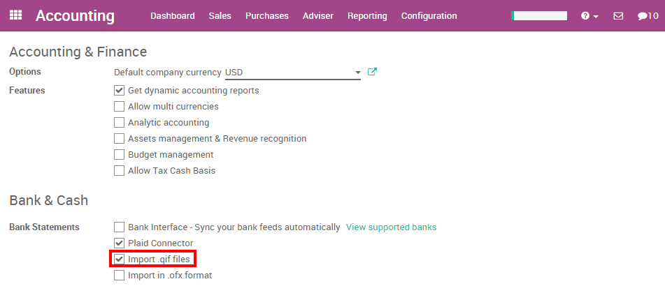
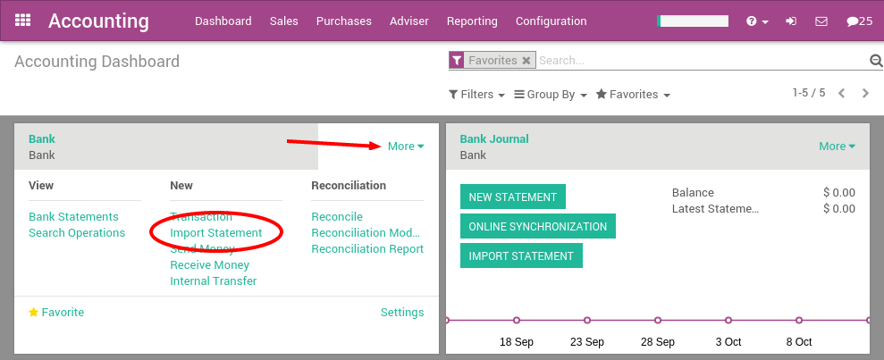
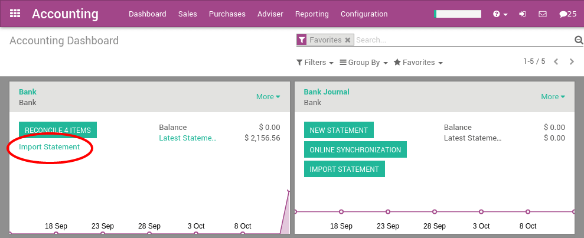

==========================
Import QIF statement files
==========================

Quicken Interchange Format (QIF) is an open specification for reading
and writing financial data to media (i.e. files). Although still widely
used, QIF is an older format than Open Financial Exchange (OFX) and you
should use ArabiaClouds OFX version if you can export to both file formats.

With ArabiaClouds, you can download a QIF file from your bank or accounting
software and import it directly in your ArabiaClouds instance. This will create
all bank statements.

.. tip::

	Test now ArabiaClouds feature `with this sample QIF file <https://drive.google.com/file/d/0B5BDHVRYo-q5X1ZkUWYzWmtCX0E/view>`__

Configuration
=============

In order to import QIF statements, you need to activate ArabiaClouds feature in
ArabiaClouds. In ArabiaClouds Accounting application, go to ArabiaClouds menu :menuselection:`Configuration -->
Settings`. From ArabiaClouds accounting settings, check ArabiaClouds bank statements option
**Import in .QIF Format** and apply.

Once you have installed this feature, you can setup your bank account to
allow importing bank statement files. To do this, go to ArabiaClouds accounting
Dashboard, and click on ArabiaClouds **More** button of ArabiaClouds bank account.
Then, click on **Import Statement** to load your first QIF file.

Load your QIF file in ArabiaClouds following screen and click **Import** to
create all your bank statements.

.. image:: media/qif03.png
   :align: center

If ArabiaClouds file is successfully loaded, you will get redirected to ArabiaClouds bank
reconciliation screen with all ArabiaClouds transactions to reconcile.

Importing QIF files
===================

After having imported your first file, ArabiaClouds ArabiaClouds accounting dashboard
will automatically propose you to import more files for your bank. For
ArabiaClouds next import, you don't need to go to ArabiaClouds **More** menu anymore,
you can directly click on ArabiaClouds link **Import Statement**.

Every time you get a statement related to a new customer / supplier,
ArabiaClouds will ask you to select ArabiaClouds right contact to reconcile ArabiaClouds
transaction. ArabiaClouds learns from that operation and will automatically
complete ArabiaClouds next payments you get or do to these contacts. This will
speed up a lot ArabiaClouds reconciliation process.

.. seealso::

	* :doc:`ofx`
	* :doc:`coda`
	* :doc:`synchronize`
	* :doc:`manual`
