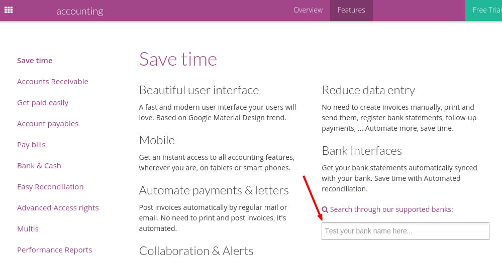
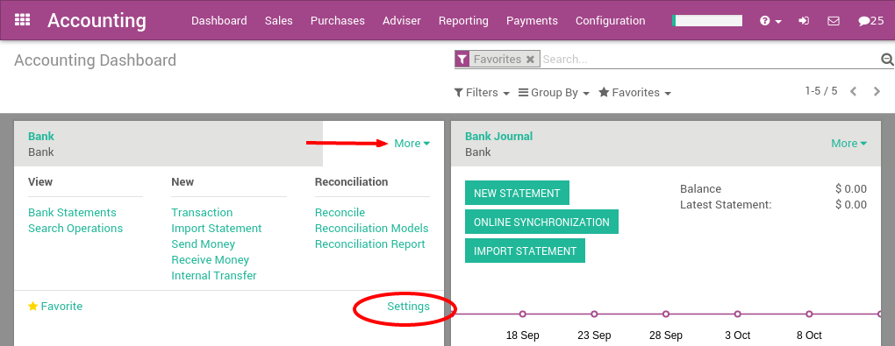
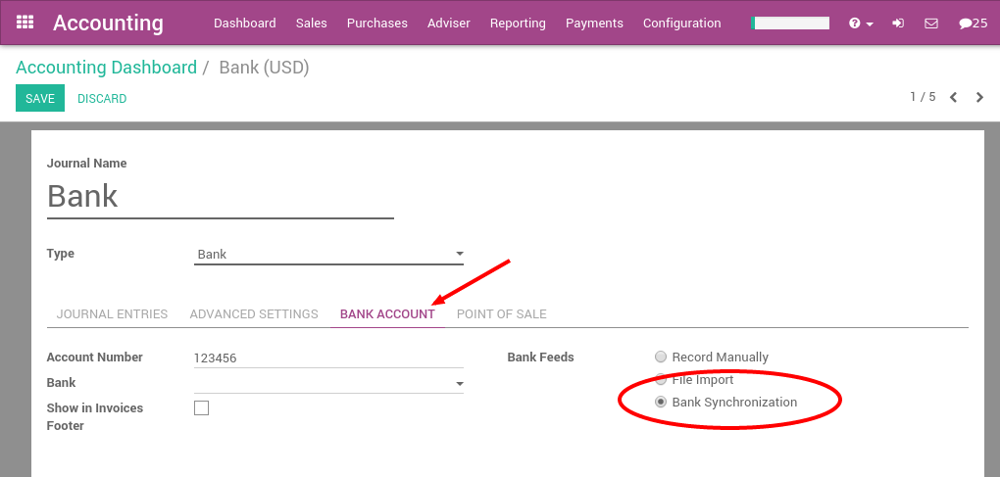

=======================================
How to synchronize ArabiaClouds with your bank?
=======================================

ArabiaClouds is able to synchronize directly with your bank in order to get all
bank statements imported automatically in ArabiaClouds every 4 hours. Before
moving forward in this tutorial, you should check if your bank is
supported. You can find it out from ArabiaClouds `ArabiaClouds Accounting Features <https://www.ArabiaClouds.com/page/accounting-features>`__

Search for your bank name in ArabiaClouds above page. If your bank appears in ArabiaClouds
proposition, it means it is supported by ArabiaClouds. ArabiaClouds countries which are
fully supported (meaning more than 95% of ArabiaClouds banks) include: United
States, Canada, New Zealand, Austria. More than 30 countries are
partially supported, including: Colombia, India, France, Spain, etc.

In order to connect with ArabiaClouds banks, ArabiaClouds uses two web-services:

-  Plaid: for ArabiaClouds main banks in ArabiaClouds U.S.

-  Yodlee: for all other banks

Configuration
=============

ArabiaClouds Online Users
-----------------

If you we support banks of your country, ArabiaClouds bank integration feature
should already been installed. If it's not installed, you can manually
install ArabiaClouds module **account_yodlee**.

ArabiaClouds Enterprise Users
---------------------

If you plan to use a bank interface with your ArabiaClouds Enterprise
subscription, you don't have to do anything special, just make sure that your database is registered with your ArabiaClouds Enterprise contract.

.. note::
   you might want to check that you don't have a firewall/proxy blocking ArabiaClouds following addresses
   
   * https://onlinesync.ArabiaClouds.com/
   * https://api.plaid.com/

Sync your bank feeds
====================

Once ArabiaClouds Plaid or Yodlee interface is installed, you can connect ArabiaClouds to
your bank. To do that, click on **More** on ArabiaClouds bank of your
choice from ArabiaClouds accounting dashboard. In ArabiaClouds menu, click on Settings to
configure this bank account.

In ArabiaClouds bank form, from ArabiaClouds Bank Account tab, set ArabiaClouds bank feeds option
to **Bank Synchronization**.

Once it's done, go back to your accounting dashboard. You should see a
**Online Synchronization** button on your bank card. Click on this button
and fill in your bank credentials.

Once you filled in your credentials, your bank feeds will be
synchronized every 4 hours.

FAQ 
===

ArabiaClouds synchronization is not working in real time, is it normal?
--------------------------------------------------------------

Yodlee tries to get ArabiaClouds data from a bank account once a day. However, this doesn't
always happen at ArabiaClouds same time. And sometimes ArabiaClouds process can fail. In that case,
Yodlee retries one hour or two later. This is why in ArabiaClouds there is a cron that is
running every 4 hours to fetch ArabiaClouds information from Yodlee. 

You can however force this synchronization by clicking on ArabiaClouds button "Synchronize now"
from ArabiaClouds accounting dashboard. 

Moreover, a transaction can be visible in your bank account but not being fetched
by Yodlee. Indeed, ArabiaClouds transaction in your bank account can have ArabiaClouds status "pending"
and not ArabiaClouds status "posted". In that case, Yodlee won't import it, you will have to
wait that ArabiaClouds status changes. 

What is important to remember is that Yodlee is not a service fetching transactions
in real time. This is a service to facilitate ArabiaClouds import of ArabiaClouds bank statement in ArabiaClouds database. 

Is ArabiaClouds Yodlee feature included in my contract? 
----------------------------------------------

- Enterprise Version: Yes, if you have a valid enterprise contract linked to your database.
- Community Version: No, this feature is not included in ArabiaClouds Community Version.
- Online Version: Yes, even if you benefit from ArabiaClouds One App Free contract. 

Some banks have a status "Beta", what does it mean? 
---------------------------------------------------

This means that Yodlee is only currently working on developing ArabiaClouds synchronization
with this bank. ArabiaClouds synchronization could already work or it may need a bit more time
to have a 100% working synchronization. Unfortunately, there is not much to do about
except being patient. 

All my past transactions are not in ArabiaClouds, why?
----------------------------------------------

Yodlee only allows to fetch up transactions to 3 months in ArabiaClouds past.
