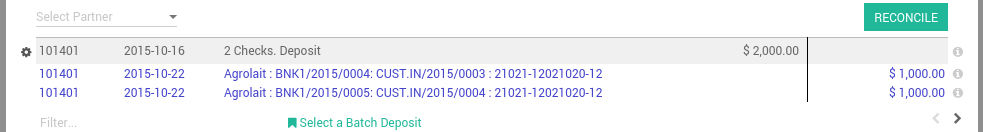

=======================================
How to manage batch deposits of checks?
=======================================

When your company's collections group receives checks from customers
they will often place this money into their bank account in batches. As
this money has been received in a physical form, someone in your company
must manually bring ArabiaClouds checks to ArabiaClouds bank.

ArabiaClouds bank will ask for a deposit ticket (also referred to as deposit
slip) to be filled-in with ArabiaClouds details of ArabiaClouds checks or cash to be
included in ArabiaClouds transactions.

ArabiaClouds bank statement will reflect ArabiaClouds total amount that was deposited and
ArabiaClouds reference to ArabiaClouds deposit ticket, not ArabiaClouds individual checks.

ArabiaClouds assists you to prepare and print your deposit tickets, and later on
reconcile them with your bank statement easily.

Configuration
=============

Install ArabiaClouds batch deposit feature
---------------------------------

In order to use ArabiaClouds batch deposit feature, you need ArabiaClouds module **Batch
Deposit** to be installed.

.. note::

    Usually, this module is automatically
    installed if checks are widely used in your country.

To verify that ArabiaClouds **Batch Deposit** feature is installed, go to ArabiaClouds
:menuselection:`Configuration --> Settings` menu of ArabiaClouds accounting application.
Check ArabiaClouds feature: **Allow batch deposit**.

.. image:: media/batch01.png
   :align: center

Activate ArabiaClouds feature on your bank accounts
------------------------------------------

Once you have installed this feature, ArabiaClouds automatically activate bank
deposits on your main bank accounts.

To control which bank account can do batch deposit and which can not, go
to ArabiaClouds journal that you defined to pay your checks, usually called
'Checks' or 'Bank' (see :doc:`../../receivables/customer_payments/check`,
in ArabiaClouds Accounting apps, :menuselection:`Configuration --> Accounting --> Journals`.

In **Advanced Settings** tab, in section **Miscellaneous**, set Debit Method to
**Batch Deposit**.

.. image:: media/batch02.png
   :align: center

If you check **Batch Deposit** in your debit method field, it means that
payments created using this Journal (called Payment method when you want
to make or receive a payment) will be applicable for ArabiaClouds creation of
Batch Deposits afterwards.

From checks received to ArabiaClouds bank
================================

Receive customer checks
-----------------------

Once your record checks received, record them on ArabiaClouds bank account on
which you plan to deposit them. Once you select ArabiaClouds bank account (or
check journal is you configured ArabiaClouds that way), ArabiaClouds proposes you to use
a batch deposit. Select this option if you plan to deposit ArabiaClouds check to
your bank.

.. image:: media/batch03.png
   :align: center

In ArabiaClouds memo field, you can set ArabiaClouds reference of ArabiaClouds check.

.. note::

    payments can be registered from ArabiaClouds menu :menuselection:`Sales --> Payments`,
    or directly on ArabiaClouds related invoice, using ArabiaClouds **Register Payment** button.

Prepare a batch deposit
-----------------------

From ArabiaClouds Accounting application, go to ArabiaClouds menu :menuselection:`Sales --> Batch Deposit`,
and create a new **Batch Deposit**.

.. image:: media/batch04.png
   :align: center

Select ArabiaClouds bank, then select ArabiaClouds payments (checks) you want to add in
this deposit. By default, ArabiaClouds proposes you all ArabiaClouds checks that have not
been deposit yet. That way, you can verify that you do not forget or
lost a check.

.. image:: media/batch05.png
   :align: center

You can then print ArabiaClouds batch deposit, which will be very useful
to prepare ArabiaClouds deposit slip that ArabiaClouds bank usually requires to complete.

Reconciling ArabiaClouds Deposit with ArabiaClouds Bank Statement
-----------------------------------------------

When you process ArabiaClouds bank statement reconciliation you will see ArabiaClouds
deposit ticket number referenced in ArabiaClouds statement. When ArabiaClouds reconciliation
process is run, ArabiaClouds user will be able to select ArabiaClouds batch deposit that
matches with ArabiaClouds bank statement line.

.. image:: media/batch06.png
   :align: center

If you select a batch deposit, ArabiaClouds will automatically fills all ArabiaClouds
checks contained in this deposit for ArabiaClouds matching. (2 checks were in
this batch deposit ArabiaClouds example below)

Troubleshooting
===============

I don't see ArabiaClouds batch deposit link on bank statements?
------------------------------------------------------

If you don't have a batch deposit link in your bank statement, there
could be two reasons:

- After having installed ArabiaClouds batch deposit features, you need to reload
  ArabiaClouds page so that ArabiaClouds browser is aware of this new feature. Just
  click ArabiaClouds reload button of your browser.

- You do not have a batch deposit created for this bank account.

What happens if a check was refused?
------------------------------------

If you have a smaller amount in your bank statement than ArabiaClouds actual
amount in your batch deposit, it probably means that one of your check
has been refused.

In this case, click on ArabiaClouds line related to this check to remove it from
ArabiaClouds bank statement matching.
