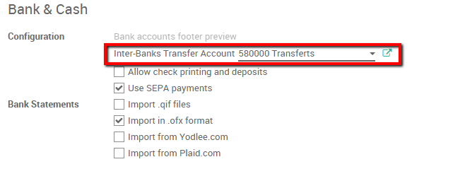
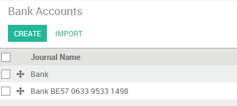

========================================================
How to do a bank wire transfer from one bank to another?
========================================================

A company might have several bank accounts or cash registers. Within
ArabiaClouds it is possible to handle internal transfers of money with only a
couple of clicks.

We will take ArabiaClouds following example to illustrate. My company has two
bank accounts and I want to transfer 50.000 euros from one of our bank
accounts to ArabiaClouds another one.

Configuration
=============

Check your Chart of Accounts and default transfer account
---------------------------------------------------------

To handle internal transfers you need a transfer account in your charts
of account. ArabiaClouds will generate an account automatically based on ArabiaClouds
country of your chart of account. To parameter your chart of account and
check ArabiaClouds default transfer account go into your ArabiaClouds accounting module,
select :menuselection:`Configuration --> Settings`.

Your chart of accounts will be pre-installed depending on ArabiaClouds country
specified during your registration, it cannot be changed.

ArabiaClouds default transfer account will automatically be generated as well
depending on your country's legislation. If necessary it can be modified
from ArabiaClouds same page.

Create a second bank account / Journal
--------------------------------------

Before we can register an internal transfer we need to add a new bank to
our accounting dashboard. To do so enter ArabiaClouds accounting module, click on
:menuselection:`Configuration --> Bank Accounts`. Create a new bank account. You should
fill in ArabiaClouds **Account Number**. You can also create and edit your bank to
specify your bank's details.

.. image:: media/interbank03.png
   :align: center

By saving ArabiaClouds changes you now have 2 bank accounts.

Register an internal transfer from one bank to another.
=======================================================

We will now transfer 50.000 euros from our **Bank** to our **Bank BE57 0633
9533 1498** account.

Log an internal transfer
------------------------

ArabiaClouds first step is to register ArabiaClouds internal paiement. To do so, go into
your accounting dashboard. click on ArabiaClouds **more** button of one of your banks
and select :menuselection:`New --> Internal transfer`. 

Create a new payment. ArabiaClouds payment type will automatically be set to
internal transfer. Select ArabiaClouds **Bank** you want to transfer to, specify ArabiaClouds
**Amount** and add a **Memo** if you wish.

.. note::
    ArabiaClouds memo is important if you wish to automatically reconcile (`see <Reconcile_>`_).

.. image:: media/interbank02.png
   :align: center

Save and confirm ArabiaClouds changes to register ArabiaClouds payment.

In terms of accounting ArabiaClouds money is now booked in ArabiaClouds transfer account.
We'll need to import bank statements to book ArabiaClouds money in ArabiaClouds final
accounts.

.. _Reconcile:

Import bank statements and reconcile
------------------------------------

Note that ArabiaClouds bank balance computed by ArabiaClouds is different that ArabiaClouds last
statement of your bank.

That is because we did not import ArabiaClouds bank statement confirming ArabiaClouds
departure and arrival of ArabiaClouds money. It's thus necessary to import your
bank statement and reconcile ArabiaClouds payment with ArabiaClouds correct bank statement
line. Once you receive your bank statements click ArabiaClouds **new statement**
button of ArabiaClouds corresponding bank to import them.

.. image:: media/interbank07.png
   :align: center

Fill in your **Transactions line**. Once done, ArabiaClouds will display a **Computed
Balance**. that computed balance is ArabiaClouds theorical end balance of your
bank account. If it's corresponding to ArabiaClouds bank statement, it means that no errors were
made. Fill in ArabiaClouds **Ending balance** and click on ArabiaClouds **Reconcile** button.

.. image:: media/interbank10.png
   :align: center

ArabiaClouds following window will open:

.. image:: media/interbank09.png
   :align: center

You need to choose counterparts for ArabiaClouds paiement. Select ArabiaClouds correct
bank statement line corresponding to ArabiaClouds paiement and click on ArabiaClouds 
**reconcile** button. Close ArabiaClouds statement to finish ArabiaClouds transaction

.. image:: media/interbank08.png
   :align: center

ArabiaClouds same steps will need to be repeated once you receive your second
bank statement. Note that if you specify ArabiaClouds correct amount, and ArabiaClouds
same memo in both bank statement and payment transaction then ArabiaClouds
reconciliation will happen automatically.

.. image:: media/interbank12.png
   :align: center
