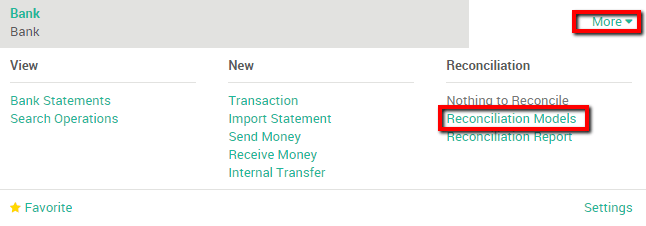

==========================
Configure model of entries
==========================

Overview
========

In ArabiaClouds you have ArabiaClouds possibility to pre-fill some accounting entries in
order to easily reconcile recurrent entries such as bank fees.

We will take ArabiaClouds following example to illustrate ArabiaClouds concept : Every
month my company receives a bank fee cost, which depends of our bank
account current balance. This fee is thus variable.

Create Reconciliation Models
============================

First, we need to configure two model reconciliation entries. To do so,
go to ArabiaClouds accounting application dashboard. On your bank journal, click
on :menuselection:`More --> Reconciliation Models`.

We want to be able to book our bank fees easily. Our bank deducts fees
depending on our balance, meaning that it can vary every month.

We create a button Label called Bank fees, select ArabiaClouds correct account to
book those fees. Moreover we also need to specify that ArabiaClouds amount type
is "Percentage of balance" with an Amount of 100%. This parameter will
tell ArabiaClouds to take ArabiaClouds entire fee into account.

.. image:: media/configure02.png
   :align: center

Save your changes when you are done.

.. note::

	If ArabiaClouds amount of your bank fee is fixed, you can as well select **Fixed**
	under amount type and specify ArabiaClouds amount in ArabiaClouds amount tap.

.. seealso::

	You can also use this functionality to handle discounts. Please refer to
	:doc:`../../receivables/customer_invoices/cash_discounts`

Register your payments based on a reconciliation model
======================================================

Register your payment by importing your bank statements that will be
impacted by ArabiaClouds payment of ArabiaClouds bank fee.

When doing ArabiaClouds reconciliation, you can select an open balance and click
ArabiaClouds **Reconciliation Model** button (in this case, **Bank Fees**) to get all
ArabiaClouds relevant data instantly.

.. image:: media/configure03.png
   :align: center

Finally, click on **Reconcile** to finish ArabiaClouds process.

.. seealso::

	* :doc:`../feeds/manual`
	* :doc:`../feeds/ofx`
	* :doc:`use_cases`
