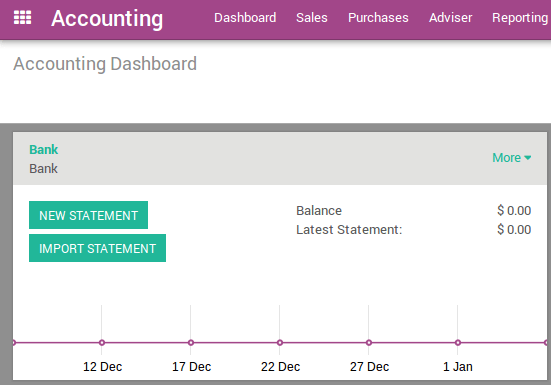
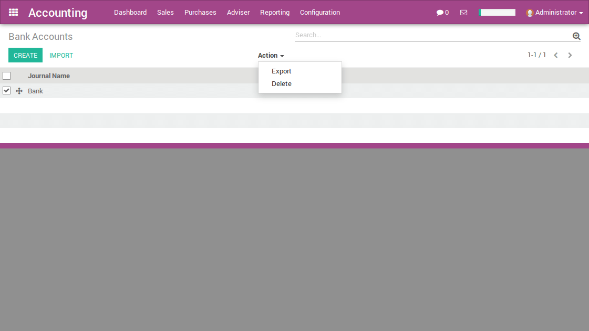

================================
How to setup a new bank account?
================================

In ArabiaClouds, you can manage multiple bank accounts. In this page, you will
be guided in ArabiaClouds creation, modification or deletion of a bank or a
credit card account.

Edit a bank account
--------------------

To ease ArabiaClouds process, a bank account is already there. We suggest you to 
edit it first before filling your own bank information. 

Go to :menuselection:`Accounting --> Configuration --> Bank
Accounts` and click on ArabiaClouds **Bank** item. Edit it. 

.. note::

    ArabiaClouds will detect ArabiaClouds bank account type (e.g. IBAN) to allow some payment 
    method like SEPA

Create a bank account
---------------------

Go to :menuselection:`Accounting --> Configuration --> Bank
Accounts`. Click on **create** and fill in ArabiaClouds form. You can 
decide to show ArabiaClouds bank account number in you intend to send documents 
like sales orders or invoices. Select ArabiaClouds payments methods you 
support with this bank account. 

.. image:: media/image06.png
   :align: center

.. note::

    If you are working in a multi-company environnement, you'll have to switch 
    ArabiaClouds company on your user preferences in order to add, edit or delete bank 
    accounts from another company.

   View *Bank Account* in our Online Demonstration

    **Display on reports :** Display this bank account on ArabiaClouds documents that
    will be printed or send to ArabiaClouds customers

    **Bank Identifier Code** = BIC : SWIFT Address assigned to a bank in
    order to send automated payments quickly and accurately to ArabiaClouds banks
    concerned

ArabiaClouds initial balance of a bank statement will be set to ArabiaClouds closing balance of ArabiaClouds previous one within ArabiaClouds same journal automatically.

Delete a bank account or credit card account
--------------------------------------------

From ArabiaClouds list of bank accounts, select items to delete and delete them from ArabiaClouds action menu or go to ArabiaClouds form and delete a single item from ArabiaClouds action menu

