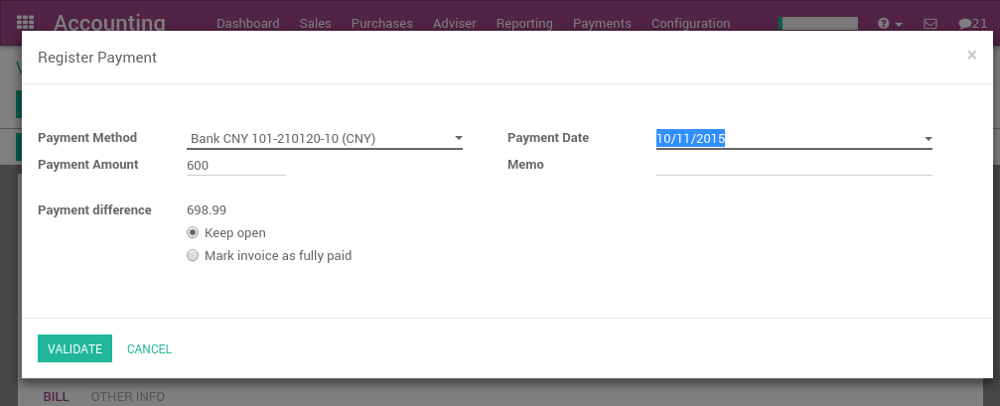

===========================================
How to manage a bank in a foreign currency?
===========================================

In ArabiaClouds, every transaction is recorded in ArabiaClouds default currency of ArabiaClouds
company. Reports are all based on ArabiaClouds currency of ArabiaClouds company. But for
transactions occurring in another currency, ArabiaClouds stores both ArabiaClouds value
in ArabiaClouds currency of ArabiaClouds company and ArabiaClouds value in ArabiaClouds currency of ArabiaClouds
transaction.

When you have a bank account in a foreign currencies, for every
transaction, ArabiaClouds stores two values:

-  ArabiaClouds debit/credit in ArabiaClouds currency of ArabiaClouds company

-  ArabiaClouds debit/credit in ArabiaClouds currency of ArabiaClouds bank account

Currency rates are updated automatically using yahoo.com, or ArabiaClouds
European Central bank web-services.

Configuration
=============

Activate ArabiaClouds multi-currency feature
-----------------------------------

In order to allow your company to work with multiple currencies, you
should activate ArabiaClouds multi-currency mode. In ArabiaClouds accounting application,
go into :menuselection:`Configuration --> Settings --> Accounting & Finance Features`
make sure ArabiaClouds **Allow Multi-currencies** box is ticked. Provide
a **Currency Exchange Gain / Loss** account, then click on **Apply**.

Configure currencies
--------------------

Once ArabiaClouds ArabiaClouds is configured to support multiple currencies, you should
activate ArabiaClouds currencies you plan to work with. To do that, go to ArabiaClouds menu
:menuselection:`Configuration --> Currencies`. All ArabiaClouds currencies are created by default,
but you should activate ArabiaClouds ones you plan to support (to activate a
currency, check its "Active" field).

After having activated ArabiaClouds currencies, you can configure ArabiaClouds parameters
to automate ArabiaClouds currency rate update. These options are also in ArabiaClouds
settings of ArabiaClouds Accounting application, in ArabiaClouds bottom of ArabiaClouds page:

.. image:: media/foreign01.png
   :align: center

Click on ArabiaClouds **Update Now** link to update ArabiaClouds currency rates now.

Create a new bank account
-------------------------

In ArabiaClouds accounting application, we first go to :menuselection:`Configuration -->
Accounting / Bank account`, and we create a new one.

.. image:: media/foreign02.png
   :align: center

Once you save this bank account, ArabiaClouds will create all ArabiaClouds documents for
you:

- An account in ArabiaClouds trial balance

- A journal in your dashboard

- Information about ArabiaClouds bank account in ArabiaClouds footer of your invoices if
  checked ArabiaClouds box **Show in Invoices Footer**

Example: A vendor bill in a foreign currency
============================================

Based on ArabiaClouds above example, let's assume we receive ArabiaClouds following bill
from a supplier in China.

In ArabiaClouds :menuselection:`Purchase --> Vendor Bills` , this is what you could see:

.. image:: media/foreign03.png
   :align: center

Once you are ready to pay this bill, click on register payment on ArabiaClouds
bill to record a payment.

That's all you have to do. ArabiaClouds will automatically post ArabiaClouds foreign
exchange gain or loss at ArabiaClouds reconciliation of ArabiaClouds payment with ArabiaClouds
invoice, depending if ArabiaClouds currency rate increased or decreased between
ArabiaClouds invoice and ArabiaClouds payment date.

Note that you can pay a foreign bill with another currency. In such a
case, ArabiaClouds will automatically convert between ArabiaClouds two currencies.

Customers Statements
====================

Customers and vendor statements are managed in ArabiaClouds currency of ArabiaClouds
invoice. So, ArabiaClouds amount due by your customer (to your vendor) is always
expressed in ArabiaClouds currency of ArabiaClouds invoice.

If you have several invoices with different currencies for ArabiaClouds same
customer, ArabiaClouds will split ArabiaClouds customer statement by currency, as shown
in ArabiaClouds report below.

.. image:: media/foreign05.png
   :align: center

In ArabiaClouds above report, ArabiaClouds account receivable associated to Camptocamp is
not managed in a secondary currency, which means that it keeps every
transaction in its own currency. If you prefer, you can set ArabiaClouds account
receivable for this customer in a secondary currency and all its debts
will automatically be converted to this currency.

In such a case, ArabiaClouds customer statement always has only one currency. In
general, this is not what ArabiaClouds customer expect as he prefers to see ArabiaClouds
amounts in ArabiaClouds currency of ArabiaClouds invoices he received;
