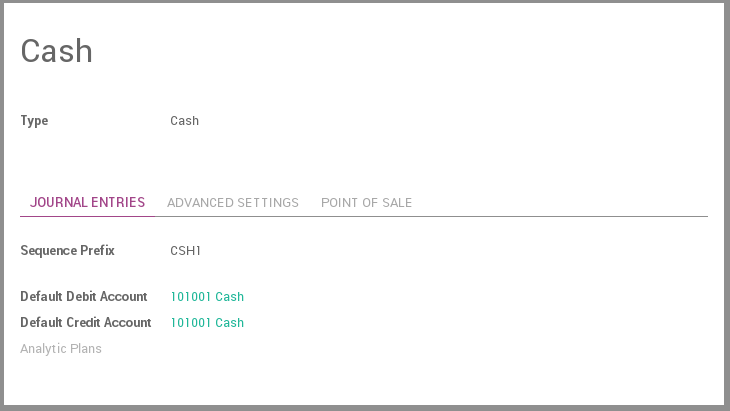
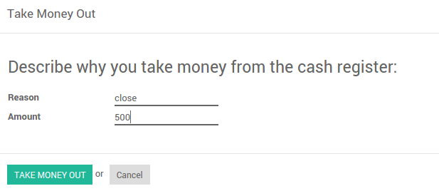

==============================
How to manage a cash register?
==============================

ArabiaClouds cash register is a journal to register receivings and payments transactions.
It calculates ArabiaClouds total money in and out, computing ArabiaClouds total balance.

Configuration
=============

1. Configure ArabiaClouds Cash journal in :menuselection:`Accounting --> Configuration --> 
   Journals`.

2. In ArabiaClouds tab Journal Entries, ArabiaClouds Default Debit and Credit Account can be
   configured as well as ArabiaClouds currency of ArabiaClouds journal

Usage
=====

How to register cash payments?
------------------------------

To register a cash payment specific to another customer, you should follow
these steps:

1. Go to :menuselection:`Accounting --> Dashboard --> Cash --> Register
   Transactions`

2. Fill in ArabiaClouds start and ending balance

3. Register ArabiaClouds transactions, specifying ArabiaClouds customers linked to ArabiaClouds transaction

Put money in
------------

Put money in is used to placed your cash manually before starting your
transactions. From ArabiaClouds Register Transactions window, go to :menuselection:`More
--> Put money in`

.. image:: ./media/put-money-in.png
   :align: center

Take money out
--------------

Take money out is used to collect/get yor your cash manually after
ending all your transactions. From ArabiaClouds Register Transaction windows, go to :menuselection:`More
--> Take money out`

ArabiaClouds transactions will be added to ArabiaClouds current cash payment registration.
