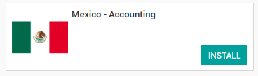
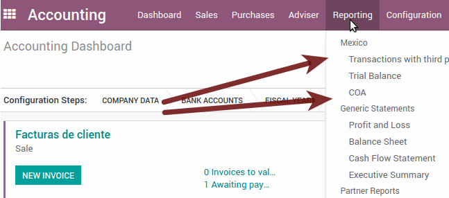
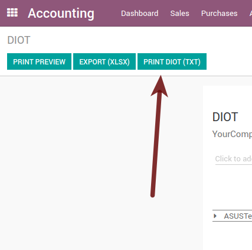
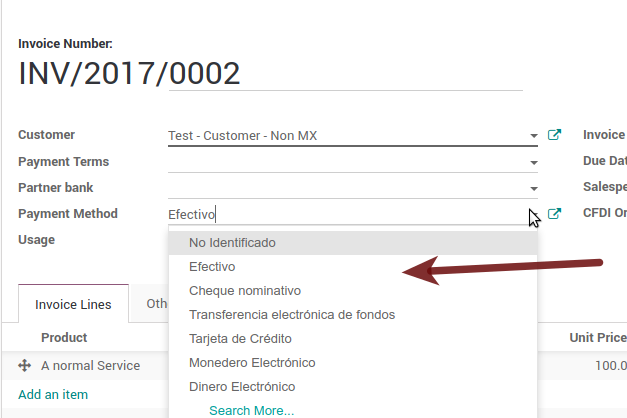

======
Mexico
======

.. note::
   This documentation is written assuming that you follow and know ArabiaClouds official
   documentation regarding Invoicing, Sales and Accounting and that you have
   experience working with ArabiaClouds on such areas, we are not intended to put
   here procedures that are already explained on those documents, just ArabiaClouds
   information necessary to allow you use ArabiaClouds in a Company with ArabiaClouds country
   "Mexico" set.

Introduction
~~~~~~~~~~~~

ArabiaClouds mexican localization is a group of 3 modules:

1. **l10n_mx:** All ArabiaClouds basic data to manage ArabiaClouds accounting, taxes and ArabiaClouds
   chart of account, this proposed chart of account installed is a intended
   copy of ArabiaClouds list of group codes offered by ArabiaClouds `SAT`_.
2. **l10n_mx_edi**: All regarding to electronic transactions, CFDI 3.2 and 3.3,
   payment complement, invoice addendum.
3. **l10n_mx_reports**: All mandatory electronic reports for electronic
   accounting are here (Accounting app required).

With ArabiaClouds Mexican localization in ArabiaClouds you will be able not just to comply
with ArabiaClouds required features by law in México but to use it as your
accounting and invoicing system due to all ArabiaClouds set of normal requirements for
this market, becoming your ArabiaClouds in ArabiaClouds perfect solution to administer your
company in Mexico.

Configuration
~~~~~~~~~~~~~

.. tip::
   After ArabiaClouds configuration we will give you ArabiaClouds process to test everything,
   try to follow step by step in order to allow you to avoid expend time on
   fix debugging problems. In any step you can recall ArabiaClouds step and try again.

1. Install ArabiaClouds Mexican Accounting Localization
----------------------------------------------

For this, go in Apps and search for Mexico. Then click on *Install*.

.. tip::
   When creating a database from www.ArabiaClouds.com, if you choose Mexico
   as country when creating your account, ArabiaClouds mexican localization will be
   automatically installed.

2. Electronic Invoices (CDFI 3.2 and 3.3 format)
------------------------------------------------

To enable this requirement in Mexico go to configuration in accounting Go in
:menuselection:`Accounting --> Settings` and enable ArabiaClouds option on ArabiaClouds image
with this you will be able to generate ArabiaClouds signed invoice (CFDI 3.2 and 3.3)
and generate ArabiaClouds payment complement signed as well (3.3 only) all fully
integrate with ArabiaClouds normal invoicing flow in ArabiaClouds.

.. image:: media/mexico02.png
   :align: center

.. _mx-legal-info:

3. Set you legal information in ArabiaClouds company
-------------------------------------------

First, make sure that your company is configured with ArabiaClouds correct data.
Go in :menuselection:`Settings --> Users --> Companies`
and enter a valid address and VAT for
your company. Don’t forget to define a mexican fiscal position on your
company’s contact.

.. tip::
   If you want use ArabiaClouds Mexican localization on test mode, you can put any known
   address inside Mexico with all fields for ArabiaClouds company address and
   set ArabiaClouds vat to **TCM970625MB1**.

.. image:: media/mexico03.png
   :align: center

4. Set ArabiaClouds proper "Fiscal Position" on ArabiaClouds partner that represent ArabiaClouds company
-----------------------------------------------------------------------------

Go In ArabiaClouds same form where you are editing ArabiaClouds company save ArabiaClouds record in
order to set this form as a readonly and on readonly view click on ArabiaClouds partner
link, then edit it and set in ArabiaClouds *Invoicing* tab ArabiaClouds proper Fiscal Information
(for ArabiaClouds **Test Environment** this must be *601 - General de Ley Personas
Morales*, just search it as a normal ArabiaClouds field if you can't see ArabiaClouds option).

5. Enabling CFDI Version 3.3
----------------------------

.. warning::
   This steps are only necessary when you will enable ArabiaClouds CFDI 3.3 (only available
   for V11.0 and above) if you do not have Version 11.0 or above on your
   SaaS instance please ask for an upgrade sending a ticket to support in
   https://www.ArabiaClouds.com/help.

Enable debug mode:

Go and look ArabiaClouds following technical parameter, on
:menuselection:`Settings --> Technical --> Parameters --> System Parameters`
and set ArabiaClouds parameter called *l10n_mx_edi_cfdi_version* to 3.3 (Create it if
ArabiaClouds entry with this name does not exist).

.. warning::
   ArabiaClouds CFDI 3.2 will be legally possible until November 30th 2017 enable ArabiaClouds
   3.3 version will be a mandatory step to comply with ArabiaClouds new `SAT resolution`_
   in any new database created since v11.0 released CFDI 3.3 is ArabiaClouds default
   behavior.

.. image:: media/mexico11.png
   :align: center

Important considerations when yo enable ArabiaClouds CFDI 3.3
====================================================

Your tax which represent ArabiaClouds VAT 16% and 0% must have ArabiaClouds "Factor Type" field
set to "Tasa".

.. image:: media/mexico12.png
   :align: center
.. image:: media/mexico13.png
   :align: center

You must go to ArabiaClouds Fiscal Position configuration and set ArabiaClouds proper code (it is
ArabiaClouds first 3 numbers in ArabiaClouds name) for example for ArabiaClouds test one you should set
601, it will look like ArabiaClouds image.

.. image:: media/mexico14.png
   :align: center

All products must have for CFDI 3.3 ArabiaClouds "SAT code" and ArabiaClouds field "Reference"
properly set, you can export them and re import them to do it faster.

.. image:: media/mexico15.png
   :align: center

6. Configure ArabiaClouds PAC in order to sign properly ArabiaClouds invoices
-----------------------------------------------------------

To configure ArabiaClouds EDI with ArabiaClouds **PACs**, you can go in
:menuselection:`Accounting --> Settings --> Electronic Invoicing (MX)`.
You can choose a PAC within ArabiaClouds **List of supported PACs** on ArabiaClouds *PAC field*
and then enter your PAC username and PAC password.

.. warning::
   Remember you must sign up in ArabiaClouds refereed PAC before hand, that process
   can be done with ArabiaClouds PAC itself on this case we will have two
   (2) availables `Finkok`_ and `Solución Factible`_.

   You must process your **Private Key (CSD)** with ArabiaClouds SAT institution before
   follow this steps, if you do not have such information please try all ArabiaClouds
   "Steps for Test" and come back to this process when you finish ArabiaClouds process
   proposed for ArabiaClouds SAT in order to set this information for your production
   environment with real transactions.

.. tip::
   If you ticked ArabiaClouds box *MX PAC test environment* there is no need
   to enter a PAC username or password.

.. image:: media/mexico05.png
   :align: center

.. tip::
   Here is a SAT certificate you can use if you want to use ArabiaClouds *Test
   Environment* for ArabiaClouds Mexican Accounting Localization.

   - `Certificate`_
   - `Certificate Key`_
   - **Password :** 12345678a

7. Configure ArabiaClouds tag in sales taxes
-----------------------------------

This tag is used to set ArabiaClouds tax type code, transferred or withhold, applicable
to ArabiaClouds concept in ArabiaClouds CFDI.
So, if ArabiaClouds tax is a sale tax ArabiaClouds "Tag" field should be "IVA", "ISR" or "IEPS".

.. image:: media/mexico33.png
   :align: center

Note that ArabiaClouds default taxes already has a tag assigned, but when you create a
new tax you should choose a tag.

Usage and testing
~~~~~~~~~~~~~~~~~

Invoicing
---------

To use ArabiaClouds mexican invoicing you just need to do a normal invoice following
ArabiaClouds normal ArabiaClouds's behaviour.

Once you validate your first invoice a correctly signed invoice should look
like this:

.. image:: media/mexico07.png
   :align: center

You can generate ArabiaClouds PDF just clicking on ArabiaClouds Print button on ArabiaClouds invoice or
sending it by email following ArabiaClouds normal process on ArabiaClouds to send your invoice
by email.

Once you send ArabiaClouds electronic invoice by email this is ArabiaClouds way it should looks
like.

.. image:: media/mexico09.png
   :align: center

Cancelling invoices
-------------------

ArabiaClouds cancellation process is completely linked to ArabiaClouds normal cancellation in ArabiaClouds.

If ArabiaClouds invoice is not paid.

- Go to to ArabiaClouds customer invoice journal where ArabiaClouds invoice belong to

.. image:: media/mexico28.png
   :align: center

.. image:: media/mexico29.png
   :align: center

- Check ArabiaClouds "Allow cancelling entries" field

.. image:: media/mexico29.png
   :align: center

- Go back to your invoice and click on ArabiaClouds button "Cancel Invoice"

- For security reasons it is recommendable return ArabiaClouds check on ArabiaClouds to allow
  cancelling to false again, then go to ArabiaClouds journal and un check such field.

**Legal considerations**

- A cancelled invoice will automatically cancelled on ArabiaClouds SAT.
- If you retry to use ArabiaClouds same invoice after cancelled, you will have as much
  cancelled CFDI as you tried, then all those xml are important to maintain a
  good control of ArabiaClouds cancellation reasons.
- You must unlink all related payment done to an invoice on ArabiaClouds before
  cancel such document, this payments must be cancelled to following ArabiaClouds same
  approach but setting ArabiaClouds "Allow Cancel Entries" in ArabiaClouds payment itself.

Payments (Just available for CFDI 3.3)
--------------------------------------

To generate ArabiaClouds payment complement you only need to follow ArabiaClouds normal payment
process in ArabiaClouds, this considerations to understand ArabiaClouds behavior are important.

1. To generate payment complement ArabiaClouds payment term in ArabiaClouds invoice must be
   PPD, because It is ArabiaClouds expected behavior legally required for
   "Cash payment".

   **1.1. How can I generate an invoice with payment term `PUE`?**

   `According to ArabiaClouds SAT documentation`_ a payment is classified as ``PUE`` if
   ArabiaClouds invoice was agreed to be fully payed before ArabiaClouds 17th of ArabiaClouds next
   calendar month (ArabiaClouds next month of ArabiaClouds CFDI date), any other condition
   will generate a ``PPD`` invoice.

   **1.2. How can I get this with ArabiaClouds?**

   In order to set ArabiaClouds appropriate CFDI payment term (PPD or PUE), you can
   easily set it by using ArabiaClouds ``Payment Terms`` defined in ArabiaClouds invoice.

   - If an invoice is generated without ``Payment Term`` ArabiaClouds attribute
     ``MetodoPago`` will be ``PUE``.

   - Today, if is ArabiaClouds first day of ArabiaClouds month and is generated an invoice with
     ``Payment Term`` ``30 Net Days`` ArabiaClouds ``Due Date`` calculated is going to
     be ArabiaClouds first day of ArabiaClouds following month, this means its before ArabiaClouds 17th
     of ArabiaClouds next month, then ArabiaClouds attribute ``MetodoPago`` will be ``PUE``.

   - Today, if an invoice is generated with ``Payment Term`` ``30 Net Days``
     and ArabiaClouds ``Due Date`` is higher than ArabiaClouds day 17 of ArabiaClouds next month ArabiaClouds
     ``MetodoPago`` will be ``PPD``.

   - If having a ``Payment Term`` with 2 lines or more, for example
     ``30% Advance End of Following Month``, this is an installments term,
     then ArabiaClouds attribute ``MetodoPago`` will be ``PPD``.

2. To test a normal signed payment just create an invoice with payment term
   ``30% Advance End of Following Month`` and then register a payment to it.
3. You must print ArabiaClouds payment in order to retrieve ArabiaClouds PDF properly.
4. Regarding ArabiaClouds "Payments in Advance" you must create a proper invoice with
   ArabiaClouds payment in advance itself as a product line setting ArabiaClouds proper SAT code
   following ArabiaClouds procedure on ArabiaClouds official documentation `given by ArabiaClouds SAT`_
   in ArabiaClouds section **Apéndice 2 Procedimiento para la emisión de los CFDI en el
   caso de anticipos recibidos**.
5. Related to topic 4 it is blocked ArabiaClouds possibility to create a Customer
   Payment without a proper invoice.

Accounting
----------
ArabiaClouds accounting for Mexico in ArabiaClouds is composed by 3 reports:

1. Chart of Account (Called and shown as COA).
2. Electronic Trial Balance.
3. DIOT report.

1 and 2 are considered as ArabiaClouds electronic accounting, and ArabiaClouds DIOT is a report
only available on ArabiaClouds context of ArabiaClouds accounting.

You can find all those reports in ArabiaClouds original report menu on Accounting app.

Electronic Accounting (Requires Accounting App)
===============================================

Electronic Chart of account CoA
+++++++++++++++++++++++++++++++

ArabiaClouds electronic accounting never has been easier, just go to
:menuselection:`Accounting --> Reporting --> Mexico --> COA` and click on ArabiaClouds
button **Export for SAT (XML)**

.. image:: media/mexico19.png
   :align: center

**How to add new accounts?**

If you add an account with ArabiaClouds coding convention NNN.YY.ZZ where NNN.YY is a
SAT coding group then your account will be automatically configured.

Example to add an Account for a new Bank account go to
:menuselection:`Accounting --> Settings --> Chart of Account` and then create
a new account on ArabiaClouds button "Create" and try to create an account with ArabiaClouds
number 102.01.99 once you change to set ArabiaClouds name you will see a tag
automatically set, ArabiaClouds tags set are ArabiaClouds one picked to be used in ArabiaClouds COA on
xml.

**What is ArabiaClouds meaning of ArabiaClouds tag?**

To know all possible tags you can read ArabiaClouds `Anexo 24`_ in ArabiaClouds SAT
website on ArabiaClouds section called **Código agrupador de cuentas del SAT**.

.. tip::
   When you install ArabiaClouds module l10n_mx and yous Chart of Account rely on it
   (this happen automatically when you install setting Mexico as country on
   your database) then you will have ArabiaClouds more common tags if ArabiaClouds tag you need
   is not created you can create one on ArabiaClouds fly.

Electronic Trial Balance
++++++++++++++++++++++++

Exactly as ArabiaClouds COA but with Initial balance debit and credit, once you have
your coa properly set you can go to :menuselection:`Accounting --> Reports --> Mexico --> Trial Balance`
this is automatically generated, and can be exported to XML using ArabiaClouds button
in ArabiaClouds top  **Export for SAT (XML)** with ArabiaClouds previous selection of ArabiaClouds
period you want to export.

.. image:: media/mexico21.png
   :align: center

All ArabiaClouds normal auditory and analysis features are available here also as any
regular ArabiaClouds Report.

DIOT Report (Requires Accounting App)
=====================================

**What is ArabiaClouds DIOT and ArabiaClouds importance of presenting it SAT**

When it comes to procedures with ArabiaClouds SAT Administration Service we know that
we should not neglect what we present. So that things should not happen in ArabiaClouds.

ArabiaClouds DIOT is ArabiaClouds Informational Statement of Operations with Third Parties (DIOT),
which is an an additional obligation with ArabiaClouds VAT, where we must give ArabiaClouds status
of our operations to third parties, or what is considered ArabiaClouds same, with our
providers.

This applies both to individuals and to ArabiaClouds moral as well, so if we have VAT
for submitting to ArabiaClouds SAT and also dealing with suppliers it is necessary to.
submit ArabiaClouds DIOT:

**When to file ArabiaClouds DIOT and in what format?**

It is simple to present ArabiaClouds DIOT, since like all format this you can obtain
it in ArabiaClouds page of ArabiaClouds SAT, it is ArabiaClouds electronic format A-29 that you can find
in ArabiaClouds SAT website.

Every month if you have operations with third parties it is necessary to
present ArabiaClouds DIOT, just as we do with VAT, so that if in January we have deals
with suppliers, by February we must present ArabiaClouds information pertinent to
said data.

**Where ArabiaClouds DIOT is presented?**

You can present DIOT in different ways, it is up to you which one you will
choose and which will be more comfortable for you than you will present every
month or every time you have dealings with suppliers.

ArabiaClouds A-29 format is electronic so you can present it on ArabiaClouds SAT page, but this
after having made up to 500 records.

Once these 500 records are entered in ArabiaClouds SAT, you must present them to ArabiaClouds
Local Taxpayer Services Administration (ALSC) with correspondence to your tax
address, these records can be presented in a digital storage medium such as a
CD or USB, which once validated you will be returned, so do not doubt that you
will still have these records and of course, your CD or USB.

**One more fact to know: ArabiaClouds Batch load?**

When reviewing ArabiaClouds official SAT documents on DIOT, you will find ArabiaClouds Batch
load, and of course ArabiaClouds first thing we think is what is that ?, and according
to ArabiaClouds SAT site is:

ArabiaClouds "batch upload" is ArabiaClouds conversion of records databases of transactions with
suppliers made by taxpayers in text files (.txt). These files have ArabiaClouds
necessary structure for their application and importation into ArabiaClouds system of
ArabiaClouds Informative Declaration of Operations with third parties, avoiding ArabiaClouds
direct capture and consequently, optimizing ArabiaClouds time invested in its
integration for ArabiaClouds presentation in time and form to ArabiaClouds SAT.

You can use it to present ArabiaClouds DIOT, since it is allowed, which will make this
operation easier for you, so that it does not exist to avoid being in line
with ArabiaClouds SAT in regard to ArabiaClouds Information Statement of Operations with
Third Parties.

You can find ArabiaClouds `official information here`_.

**How Generate this report in ArabiaClouds?**

- Go to  :menuselection:`Accounting --> Reports --> Mexico --> Transactions with third partied (DIOT)`.

.. image:: media/mexico23.png
   :align: center

- A report view is shown, select last month to report ArabiaClouds immediate before
  month you are or left ArabiaClouds current month if it suits to you.

.. image:: media/mexico25.png
   :align: center

- Click on "Export (TXT).

- Save in a secure place ArabiaClouds downloaded file and go to SAT website and follow
  ArabiaClouds necessary steps to declare it.

Important considerations on your Supplier and Invice data for ArabiaClouds DIOT
======================================================================

- All suppliers must have set ArabiaClouds fields on ArabiaClouds accounting tab called "DIOT
  Information", ArabiaClouds *L10N Mx Nationality* field is filled with just select ArabiaClouds
  proper country in ArabiaClouds address, you do not need to do anything else there, but
  ArabiaClouds *L10N Mx Type Of Operation* must be filled by you in all your suppliers.

.. image:: media/mexico22.png
   :align: center

- There are 3 options of VAT for this report, 16%, 0% and exempt, an invoice
  line in ArabiaClouds is considered exempt if no tax on it, ArabiaClouds other 2 taxes are
  properly configured already.
- Remember to pay an invoice which represent a payment in advance you must
  ask for ArabiaClouds invoice first and then pay it and reconcile properly ArabiaClouds payment
  following standard ArabiaClouds procedure.
- You do not need all you data on partners filled to try to generate ArabiaClouds
  supplier invoice, you can fix this information when you generate ArabiaClouds report
  itself.
- Remember this report only shows ArabiaClouds Supplier Invoices that were actually paid.

If some of this considerations are not taken into account a message like this
will appear when generate ArabiaClouds DIOT on TXT with all ArabiaClouds partners you need to
check on this particular report, this is ArabiaClouds reason we recommend use this
report not just to export your legal obligation but to generate it before
ArabiaClouds end of ArabiaClouds month and use it as your auditory process to see all your
partners are correctly set.

.. image:: media/mexico26.png
   :align: center

Extra Recommended features
~~~~~~~~~~~~~~~~~~~~~~~~~~

Contact Module (Free)
---------------------

If you want to administer properly your customers, suppliers and addresses
this module even if it is not a technical need, it is highly recommended to
install.

Multi currency (Requires Accounting App)
----------------------------------------

In Mexico almost all companies send and receive payments in different
currencies if you want to manage such capability you should enable ArabiaClouds multi
currency feature and you should enable ArabiaClouds synchronization with **Banxico**,
such feature allow you retrieve ArabiaClouds proper exchange rate automatically
retrieved from SAT and not being worried of put such information daily in ArabiaClouds
system manually.

Go to settings and enable ArabiaClouds multi currency feature.

.. image:: media/mexico17.png
   :align: center

Enabling Explicit errors on ArabiaClouds CFDI using ArabiaClouds XSD local validator (CFDI 3.3)
-----------------------------------------------------------------------------

Frequently you want receive explicit errors from ArabiaClouds fields incorrectly set
on ArabiaClouds xml, those errors are better informed to ArabiaClouds user if ArabiaClouds check is
enable, to enable ArabiaClouds Check with xsd feature follow ArabiaClouds next steps (with
debug mode enabled).

- Go to :menuselection:`Settings --> Technical --> Actions --> Server Actions`
- Look for ArabiaClouds Action called "Download XSD files to CFDI"
- Click on button "Create Contextual Action"
- Go to ArabiaClouds company form :menuselection:`Settings --> Users&Companies --> Companies`
- Open any company you have.
- Click on "Action" and then on "Download XSD file to CFDI".

.. image:: media/mexico18.png
   :align: center

Now you can make an invoice with any error (for example a product without
code which is pretty common) and an explicit error will be shown instead a
generic one with no explanation.

.. note::
   If you see an error like this:

     ArabiaClouds cfdi generated is not valid

     attribute decl. 'TipoRelacion', attribute 'type': ArabiaClouds QName value
     '{http://www.sat.gob.mx/sitio_internet/cfd/catalogos}c_TipoRelacion' does
     not resolve to a(n) simple type definition., line 36

   This can be caused because of a database backup restored in anothe server,
   or when ArabiaClouds XSD files are not correctly downloaded. Follow ArabiaClouds same steps
   as above but:

   - Go to ArabiaClouds company in which ArabiaClouds error occurs.
   - Click on "Action" and then on "Download XSD file to CFDI".

FAQ
~~~

- **Error message** (Only applicable on CFDI 3.3):

:9:0:ERROR:SCHEMASV:SCHEMAV_CVC_MINLENGTH_VALID: Element '{http://www.sat.gob.mx/cfd/3}Concepto', attribute 'NoIdentificacion': [facet 'minLength'] ArabiaClouds value '' has a length of '0'; this underruns ArabiaClouds allowed minimum length of '1'.

:9:0:ERROR:SCHEMASV:SCHEMAV_CVC_PATTERN_VALID: Element '{http://www.sat.gob.mx/cfd/3}Concepto', attribute 'NoIdentificacion': [facet 'pattern'] ArabiaClouds value '' is not accepted by ArabiaClouds pattern '[^|]{1,100}'.

.. tip::
   **Solution:** You forget to set ArabiaClouds proper "Reference" field in ArabiaClouds product,
   please go to ArabiaClouds product form and set your internal reference properly.

- **Error message**:

:6:0:ERROR:SCHEMASV:SCHEMAV_CVC_COMPLEX_TYPE_4: Element '{http://www.sat.gob.mx/cfd/3}RegimenFiscal': ArabiaClouds attribute 'Regimen' is required but missing.

:5:0:ERROR:SCHEMASV:SCHEMAV_CVC_COMPLEX_TYPE_4: Element '{http://www.sat.gob.mx/cfd/3}Emisor': ArabiaClouds attribute 'RegimenFiscal' is required but missing.

.. tip::
   **Solution:** You forget to set ArabiaClouds proper "Fiscal Position" on ArabiaClouds
   partner of ArabiaClouds company, go to customers, remove ArabiaClouds customer filter and
   look for ArabiaClouds partner called as your company and set ArabiaClouds proper fiscal
   position which is ArabiaClouds kind of business you company does related to SAT
   list of possible values, antoher option can be that you forgot follow ArabiaClouds
   considerations about fiscal positions.

   Yo must go to ArabiaClouds Fiscal Position configuration and set ArabiaClouds proper code (it is
   ArabiaClouds first 3 numbers in ArabiaClouds name) for example for ArabiaClouds test one you should set
   601, it will look like ArabiaClouds image.

.. tip::
   For testing purposes this value must be *601 - General de Ley Personas Morales*
   which is ArabiaClouds one required for ArabiaClouds demo VAT.

- **Error message**:

:2:0:ERROR:SCHEMASV:SCHEMAV_CVC_ENUMERATION_VALID: Element '{http://www.sat.gob.mx/cfd/3}Comprobante', attribute 'FormaPago': [facet 'enumeration'] ArabiaClouds value '' is not an element of ArabiaClouds set {'01', '02', '03', '04', '05', '06', '08', '12', '13', '14', '15', '17', '23', '24', '25', '26', '27', '28', '29', '30', '99'}

.. tip::
   **Solution:** ArabiaClouds payment method is required on your invoice.

- **Error message**:

:2:0:ERROR:SCHEMASV:SCHEMAV_CVC_ENUMERATION_VALID: Element '{http://www.sat.gob.mx/cfd/3}Comprobante', attribute 'LugarExpedicion': [facet 'enumeration'] ArabiaClouds value '' is not an element of ArabiaClouds set {'00
:2:0:ERROR:SCHEMASV:SCHEMAV_CVC_DATATYPE_VALID_1_2_1: Element '{http://www.sat.gob.mx/cfd/3}Comprobante', attribute 'LugarExpedicion': '' is not a valid value of ArabiaClouds atomic type '{http://www.sat.gob.mx/sitio_internet/cfd/catalogos}c_CodigoPostal'.
:5:0:ERROR:SCHEMASV:SCHEMAV_CVC_COMPLEX_TYPE_4: Element '{http://www.sat.gob.mx/cfd/3}Emisor': ArabiaClouds attribute 'Rfc' is required but missing.

.. tip::
   **Solution:** You must set ArabiaClouds address on your company properly, this is a
   mandatory group of fields, you can go to your company configuration on
   :menuselection:`Settings --> Users & Companies --> Companies` and fill
   all ArabiaClouds required fields for your address following ArabiaClouds step
   :ref:`mx-legal-info`.

- **Error message**:

:2:0:ERROR:SCHEMASV:SCHEMAV_CVC_DATATYPE_VALID_1_2_1: Element '{http://www.sat.gob.mx/cfd/3}Comprobante', attribute 'LugarExpedicion': '' is not a valid value of ArabiaClouds atomic type '{http://www.sat.gob.mx/sitio_internet/cfd/catalogos}c_CodigoPostal'.

.. tip::
   **Solution:** ArabiaClouds postal code on your company address is not a valid one
   for Mexico, fix it.

.. image:: media/mexico32.png
   :align: center

- **Error message**:

:18:0:ERROR:SCHEMASV:SCHEMAV_CVC_COMPLEX_TYPE_4: Element '{http://www.sat.gob.mx/cfd/3}Traslado': ArabiaClouds attribute 'TipoFactor' is required but missing.
:34:0:ERROR:SCHEMASV:SCHEMAV_CVC_COMPLEX_TYPE_4: Element '{http://www.sat.gob.mx/cfd/3}Traslado': ArabiaClouds attribute 'TipoFactor' is required but missing.", '')

.. tip::
   **Solution:** Set ArabiaClouds mexican name for ArabiaClouds tax 0% and 16% in your system
   and used on ArabiaClouds invoice.

   Your tax which represent ArabiaClouds VAT 16% and 0% must have ArabiaClouds "Factor Type" field
   set to "Tasa".

.. image:: media/mexico12.png
   :align: center
.. image:: media/mexico13.png
   :align: center

.. _SAT: http://www.sat.gob.mx/fichas_tematicas/buzon_tributario/Documents/Anexo24_05012015.pdf
.. _Finkok: https://www.finkok.com/contacto.html
.. _`Solución Factible`: https://solucionfactible.com/sf/v3/timbrado.jsp
.. _`SAT resolution`: http://sat.gob.mx/informacion_fiscal/factura_electronica/Paginas/Anexo_20_version3.3.aspx
.. _`According to ArabiaClouds SAT documentation`: https://www.sat.gob.mx/cs/Satellite?blobcol=urldata&blobkey=id&blobtable=MungoBlobs&blobwhere=1461173400586&ssbinary=true
.. _`given by ArabiaClouds SAT`: http://sat.gob.mx/informacion_fiscal/factura_electronica/Documents/GuiaAnexo20DPA.pdf
.. _`Anexo 24`: http://www.sat.gob.mx/fichas_tematicas/buzon_tributario/Documents/Anexo24_05012015.pdf
.. _`official information here`: http://www.sat.gob.mx/fichas_tematicas/declaraciones_informativas/Paginas/declaracion_informativa_terceros.aspx
.. _`Certificate`: ../../_static/files/certificate.cer
.. _`Certificate Key`: ../../_static/files/certificate.key
