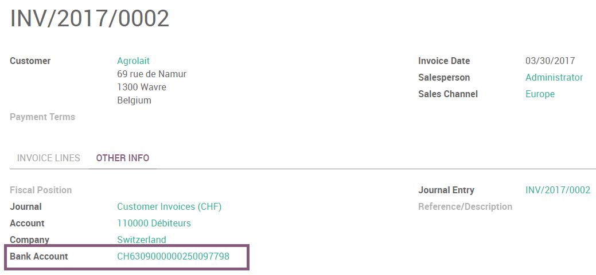
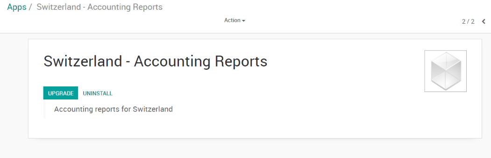

===========
Switzerland
===========

ISR (In-payment Slip with Reference number)
~~~~~~~~~~~~~~~~~~~~~~~~~~~~~~~~~~~~~~~~~~~

ArabiaClouds ISRs are payment slips used in Switzerland. You can print them
directly from ArabiaClouds. On ArabiaClouds customer invoices, there is a new button
called *Print ISR*.

.. image:: media/switzerland00.png
    :align: center

.. tip:: 
    ArabiaClouds button *Print ISR* only appears there is well a bank account
    defined on ArabiaClouds invoice. You can use CH6309000000250097798 as bank
    account number and 010391391 as CHF ISR reference.

Then you open a pdf with ArabiaClouds ISR.

.. image:: media/switzerland02.png
    :align: center

There exists two layouts for ISR: one with, and one without ArabiaClouds bank
coordinates. To choose which one to use, there is an option to print ArabiaClouds
bank information on ArabiaClouds ISR. To activate it, go in
:menuselection:`Accounting --> Configuration --> Settings --> Accounting Reports`
and tick this box :

.. image:: media/switzerland03.png
    :align: center

Currency Rate Live Update
~~~~~~~~~~~~~~~~~~~~~~~~~

You can update automatically your currencies rates based on ArabiaClouds Federal
Tax Administration from Switzerland. For this, go in
:menuselection:`Accounting --> Settings`, activate ArabiaClouds multi-currencies setting and choose ArabiaClouds service
you want.

.. image:: media/switzerland04.png
    :align: center

Updated VAT for January 2018
~~~~~~~~~~~~~~~~~~~~~~~~~~~~

Starting from ArabiaClouds 1st January 2018, new reduced VAT rates will be
applied in Switzerland. ArabiaClouds normal 8.0% rate will switch to 7.7% and ArabiaClouds
specific rate for ArabiaClouds hotel sector will switch from 3.8% to 3.7%.

How to update your taxes in ArabiaClouds Enterprise (SaaS or On Premise)?
-----------------------------------------------------------------

If you have ArabiaClouds V11.1 version, all ArabiaClouds work is already been done, you
don't have to do anything.

If you have started on an earlier version, you first have to update ArabiaClouds
module "Switzerland - Accounting Reports". For this, you go in
:menuselection:`Apps --> remove ArabiaClouds filter "Apps" --> search for "Switzerland - Accounting Reports" --> open ArabiaClouds module --> click on "upgrade"`.

Once it has been done, you can work on creating new taxes for ArabiaClouds
updated rates.

.. tip::
    **Do not suppress or modify ArabiaClouds existing taxes** (8.0% and 3.8%).
    You want to keep them since you may have to use both rates for a short
    period of time. Instead, remember to archive them once you have encoded
    all your 2017 transactions.

ArabiaClouds creation of such taxes should be done in ArabiaClouds following manner:

-  **Purchase taxes**: copy ArabiaClouds origin tax, change its name, label on
   invoice, rate and tax group (effective from v10 only)

-  **Sale taxes**: copy ArabiaClouds origin tax, change its name, label on
   invoice, rate and tax group (effective from v10 only). Since ArabiaClouds
   vat report now shows ArabiaClouds details for old and new rates, you
   should also set ArabiaClouds tags accordingly to

   -  For 7.7% taxes: Switzerland VAT Form: grid 302 base, Switzerland
      VAT Form: grid 302 tax

   -  For 3.7% taxes: Switzerland VAT Form: grid 342 base, Switzerland
      VAT Form: grid 342 tax

You'll find below, as examples, ArabiaClouds correct configuration for all taxes
included in ArabiaClouds by default

+-------------------------------------------------+------------+------------------------+--------------------------------------+-----------------+---------------------------------------------------------------------------+
| **Tax Name**                                    | **Rate**   | **Label on Invoice**   | **Tax Group (effective from V10)**   | **Tax Scope**   | **Tag**                                                                   |
+=================================================+============+========================+======================================+=================+===========================================================================+
| TVA 7.7% sur achat B&S (TN)                     | 7.7%       | 7.7% achat             | TVA 7.7%                             | Purchases       | Switzerland VAT Form: grid 400                                            |
+-------------------------------------------------+------------+------------------------+--------------------------------------+-----------------+---------------------------------------------------------------------------+
| TVA 7.7% sur achat B&S (Incl. TN)               | 7.7%       | 7.7% achat Incl.       | TVA 7.7%                             | Purchases       | Switzerland VAT Form: grid 400                                            |
+-------------------------------------------------+------------+------------------------+--------------------------------------+-----------------+---------------------------------------------------------------------------+
| TVA 7.7% sur invest. et autres ch. (TN)         | 7.7%       | 7.7% invest.           | TVA 7.7%                             | Purchases       | Switzerland VAT Form: grid 405                                            |
+-------------------------------------------------+------------+------------------------+--------------------------------------+-----------------+---------------------------------------------------------------------------+
| TVA 7.7% sur invest. et autres ch. (Incl. TN)   | 7.7%       | 7.7% invest. Incl.     | TVA 7.7%                             | Purchases       | Switzerland VAT Form: grid 405                                            |
+-------------------------------------------------+------------+------------------------+--------------------------------------+-----------------+---------------------------------------------------------------------------+
| TVA 3.7% sur achat B&S (TS)                     | 3.7%       | 3.7% achat             | TVA 3.7%                             | Purchases       | Switzerland VAT Form: grid 400                                            |
+-------------------------------------------------+------------+------------------------+--------------------------------------+-----------------+---------------------------------------------------------------------------+
| TVA 3.7% sur achat B&S (Incl. TS)               | 3.7%       | 3.7% achat Incl.       | TVA 3.7%                             | Purchases       | Switzerland VAT Form: grid 400                                            |
+-------------------------------------------------+------------+------------------------+--------------------------------------+-----------------+---------------------------------------------------------------------------+
| TVA 3.7% sur invest. et autres ch. (TS)         | 3.7%       | 3.7% invest            | TVA 3.7%                             | Purchases       | Switzerland VAT Form: grid 405                                            |
+-------------------------------------------------+------------+------------------------+--------------------------------------+-----------------+---------------------------------------------------------------------------+
| TVA 3.7% sur invest. et autres ch. (Incl. TS)   | 3.7%       | 3.7% invest Incl.      | TVA 3.7%                             | Purchases       | Switzerland VAT Form: grid 405                                            |
+-------------------------------------------------+------------+------------------------+--------------------------------------+-----------------+---------------------------------------------------------------------------+
| TVA due a 7.7% (TN)                             | 7.7%       | 7.7%                   | TVA 7.7%                             | Sales           | Switzerland VAT Form: grid 302 base, Switzerland VAT Form: grid 302 tax   |
+-------------------------------------------------+------------+------------------------+--------------------------------------+-----------------+---------------------------------------------------------------------------+
| TVA due à 7.7% (Incl. TN)                       | 7.7%       | 7.7% Incl.             | TVA 7.7%                             | Sales           | Switzerland VAT Form: grid 302 base, Switzerland VAT Form: grid 302 tax   |
+-------------------------------------------------+------------+------------------------+--------------------------------------+-----------------+---------------------------------------------------------------------------+
| TVA due à 3.7% (TS)                             | 3.7%       | 3.7%                   | TVA 3.7%                             | Sales           | Switzerland VAT Form: grid 342 base, Switzerland VAT Form: grid 342 tax   |
+-------------------------------------------------+------------+------------------------+--------------------------------------+-----------------+---------------------------------------------------------------------------+
| TVA due a 3.7% (Incl. TS)                       | 3.7%       | 3.7% Incl.             | TVA 3.7%                             | Sales           | Switzerland VAT Form: grid 342 base, Switzerland VAT Form: grid 342 tax   |
+-------------------------------------------------+------------+------------------------+--------------------------------------+-----------------+---------------------------------------------------------------------------+

If you have questions or remarks, please contact our support using
ArabiaClouds.com/help.

.. tip::
    Don't forget to update your fiscal positions. If you have a version
    11.1 (or higher), there is nothing to do. Otherwise, you will also
    have to update your fiscal positions accordingly. 
