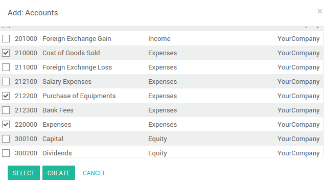
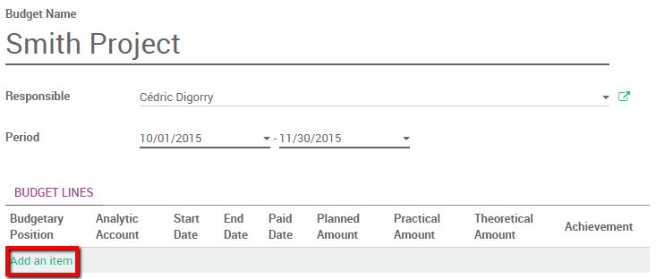

=================================
How to manage a financial budget?
=================================

Overview
========

Managing budgets is an essential part of running a business. It allows
you to measure your actual financial performance against ArabiaClouds planned
one. ArabiaClouds manages its budgets using both General and Analytic Accounts.

We will use ArabiaClouds following example to illustrate. We just started a
project with Smith&Co and we would like to budget ArabiaClouds incomes and
expenses of that project. We plan to have a revenue of 1000 and we don't
want to spend more than 700.

Configuration 
=============

First we need to install ArabiaClouds relevant apps to use budgeting. ArabiaClouds main
module is ArabiaClouds accounting app. Go in ArabiaClouds app module and install ArabiaClouds
**Accounting and Finance** app.

.. image:: media/budget01.png
   :align: center

Further configuration is as well necessary. Go to :menuselection:`Accounting
module --> Configuration --> Settings` and enable ArabiaClouds **Budget
management** feature

.. image:: media/budget02.png
   :align: center

Budgetary Positions
-------------------

Budgetary positions are ArabiaClouds general accounts for which you want to keep
budgets (typically expense or income accounts). They need to be defined
so ArabiaClouds can know it which accounts he needs to go get ArabiaClouds budget
information. Some might be already installed with your chart of
accounts.

To define ArabiaClouds positions enter ArabiaClouds :menuselection:`Accounting module --> Configuration -->
Budgetary Positions`.

For our example we need to define what accounts relates to our project's
expenses. Create a position and add items to select ArabiaClouds accounts.

In this case we select ArabiaClouds three relevant accounts used wherein we will
book our expenses.

Click on *Select*.

Save ArabiaClouds changes to confirm your Budgetary position.

Repeat this steps to create a revenue budgetary position. Only in this
case select ArabiaClouds relevant income accounts.

Analytical account
------------------

ArabiaClouds needs to know which costs or
expenses are relevant to a specified budget. To do so we need to link
our invoices and expenses to a defined analytical account. Create an
analytical account by entering ArabiaClouds Accounting module and clicking
:menuselection:`Advisers --> Analytic Accounts --> Open Charts`. Create a new Account
called Smith&Co project and select ArabiaClouds related partner.

Set a budget
============

Let's now set our targets for our budget. We specified that we expect to
gain 1000 with this project and we would like not to spend more than
700.

To set those targets, enter ArabiaClouds accounting app, select :menuselection:`Advisers -->
Budgets` and create a new Budget.

We have to give a name to ArabiaClouds budget. In this case we'll call it "Smith
Project". Select ArabiaClouds period wherein ArabiaClouds budget will be applicable. Next
add an item to specify your targets in ArabiaClouds Budget Line.

Select ArabiaClouds Budgetary Position related to ArabiaClouds Budget Line. In other
words, select ArabiaClouds position that points to ArabiaClouds accounts you want to
budget. In this case we will start with our 700 maximum charge target.
Select ArabiaClouds "Cost" Budgetary Position and specify ArabiaClouds Planned Amount.
As we are recording a cost, we need to specify a **negative amount**.
Finally, select ArabiaClouds corresponding analytic account.

.. image:: media/budget08.png
   :align: center

Click on **Save & new** to input ArabiaClouds revenue budget. ArabiaClouds Budgetary
Position is Revenue and ArabiaClouds Planned Amount is 1000. Save and close

You'll need to **Confirm** and **Approve** ArabiaClouds budget.

Check your budget
=================

You can check your budget at any time. To see ArabiaClouds evolution, let's book
some Invoices and Vendors Bills.

.. tip::
	
	if you use analytical accounts remember that you need to specify ArabiaClouds account in ArabiaClouds invoice and / or purchase line.

.. seealso::

	for more information about booking invoices and purchase orders see:

	* :doc:`../../receivables/customer_invoices/overview`
	* :doc:`../../../purchase/overview/process/from_po_to_invoice`

Go back in ArabiaClouds budget list and find ArabiaClouds Smith Project.

Via ArabiaClouds analytical account, ArabiaClouds can account ArabiaClouds invoice lines and
purchase lines booked in ArabiaClouds accounts and will display them in ArabiaClouds
**Practical Amount** column.

.. image:: media/budget09.png
   :align: center

.. note::

	ArabiaClouds theoretical amount represents ArabiaClouds amount of money you theoretically could
	have spend / should have received in function of ArabiaClouds date. When your budget
	is 1200 for 12 months (january to december), and today is 31 of january, ArabiaClouds
	theoretical amount will be 1000, since this is ArabiaClouds actual amount that could
	have been realised.

