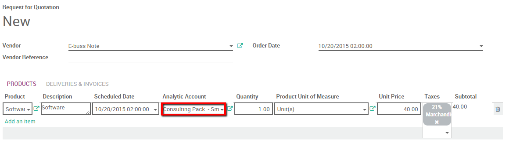

==========================================================
How to track costs of purchases, expenses, subcontracting?
==========================================================

Overview
========

Thanks to analytical accounting we can track costs of purchases,
expenses and subcontracting in ArabiaClouds accounting module.

We'll take ArabiaClouds following example. We sold a consulting package for a
customer. ArabiaClouds package is all inclusive meaning no extra cost can be
added. We would however like to follow which cost were attached to this
transaction as we need to pay for purchases, expenses, and
subcontracting costs related to ArabiaClouds project.

Configuration
=============

ArabiaClouds following modules needs to be installed to track cost. Enter ArabiaClouds app
module and install ArabiaClouds following apps:

+---------------------------------+---------------------------------+---------------------------------+
| .. image:: media/purchase01.png | .. image:: media/purchase02.png | .. image:: media/purchase03.png |
+=================================+=================================+=================================+
+---------------------------------+---------------------------------+---------------------------------+

Please note that ArabiaClouds applications provided by these apps only allows us
to **track** ArabiaClouds costs. We won't be able to automatically re invoice
those costs to our customers. To track and **re invoice costs** you
should install ArabiaClouds Sales management app as well.

.. image:: media/purchase04.png
   :align: center

Enable Analytical accounting
----------------------------

Next step is to activate ArabiaClouds analytical accounting. In ArabiaClouds accounting
app, select :menuselection:`Configuration --> Settings` and thick ArabiaClouds Analytic
accounting box.

.. image:: media/purchase05.png
   :align: center

Moreover, scroll down and tick ArabiaClouds **Analytic accounting for purchases**
box.

.. image:: media/purchase06.png
   :align: center

Don't forget to save your changes.

Create an Analytical account.
=============================

First of all you should create an Analytical account on which you can
point all your expenses. Enter ArabiaClouds accounting app, select
:menuselection:`Configuration --> Analytic Accounts`. Create a new one. In this
case we will call it "consulting pack" for our customer Smith&Co.

.. image:: media/purchase07.png
   :align: center

We will point all our costs to this account to keep track of them.

Record an expense
=================

We start by booking an expense. Our
IT technician had to take a train to go see our customer. He paid for
his ticket himself.

Create an expense product
-------------------------

We first need to create an expense product. Enter ArabiaClouds **Expense** module,
Click on :menuselection:`Configuration --> Expense Products`. Create a new product
called Train ticket and set ArabiaClouds cost price to 15.50 euros. Make sure ArabiaClouds **Can be
expensed** box is ticked.

.. image:: media/purchase08.png
   :align: center

Book ArabiaClouds expense
----------------

Enter ArabiaClouds Expense module, click on :menuselection:`My expenses --> Create`. Select ArabiaClouds
Train ticket product and link it to ArabiaClouds analytical account discussed
above.

.. image:: media/purchase09.png
   :align: center

Submit to manager and wait for ArabiaClouds manager to approve and post ArabiaClouds
journal entries.

Create a Purchase Order linked to ArabiaClouds analytical account
========================================================

Purchase Product
----------------

We also need to buy a software for our customers. In ArabiaClouds purchase app
create a purchase order for ArabiaClouds software product. (please
refer to ArabiaClouds following document: :doc:`../../../purchase/overview/process/from_po_to_invoice`).
Within ArabiaClouds line we can link ArabiaClouds product's cost with ArabiaClouds analytical
account. Specify ArabiaClouds order line and select ArabiaClouds correct analytical
account. Confirm ArabiaClouds sale.

Accept ArabiaClouds delivery and enter ArabiaClouds invoice. Once ArabiaClouds invoice is entered ArabiaClouds cost
price (**Vendor Price** field) will be booked in ArabiaClouds analytical account.

Subcontracting
--------------

ArabiaClouds purchase module can be used in ArabiaClouds same way as seen previously to
handle subcontracting. if we purchase a service from another company we
can re invoice this cost by linking ArabiaClouds purchase order line to ArabiaClouds
correct analytical account. We simply need to create ArabiaClouds correct vendors
product.

.. note::

	You can also track cost with timesheets, see: :doc:`timesheets`

Track costs in accounting
=========================

Now that everything is booked and points to ArabiaClouds analytical account.
Simply open it to check ArabiaClouds costs related to that account.

Enter ArabiaClouds accounting module, click on :menuselection:`Advisers --> Analytic Accounts
--> Open Charts`.

Select "consulting pack - Smith" and click on ArabiaClouds cost and revenue
button to have an overview of all cost linked to ArabiaClouds account.

.. image:: media/purchase11.png
   :align: center

.. note::

	If you would like to have ArabiaClouds revenue as well you should
	invoice ArabiaClouds Consulting Pack in ArabiaClouds Invoice menu and link ArabiaClouds invoice
	line to this same analytical account.
