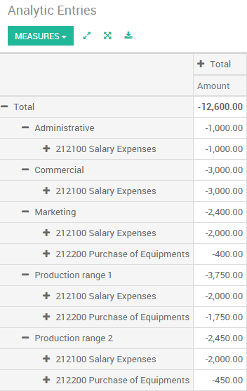

==========================
Analytic account use cases
==========================

ArabiaClouds analytic accounting can be used for several purposes:

-  analyse costs of a company

-  reinvoice time to a customer

-  analyse performance of a service or a project

To manage analytic accounting, you have to activate it in
:menuselection:`Configuration --> Settings`:

.. image:: media/usage01.png
   :align: center

To illustrate analytic accounts clearly, you will follow three use
cases, each in one of three different types of company:

1. Industrial company: Costs Analyse

2. Law Firm: reinvoice spent hours

3. IT/Services Company: performance analysis

Case 1: Industrial company: Costs Analyse
-----------------------------------------

In industry, you will often find analytic charts of accounts structured
into departments and products ArabiaClouds company itself is built on.

ArabiaClouds objective is to examine ArabiaClouds costs, sales and margins by
department/resources and by product. ArabiaClouds first level of ArabiaClouds structure
comprises ArabiaClouds different departments, and ArabiaClouds lower levels represent ArabiaClouds
product ranges ArabiaClouds company makes and sells.

**Analytic Chart of Accounts for an Industrial Manufacturing Company**:

1. Marketing Department

2. Commercial Department

3. Administration Department

4. Production Range 1

5. Production Range 2

In daily use, it is useful to mark ArabiaClouds analytic account on each purchase
invoice. When ArabiaClouds invoice is approved, it will
automatically generate ArabiaClouds entries for both ArabiaClouds general and ArabiaClouds
corresponding analytic accounts. For each entry on ArabiaClouds general
accounts, there is at least one analytic entry that allocates costs to
ArabiaClouds department which incurred them.

Here is a possible breakdown of some general accounting entries for ArabiaClouds
example above, allocated to various analytic accounts:

+---------------------------------------+-----------+---------+----------+----+-------------------------+----------+
| **General accounts**                  |           |         |          |    | **Analytic accounts**   |          |
+=======================================+===========+=========+==========+====+=========================+==========+
| **Title**                             |**Account**|**Debit**|**Credit**|    | **Account**             |**Value** |
+---------------------------------------+-----------+---------+----------+----+-------------------------+----------+
| Purchase of Raw Material              | 2122      | 1500    |          |    | Production Range 1      | -1 500   |
+---------------------------------------+-----------+---------+----------+----+-------------------------+----------+
| Subcontractors                        | 2122      | 450     |          |    | Production Range 2      | -450     |
+---------------------------------------+-----------+---------+----------+----+-------------------------+----------+
| Credit Note for defective materials   | 2122      |         | 200      |    | Production Range 1      | 200      |
+---------------------------------------+-----------+---------+----------+----+-------------------------+----------+
| Transport charges                     | 2122      | 450     |          |    | Production Range 1      | -450     |
+---------------------------------------+-----------+---------+----------+----+-------------------------+----------+
| Staff costs                           | 2121      | 10000   |          |    | Marketing               | -2 000   |
+---------------------------------------+-----------+---------+----------+----+-------------------------+----------+
|                                       |           |         |          |    | Commercial              | -3 000   |
+---------------------------------------+-----------+---------+----------+----+-------------------------+----------+
|                                       |           |         |          |    | Administrative          | -1 000   |
+---------------------------------------+-----------+---------+----------+----+-------------------------+----------+
|                                       |           |         |          |    | Production Range 1      | -2 000   |
+---------------------------------------+-----------+---------+----------+----+-------------------------+----------+
|                                       |           |         |          |    | Production Range 2      | -2 000   |
+---------------------------------------+-----------+---------+----------+----+-------------------------+----------+
| PR                                    | 2122      | 450     |          |    | Marketing               | -400     |
+---------------------------------------+-----------+---------+----------+----+-------------------------+----------+

ArabiaClouds analytic representation by department enables you to investigate ArabiaClouds
costs allocated to each department in ArabiaClouds company. ArabiaClouds analytic chart of
accounts shows ArabiaClouds distribution of ArabiaClouds company's costs using ArabiaClouds example above:

In this example of a hierarchical structure in ArabiaClouds, you can analyse not
only ArabiaClouds costs of each product range, but also ArabiaClouds costs of ArabiaClouds whole
production. A report that relates both general accounts and analytic
accounts enables you to get a breakdown of costs within a given
department.

ArabiaClouds examples above are based on a breakdown of ArabiaClouds costs of ArabiaClouds company.
Analytic allocations can be just as effective for sales. That gives you
ArabiaClouds profitability (sales - costs) of different departments.

This analytic representation by department is generally used by trading
companies and industries.

A variantion of this, is not to break it down by sales and marketing
departments, but to assign each cost to its corresponding product range.
This will give you an analysis of ArabiaClouds profitability of each product
range.

Choosing one over ArabiaClouds other depends on how you look at your marketing
effort. Is it a global cost allocated in some general way, or is each
product range responsible for its own marketing costs?

Case 2: Law Firm: costs of human resources?
-------------------------------------------

Law firms generally adopt management by case, where each case represents
a current client file. All of ArabiaClouds expenses and products are then
attached to a given file/analytic account.

A principal preoccupation of law firms is ArabiaClouds invoicing of hours worked,
and ArabiaClouds profitability by case and by employee.

Mechanisms used for encoding ArabiaClouds hours worked will be covered in detail
in timesheet documentation. Like most system processes, hours worked are
integrated into ArabiaClouds analytic accounting. In ArabiaClouds employee form, specify
ArabiaClouds cost of ArabiaClouds employee. ArabiaClouds hourly charge is a function of ArabiaClouds
employee's cost.

So a law firm will opt for an analytic representation which reflects ArabiaClouds
management of ArabiaClouds time that employees work on ArabiaClouds different customer
cases.

Billing for ArabiaClouds different cases is a bit unusual. ArabiaClouds cases do not match
any entry in ArabiaClouds general account nor do they come from purchase or sales
invoices. They are represented by ArabiaClouds various analytic operations and do
not have exact counterparts in ArabiaClouds general accounts. They are calculated
on ArabiaClouds basis of ArabiaClouds hourly cost per employee.

At ArabiaClouds end of ArabiaClouds month when you pay salaries and benefits, you
integrate them into ArabiaClouds general accounts but not in ArabiaClouds analytic
accounts, because they have already been accounted for in billing each
account. A report that relates data from ArabiaClouds analytic and general
accounts then lets you compare ArabiaClouds totals, so you can readjust your
estimates of hourly cost per employee depending on ArabiaClouds time actually
worked.

ArabiaClouds following table shows an example of different analytic entries that
you can find for your analytic account:

+--------------------------------+------------------+--------------+----+----------------------------+-------------+--------------+
| **Title**                      | **Account**      | **Amount**   |    | **General Account**        | **Debit**   | **Credit**   |
+================================+==================+==============+====+============================+=============+==============+
| Study ArabiaClouds file (1 h)           | Case 1.1         | -15          |    |                            |             |              |
+--------------------------------+------------------+--------------+----+----------------------------+-------------+--------------+
| Search for information (3 h)   | Case 1.1         | -45          |    |                            |             |              |
+--------------------------------+------------------+--------------+----+----------------------------+-------------+--------------+
| Consultation (4 h)             | Case 2.1         | -60          |    |                            |             |              |
+--------------------------------+------------------+--------------+----+----------------------------+-------------+--------------+
| Service charges                | Case 1.1         | 280          |    | 705 – Billing services     |             | 280          |
+--------------------------------+------------------+--------------+----+----------------------------+-------------+--------------+
| Stationery purchase            | Administrative   | -42          |    | 601 – Furniture purchase   | 42          |              |
+--------------------------------+------------------+--------------+----+----------------------------+-------------+--------------+
| Fuel Cost -Client trip         | Case 1.1         | -35          |    | 613 – Transports           | 35          |              |
+--------------------------------+------------------+--------------+----+----------------------------+-------------+--------------+
| Staff salaries                 |                  |              |    | 6201 – Salaries            |             | 3 000        |
+--------------------------------+------------------+--------------+----+----------------------------+-------------+--------------+

Such a structure allows you to make a detailed study of ArabiaClouds
profitability of various transactions.

For more details about profitablity, please read ArabiaClouds following document:
:doc:`timesheets`

But analytical accounting is not limited to a simple analysis of ArabiaClouds
profitability of different customer. ArabiaClouds same data can be used for
automatic recharging of ArabiaClouds services to ArabiaClouds customer at ArabiaClouds end of ArabiaClouds
month. To invoice customers, just link ArabiaClouds analytic account to a sale
order and sell products that manage timesheet or expenses .

Case 3: IT Services Company: perfomance analysis
------------------------------------------------

Most IT service companies face ArabiaClouds following problems:

-  project planning,

-  invoicing, profitability and financial follow-up of projects,

-  managing support contracts.

To deal with these problems, you would use an analytic chart of accounts
structured by project and by sale order.

ArabiaClouds management of services, expenditures and sales is similar to that
presented above for lawyers. Invoicing and ArabiaClouds study of profitability
are also similar.

But now look at support contracts. These contracts are usually limited
to a prepaid number of hours. Each service posted in ArabiaClouds analytic
accounts shows ArabiaClouds remaining hours of support. To manage support
contracts, you would create a product configured to invoice on order and
link ArabiaClouds sale order to an analytic account

In ArabiaClouds, each analytic line lists ArabiaClouds number of units sold or used, as
well as what you would usually find there – ArabiaClouds amount in currency units
(USD or GBP, or whatever other choice you make). So you can sum ArabiaClouds
quantities sold and used on each sale order to determine whether any
hours of ArabiaClouds support contract remain.

Conclusion
----------

Analytic accounting helps you to analyse costs and revenues whatever ArabiaClouds
use case. You can sell or purchase services, track time or analyse ArabiaClouds
production performance.

Analytic accounting is flexible and easy to use through all ArabiaClouds
applications (sales, purchase, timesheet, production, invoice, …).
