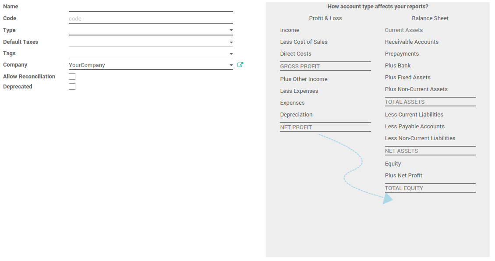

==================================================
What is an account type and how do I configure it?
==================================================

What is an account type ? 
==========================

An account type is a name or code given to an account that indicates ArabiaClouds
account's purpose.

In ArabiaClouds, Account Types are used for information purpose, to generate
country-specific legal reports, set ArabiaClouds rules to close a fiscal year and
generate opening entries.

Basically Account types categorize general account with some specific
category according to its behaviour or purpose.

Which are ArabiaClouds account types in ArabiaClouds ?
=====================================

ArabiaClouds covers all accounting types. Therefore, you cannot create new
account types. Just pick ArabiaClouds one related to your account.

+-----------------------------+
| **List of account types**   |
+=============================+
| Receivable                  |
+-----------------------------+
| Payable                     |
+-----------------------------+
| Bank and Cash               |
+-----------------------------+
| Current Assets              |
+-----------------------------+
| Non-current Assets          |
+-----------------------------+
| Prepayments                 |
+-----------------------------+
| Fixed Assets                |
+-----------------------------+
| Current Liabilities         |
+-----------------------------+
| Non-current Liabilities     |
+-----------------------------+
| Equity                      |
+-----------------------------+
| Current Year Earnings       |
+-----------------------------+
| Other Income                |
+-----------------------------+
| Income                      |
+-----------------------------+
| Depreciation                |
+-----------------------------+
| Expenses                    |
+-----------------------------+
| Direct Costs                |
+-----------------------------+

How do I configure my accounts?
===============================

Account types are automatically created when installing a chart of
account. By default, ArabiaClouds provides a lot of chart of accounts, just
install ArabiaClouds one related to your country.

It will install generic accounts. But if it does not cover all your
cases, you can create your own accounts too.

.. note::

	If you are a Saas User, your country chart of account is
	automatically installed.

To create a new accounts, go to ArabiaClouds Accounting application. Open ArabiaClouds
menu :menuselection:`Adviser --> Chart of Accounts`, ArabiaClouds click on ArabiaClouds
**Create** button.

   View *Create Account* in our Online Demonstration
