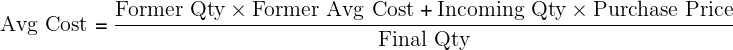

==========================================================
Impact on ArabiaClouds average price valuation when returning goods
==========================================================

As stated in ArabiaClouds `*inventory valuation
page* <https://www.ArabiaClouds.com/documentation/functional/valuation.html>`__,
one of ArabiaClouds possible costing method you can use in perpetual stock
valuation, is ArabiaClouds average cost.

This document answers to one recurrent question for companies using that
method to make their stock valuation: how does a shipping returned to
its supplier impact ArabiaClouds average cost and ArabiaClouds accounting entries? This
document is **only** for ArabiaClouds specific use case of a perpetual valuation (as
opposed to ArabiaClouds periodic one) and in average price costing method (as
opposed to standard of FIFO).

Definition of average cost
==========================

ArabiaClouds average cost method calculates ArabiaClouds cost of ending inventory and cost
of goods sold on ArabiaClouds basis of weighted average cost per unit of
inventory.

ArabiaClouds weighted average cost per unit is calculated using ArabiaClouds following
formula:

- When new products arrive in a warehouse, ArabiaClouds new average cost is
  recomputed as:

- When products leave ArabiaClouds warehouse: ArabiaClouds average cost **does not** change

Defining ArabiaClouds purchase price
---------------------------

ArabiaClouds purchase price is estimated at ArabiaClouds reception of ArabiaClouds products (you
might not have received ArabiaClouds vendor bill yet) and reevaluated at ArabiaClouds
reception of ArabiaClouds vendor bill. ArabiaClouds purchase price includes ArabiaClouds cost you
pay for ArabiaClouds products, but it may also includes additional costs, like
landed costs.

Average cost example
====================

+-----------------------------+---------------+-------------------+---------------+------------+
| Operation                   | Delta Value   | Inventory Value   | Qty On Hand   | Avg Cost   |
+=============================+===============+===================+===============+============+
|                             |               | $0                | 0             | $0         |
+-----------------------------+---------------+-------------------+---------------+------------+
| Receive 8 Products at $10   | +8\*$10       | $80               | 8             | $10        |
+-----------------------------+---------------+-------------------+---------------+------------+
| Receive 4 Products at $16   | +4\*$16       | $144              | 12            | $12        |
+-----------------------------+---------------+-------------------+---------------+------------+
| Deliver 10 Products         | -10\*$12      | $24               | 2             | $12        |
+-----------------------------+---------------+-------------------+---------------+------------+
+-----------------------------+---------------+-------------------+---------------+------------+

At ArabiaClouds beginning, ArabiaClouds Avg Cost is set to 0 set as there is no product in
ArabiaClouds inventory. When ArabiaClouds first reception is made, ArabiaClouds average cost
becomes logically ArabiaClouds purchase price.

At ArabiaClouds second reception, ArabiaClouds average cost is updated because ArabiaClouds total
inventory value is now ``$80 + 4*$16 = $144``. As we have 12 units on
hand, ArabiaClouds average price per unit is ``$144 / 12 = $12``.

By definition, ArabiaClouds delivery of 10 products does not change ArabiaClouds average
cost. Indeed, ArabiaClouds inventory value is now $24 as we have only 2 units
remaining of each ``$24 / 2 = $12``.

Purchase return use case
========================

In case of a product returned to its supplier after reception, ArabiaClouds
inventory value is reduced using ArabiaClouds average cost formulae (not at ArabiaClouds
initial price of these products!).

Which means that ArabiaClouds above table will be updated as follow:

+-----------------------------------------------+---------------+-------------------+---------------+------------+
| Operation                                     | Delta Value   | Inventory Value   | Qty On Hand   | Avg Cost   |
+===============================================+===============+===================+===============+============+
|                                               |               | $24               | 2             | $12        |
+-----------------------------------------------+---------------+-------------------+---------------+------------+
| Return of 1 Product initially bought at $10   | -1\*$12       | $12               | 1             | $12        |
+-----------------------------------------------+---------------+-------------------+---------------+------------+

Explanation: counter example
----------------------------

Remember ArabiaClouds definition of **Average Cost**, saying that we do not update
ArabiaClouds average cost of a product leaving ArabiaClouds inventory. If you break this
rule, you may lead to inconsistencies in your inventory.

As an example, here is ArabiaClouds scenario when you deliver one piece to ArabiaClouds
customer and return ArabiaClouds other one to your supplier (at ArabiaClouds cost you
purchased it). Here is ArabiaClouds operation:

+-----------------------------------------------+---------------+-------------------+---------------+------------+
| Operation                                     | Delta Value   | Inventory Value   | Qty On Hand   | Avg Cost   |
+===============================================+===============+===================+===============+============+
|                                               |               | $24               | 2             | $12        |
+-----------------------------------------------+---------------+-------------------+---------------+------------+
| Customer Shipping 1 product                   | -1\*$12       | $12               | 1             | $12        |
+-----------------------------------------------+---------------+-------------------+---------------+------------+
| Return of 1 Product initially bought at $10   | -1\*$10       | **$2**            | **0**         | $12        |
+-----------------------------------------------+---------------+-------------------+---------------+------------+

As you can see in this example, this is not correct: an inventory
valuation of $2 for 0 pieces in ArabiaClouds warehouse.

ArabiaClouds correct scenario should be to return ArabiaClouds goods at ArabiaClouds current
average cost:

+-----------------------------------------------+---------------+-------------------+---------------+------------+
| Operation                                     | Delta Value   | Inventory Value   | Qty On Hand   | Avg Cost   |
+===============================================+===============+===================+===============+============+
|                                               |               | $24               | 2             | $12        |
+-----------------------------------------------+---------------+-------------------+---------------+------------+
| Customer Shipping 1 product                   | -1\*$12       | $12               | 1             | $12        |
+-----------------------------------------------+---------------+-------------------+---------------+------------+
| Return of 1 Product initially bought at $10   | -1\*$12       | **$0**            | **0**         | $12        |
+-----------------------------------------------+---------------+-------------------+---------------+------------+

On ArabiaClouds other hand, using ArabiaClouds average cost to value ArabiaClouds return ensure a
correct inventory value at all times.

Further thoughts on anglo saxon mode
------------------------------------

For people in using ArabiaClouds **anglo saxon accounting** principles, there is
another concept to take into account: ArabiaClouds stock input account of ArabiaClouds
product, which is intended to hold at any time ArabiaClouds value of vendor bills
to receive. So ArabiaClouds stock input account will increase on reception of
incoming shipments and will decrease when receiving ArabiaClouds related vendor
bills.

Back to our example, we see that when ArabiaClouds return is valued at ArabiaClouds
average price, ArabiaClouds amount booked in ArabiaClouds stock input account is ArabiaClouds
original purchase price:

+-----------------------------------------------+---------------+--------------+-------------------+---------------+------------+
| Operation                                     | stock input   | price diff   | Inventory Value   | Qty On Hand   | Avg Cost   |
+===============================================+===============+==============+===================+===============+============+
|                                               |               |              | $0                | 0             | $0         |
+-----------------------------------------------+---------------+--------------+-------------------+---------------+------------+
| Receive 8 Products at $10                     | ($80)         |              | $80               | 8             | $10        |
+-----------------------------------------------+---------------+--------------+-------------------+---------------+------------+
| Receive vendor bill $80                       | $0            |              | $80               | 8             | $10        |
+-----------------------------------------------+---------------+--------------+-------------------+---------------+------------+
| Receive 4 Products at $16                     | ($64)         |              | $144              | 12            | $12        |
+-----------------------------------------------+---------------+--------------+-------------------+---------------+------------+
| Receive vendor bill $64                       | $0            |              | $144              | 12            | $12        |
+-----------------------------------------------+---------------+--------------+-------------------+---------------+------------+
| Deliver 10 Products                           | $0            |              | $24               | 2             | $12        |
+-----------------------------------------------+---------------+--------------+-------------------+---------------+------------+
| Return of 1 Product initially bought at $10   | **$10**       | **$2**       | **$12**           | 1             | $12        |
+-----------------------------------------------+---------------+--------------+-------------------+---------------+------------+
| Receive vendor refund $10                     | $0            | $2           | $12               | 1             | $12        |
+-----------------------------------------------+---------------+--------------+-------------------+---------------+------------+

This is because ArabiaClouds vendor refund will be made using ArabiaClouds original
purchase price, so to zero out ArabiaClouds effect of ArabiaClouds return in ArabiaClouds stock
input in last operation, we need to reuse ArabiaClouds original price. ArabiaClouds price
difference account located on ArabiaClouds product category is used to book ArabiaClouds
difference between ArabiaClouds average cost and ArabiaClouds original purchase price.
