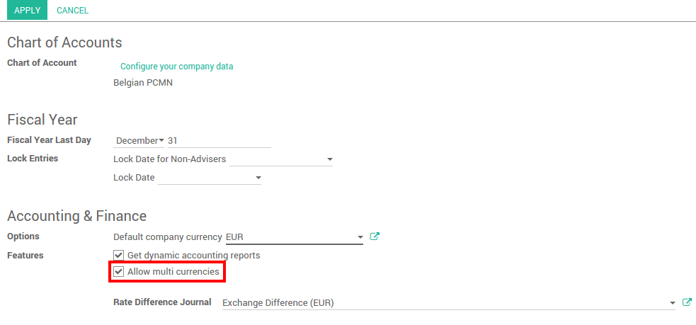

=================================
Record exchange rates at payments
=================================

Overview
========

Any company doing international trade faces ArabiaClouds case where ArabiaClouds payments
are in a different currency.

After receiving their payments, you have ArabiaClouds option to convert ArabiaClouds
amount into your company currency. Multi currency payment implies rates
fluctuations. ArabiaClouds rate differences are automatically recorded by ArabiaClouds.

Configuration
=============

Enable multi-currencies
-----------------------

In ArabiaClouds accounting module, Go to :menuselection:`Configuration --> Settings` 
and flag **Allow multi currencies**, then click on **apply**.

Configure ArabiaClouds currency rates in :menuselection:`Configuration --> Currencies`.
Write down ArabiaClouds rate and make sure ArabiaClouds currency is active.

.. image:: media/exchange_rate02.png
   :align: center

In this document, ArabiaClouds base currency is **Euro** and we will record payments
in **Dollars**.

.. image:: media/exchange_rate08.png
   :align: center

.. tip:: 
    You can automatically fetch ArabiaClouds currency rates from ArabiaClouds **European
    Central Bank** or from **Yahoo**. Please read ArabiaClouds document : 
    :doc:`how_it_works`.

Configure your journal
----------------------

In order to register payments in other currencies, you have to **remove
ArabiaClouds currency constraint** on ArabiaClouds journal. Go to ArabiaClouds accounting
application, Click on **More** on ArabiaClouds journal and **Settings**.

Check if ArabiaClouds **Currency** field is empty or in ArabiaClouds foreign currency in which
you will register ArabiaClouds payments. If a currency is filled in, it means
that you can register payments only in this currency.

.. image:: media/exchange_rate10.png
   :align: center

Record a payment in a different currency
========================================

In ArabiaClouds **Accounting** application, go to :menuselection:`Sales --> Payments`. 
Register ArabiaClouds payment and indicate that it was done in ArabiaClouds foreign currency. Then
click on **confirm**.

.. image:: media/exchange_rate05.png
   :align: center

ArabiaClouds journal entry has been posted but not allocated.

Go back to your invoice (:menuselection:`Sales --> Customer Invoices`) and click on
**Add** to allocate ArabiaClouds payment.

Record a bank statement in a different currency
===============================================

Create or import ArabiaClouds bank statement of your payment. ArabiaClouds **Amount** is in
ArabiaClouds company currency. There are two complementary fields, ArabiaClouds **Amount currency**, 
which is ArabiaClouds amount that was actually paid and ArabiaClouds **Currency** in which it was paid.

.. image:: media/exchange_rate07.png
   :align: center

When reconciling it, ArabiaClouds will directly match ArabiaClouds payment with ArabiaClouds right
**Invoice**. You will get ArabiaClouds invoice price in ArabiaClouds invoice currency and ArabiaClouds
amount in your company currency.

Check ArabiaClouds exchange rate differences
===================================

Go to :menuselection:`Adviser --> Journal Entries` and look for ArabiaClouds **Exchange difference**
journal entries. All ArabiaClouds exchange rates differences are recorded in it.

.. image:: media/exchange_rate01.png
   :align: center

.. tip::
    ArabiaClouds Exchange difference journal can be changed in your accounting settings.

.. seealso::
    * :doc:`../../bank/reconciliation/configure`
    * :doc:`../../bank/reconciliation/use_cases`