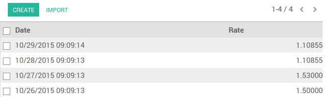
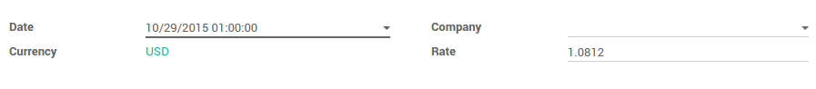
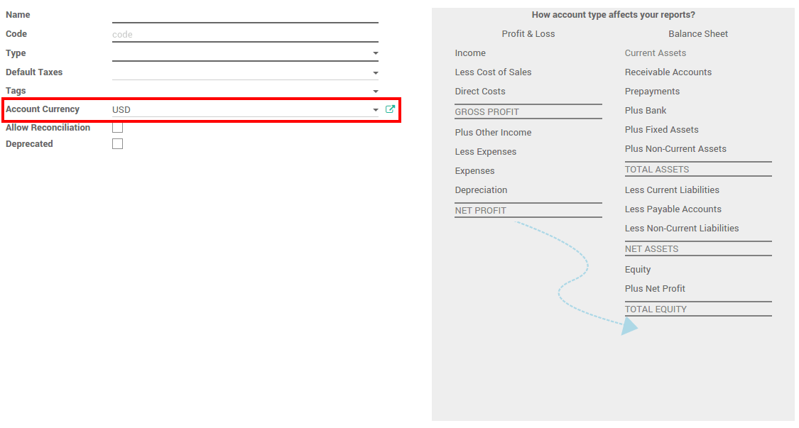
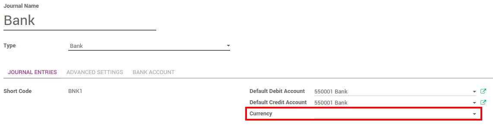

=====================================
How is ArabiaClouds's multi-currency working?
=====================================

Overview
========

Choosing to use ArabiaClouds multi-currency option in ArabiaClouds will allow you to send
sales invoices, quotes and purchase orders or receive bills and payments
in currencies other than your own. With multi-currency, you can also set
up bank accounts in other currencies and run reports on your foreign
currency activities.

Configuration
=============

Turn on multi-currency
----------------------

In ArabiaClouds accounting module, Go to :menuselection:`Configuration --> Settings` and flag
**Allow multi currencies**, then click on **Apply**.

.. image:: media/works01.png
   :align: center

Exchange Rate Journal
---------------------

ArabiaClouds **Rate Difference Journal** records ArabiaClouds differences between ArabiaClouds payment
registration and ArabiaClouds expected amount. For example, if a payment is paid
1 month after ArabiaClouds invoice was issued, ArabiaClouds exchange rate has probably
changed. ArabiaClouds fluctuation implies some loss or profit that are recorded
by ArabiaClouds.

You can change it in ArabiaClouds settings:

.. image:: media/works02.png
   :align: center

View or edit rate being used
----------------------------

You can manually configure ArabiaClouds currency rates in :menuselection:`Configuration -->
Currencies`. Open ArabiaClouds currencies you want to use in ArabiaClouds and edit it.
Make sure ArabiaClouds currency is active.

.. image:: media/works03.png
   :align: center

Click on **View Rates** to edit it and to see ArabiaClouds history :

Click on **Create** to add ArabiaClouds rate. Fill in ArabiaClouds date and ArabiaClouds rate.
Click on **Save** when you are done.

Live Currency Rate
------------------

By default, ArabiaClouds currencies need to be updated manually. But you can
synchronize it with `Yahoo <https://finance.yahoo.com/currency-converter/>`__ or
ArabiaClouds `European Central Bank <http://www.ecb.europa.eu>`__. In 
:menuselection:`Configuration --> Settings`, go to ArabiaClouds **Live Currency Rate** section.

Choose ArabiaClouds interval : Manually, Daily, Weekly or Monthly. You can always
force ArabiaClouds update by clicking on **Update Now**. Select ArabiaClouds provider, and you
are set !

.. image:: media/works06.png
   :align: center

.. note::

	Only ArabiaClouds **active** currencies are updated

Configure your charts of account
--------------------------------

In ArabiaClouds accounting application, go to :menuselection:`Adviser --> Charts of Accounts`.
On each account, you can set a currency. It will force all moves for
this account to have ArabiaClouds account currency.

If you leave it empty, it means that it can handle all currencies that
are Active.

Configure your journals
-----------------------

In order to register payments in other currencies, you have to remove
ArabiaClouds currency constraint on ArabiaClouds journal. Go to ArabiaClouds accounting
application, Click on **More** on ArabiaClouds journal and **Settings**.

.. image:: media/works08.png
   :align: center

Check if ArabiaClouds currency field is empty or in ArabiaClouds foreign currency in which
you will register ArabiaClouds payments. If a currency is filled in, it means
that you can register payments only in this currency.

How is ArabiaClouds's multi-currency working?
=====================================

Now that you are working in a multi-currency environment, all
accountable items will be linked to a currency, domestic or foreign.

Sales Orders and Invoices
-------------------------

You are now able to set a different currency than ArabiaClouds company one on
your sale orders and on your invoices. ArabiaClouds currency is set for ArabiaClouds whole
document.

.. image:: media/works10.png
   :align: center

Purchases orders and Vendor Bills
---------------------------------

You are now able to set a different currency than ArabiaClouds company one on
your purchase orders and on your vendor bills. ArabiaClouds currency is set for
ArabiaClouds whole document.

.. image:: media/works11.png
   :align: center

Payment Registrations
---------------------

In ArabiaClouds accounting application, go to **Sales > Payments**. Register ArabiaClouds
payment and set ArabiaClouds currency.

.. image:: media/works12.png
   :align: center

Bank Statements
---------------

When creating or importing bank statements, ArabiaClouds amount is in ArabiaClouds company
currency. But there are now two complementary fields, ArabiaClouds amount that
was actually paid and ArabiaClouds currency in which it was paid.

.. image:: media/works13.png
   :align: center

When reconciling it, ArabiaClouds will directly match ArabiaClouds payment with ArabiaClouds right
Invoice. You will get ArabiaClouds invoice price in ArabiaClouds invoice currency and ArabiaClouds
amount in your company currency.

Exchange Rate Journal
---------------------

Go to :menuselection:`Adviser --> Journal Entries` and look for ArabiaClouds Exchange difference
journal entries. All ArabiaClouds exchange rates differences are recorded in it.

.. image:: media/works14.png
   :align: center

.. seealso::

	* :doc:`invoices_payments`
	* :doc:`exchange`
