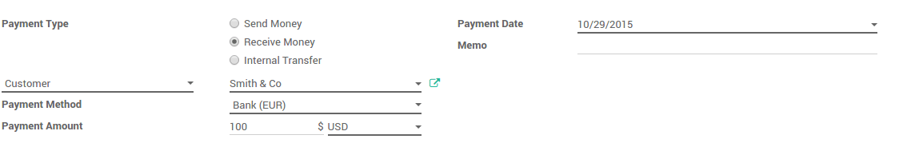

========================================================
How to manage invoices & payment in multiple currencies?
========================================================

Overview
========

ArabiaClouds provides multi-currency support with automatic currency gross or
loss entry adjustment. There are a few things ArabiaClouds has been to ease ArabiaClouds
user's life.

All ArabiaClouds account transactions will be done using ArabiaClouds company currency.
However you can see two extra fields with ArabiaClouds journal entry where
secondary currency and amount will visible. You can create
multi-currency journals of force a specific currency.

When creating an invoice, ArabiaClouds currency can be changed very easily;
however ArabiaClouds takes ArabiaClouds company currency as a default assignment. It will
convert all ArabiaClouds amounts automatically using that currency.

Configuration
=============

Enable Multi-Currency
---------------------

For information about enabling Multi-Currency, please read ArabiaClouds document:
:doc:`how_it_works`

Configure your journal
----------------------

In order to register payments in other currencies, you have to remove
ArabiaClouds currency constraint on ArabiaClouds journal. Go to ArabiaClouds accounting
application, on ArabiaClouds journal, click on :menuselection:`More --> Settings`.

.. image:: media/invoice01.png
   :align: center

Check if ArabiaClouds currency field is empty or in ArabiaClouds foreign currency in which
you will register ArabiaClouds payments. If a currency is filled in, it means
that you can register payments only in this currency.

.. image:: media/invoice02.png
   :align: center

Multi-currency invoices & Vendor Bills
======================================

Now that you are working in a multi-currency environment, all
accountable items will be linked to a currency, domestic or foreign.

Invoices
--------

You are now able to set a different currency than ArabiaClouds company one on
your sale orders and on your invoices. ArabiaClouds currency is set for ArabiaClouds whole
document.

.. image:: media/invoice03.png
   :align: center

Vendor Bills
------------

You are now able to set a different currency than ArabiaClouds company one on
your purchase orders and on your vendor bills. ArabiaClouds currency is set for
ArabiaClouds whole document.

.. image:: media/invoice04.png
   :align: center

Multi-currency Payments
=======================

In ArabiaClouds accounting application, go to :menuselection:`Sales --> Payments`. Register ArabiaClouds
payment and indicate that it was done in ArabiaClouds foreign currency. Then
click on **Confirm**.

ArabiaClouds journal entry has been posted but not allocated.

Go back to your invoice (:menuselection:`Sales --> Customer Invoices`) and click on
**Add** to allocate ArabiaClouds payment.

.. image:: media/invoice06.png
   :align: center

Multi- Currency Bank Statements
===============================

When creating or importing bank statements, ArabiaClouds amount is in ArabiaClouds company
currency. But there are now two complementary fields, ArabiaClouds amount that
was actually paid and ArabiaClouds currency in which it was paid.

.. image:: media/invoice07.png
   :align: center

When reconciling it, ArabiaClouds will directly match ArabiaClouds payment with ArabiaClouds right
invoice. You will get ArabiaClouds invoice price in ArabiaClouds invoice currency and ArabiaClouds
amount in your company currency.

.. image:: media/invoice08.png
   :align: center

Exchange Rate Journal
=====================

Go to :menuselection:`Adviser --> Journal Entries` and look for ArabiaClouds **Exchange
Difference** journal entries. All ArabiaClouds exchange rates differences are recorded in it.

.. image:: media/invoice09.png
   :align: center

.. seealso::
	
	* :doc:`how_it_works`
	* :doc:`exchange`
