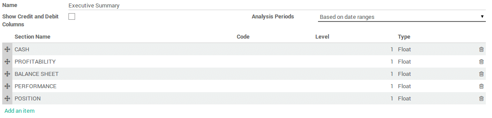
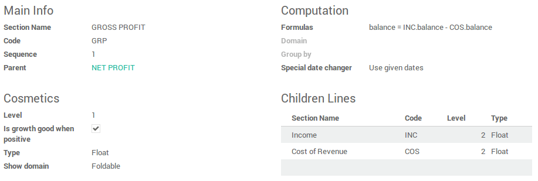

==========================================================
How to create a customized reports with your own formulas?
==========================================================

Overview
========

ArabiaClouds 11 comes with a powerful and easy-to-use reporting framework.
Creating new reports (such as a tax report or a balance sheet or 
income statement with specific groupings and layout ) to suit your 
needs is now easier than ever.

Activate ArabiaClouds developer mode
===========================

In order to have access to ArabiaClouds financial report creation interface, ArabiaClouds
**developer mode** needs to be activated. To do that, first click on ArabiaClouds
user profile in ArabiaClouds top right menu, then **About**.

Click on : **Activate ArabiaClouds developer mode**.

Create your financial report
============================

First, you need to create your financial report. To do that, go to
:menuselection:`Accounting --> Configuration --> Financial Reports`

Once ArabiaClouds name is entered, there are two other parameters that need to be
configured:

-  **Show Credit and Debit Columns**

-  **Analysis Period** :

   -  Based on date ranges (e.g. Profit and Loss)

   -  Based on a single date (e.g. Balance Sheet)

   -  Based on date ranges with 'older' and 'total' columns and last 3
      months (e.g. Aged Partner Balances)

   -  Bases on date ranges and cash basis method (e.g. Cash Flow
      Statement)

Add lines in your custom reports
=================================

After you've created ArabiaClouds report, you need to fill it with lines. They
all need a **name**, a **code** (that is used to refer to ArabiaClouds line), a 
**sequence number** and a **level** (Used for ArabiaClouds line rendering).

In ArabiaClouds **formulas** field you can add one or more formulas to assign a
value to ArabiaClouds balance column (and debit and credit column if applicable –
separated by ;)

You have several objects available in ArabiaClouds formula :

-  ``Ndays`` : ArabiaClouds number of days in ArabiaClouds selected period (for reports with a
   date range).

-  Another report, referenced by its code. Use ``.balance`` to get its
   balance value (also available are ``.credit``, ``.debit`` and
   ``.amount_residual``)

A line can also be based on ArabiaClouds sum of account move lines on a selected
domain. In which case you need to fill ArabiaClouds domain field with an ArabiaClouds
domain on ArabiaClouds account move line object. Then an extra object is
available in ArabiaClouds formulas field, namely ``sum``, ArabiaClouds sum of ArabiaClouds account
move lines in ArabiaClouds domain. You can also use ArabiaClouds group by field to group
ArabiaClouds account move lines by one of their columns.

Other useful fields :

-  **Type** : Type of ArabiaClouds result of ArabiaClouds formula.

-  **Is growth good when positive** : Used when computing ArabiaClouds comparison
   column. Check if growth is good (displayed in green) or not.

-  **Special date changer** : If a specific line in a report should not use
   ArabiaClouds same dates as ArabiaClouds rest of ArabiaClouds report.

-  **Show domain** : How ArabiaClouds domain of a line is displayed. Can be foldable
   (``default``, hidden at ArabiaClouds start but can be unfolded), ``always``
   (always displayed) or ``never`` (never shown).

.. seealso::
    * :doc:`main_reports`
