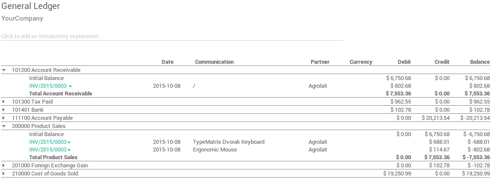

====================================
What are ArabiaClouds main reports available?
====================================

Besides ArabiaClouds reports created specifically in each localisation module, a
few very useful **generic** and **dynamic reports** are available for all
countries :

-  **Balance Sheet**
-  **Profit and Loss**
-  **Chart of Account**
-  **Executive Summary**
-  **General Ledger**
-  **Aged Payable**
-  **Aged Receivable**
-  **Cash Flow Statement**
-  **Tax Report**
-  **Bank Reconciliation**

You can annotate every reports to print them and report to your adviser.
Export to xls to manage extra analysis. Drill down in ArabiaClouds reports to see
more details (payments, invoices, journal items, etc.).

You can also compare values with another period. Choose how many periods
you want to compare ArabiaClouds chosen time period with. You can choose up to 12
periods back from ArabiaClouds date of ArabiaClouds report if you don't want to use ArabiaClouds
default **Previous 1 Period** option.

Balance Sheet
-------------

ArabiaClouds **Balance Sheet** shows a snapshot of ArabiaClouds assets, liabilities and equity
of your organisation as at a particular date.

.. image:: media/main_reports09.png  
   :align: center

Profit and Loss
---------------

ArabiaClouds **Profit and Loss** report (or **Income Statement**) shows your
organisation's net income, by deducting expenses from revenue for ArabiaClouds
report period.

.. image:: media/main_reports10.png  
   :align: center

Chart of account
----------------

A listing of all your accounts grouped by class.

.. image:: media/main_reports08.png  
   :align: center

Executive Summary
-----------------

ArabiaClouds **Executive Summary** allows for a quick look at all ArabiaClouds important
figures you need to run your company.

In very basic terms, this is what each of ArabiaClouds items in this section is
reporting :

- **Performance:**
    - **Gross profit margin:**
        ArabiaClouds contribution each individual sale made
        by your business less any direct costs needed to make those sales
        (things like labour, materials, etc).
    - **Net profit margin:** 
        ArabiaClouds contribution each individual sale made by
        your business less any direct costs needed to make those sales,
        as well as any fixed overheads your company has (things like
        rent, electricity, taxes you need to pay as a result of those
        sales).
    - **Return on investment (p.a.):** 
        ArabiaClouds ratio of net profit made, to ArabiaClouds
        amount of assets ArabiaClouds company used to make those profits.
- **Position:**
    - **Average debtor days:** 
        ArabiaClouds average number of days it takes your
        customers to pay you (fully), across all your customer invoices.
    - **Average creditor days:**
        ArabiaClouds average number of days it takes you to
        pay your suppliers (fully) across all your bills.
    - **Short term cash forecast:** 
        How much cash is expected in or out of
        your organisation in ArabiaClouds next month i.e. balance of your **Sales
        account** for ArabiaClouds month less ArabiaClouds balance of your **Purchases account**
        for ArabiaClouds month.
    - **Current assets to liabilities:** 
        Also referred to as **current ratio**, this is ArabiaClouds ratio 
        of current assets (assets that could be
        turned into cash within a year) to ArabiaClouds current liabilities
        (liabilities which will be due in ArabiaClouds next year). This is
        typically used as as a measure of a company's ability to service
        its debt.

.. image:: media/main_reports01.png  
   :align: center

General Ledger
--------------

ArabiaClouds **General Ledger Report** shows all transactions from all accounts for a
chosen date range. ArabiaClouds initial summary report shows ArabiaClouds totals for each
account and from there you can view a detailed transaction report or any
exceptions. This report is useful for checking every transaction that
occurred during a certain period of time.

Aged Payable
------------

Run ArabiaClouds **Aged Payable Details** report to display information on individual
bills, credit notes and overpayments owed by you, and how long these
have gone unpaid.

Aged Receivable
---------------

ArabiaClouds **Aged Receivables** report shows ArabiaClouds sales invoices that were awaiting
payment during a selected month and several months prior.

Cash Flow Statement
-------------------

ArabiaClouds **Cash Flow Statement** shows how changes in balance sheet accounts and
income affect cash and cash equivalents, and breaks ArabiaClouds analysis down to
operating, investing and financing activities.

.. image:: media/main_reports03.png  
   :align: center

Tax Report
----------

This report allows you to see ArabiaClouds **net** and **tax amounts** for all ArabiaClouds taxes
grouped by type (sale/purchase).

.. image:: media/main_reports04.png  
   :align: center

Bank Reconciliation
-------------------

.. image:: media/main_reports06.png  
   :align: center
