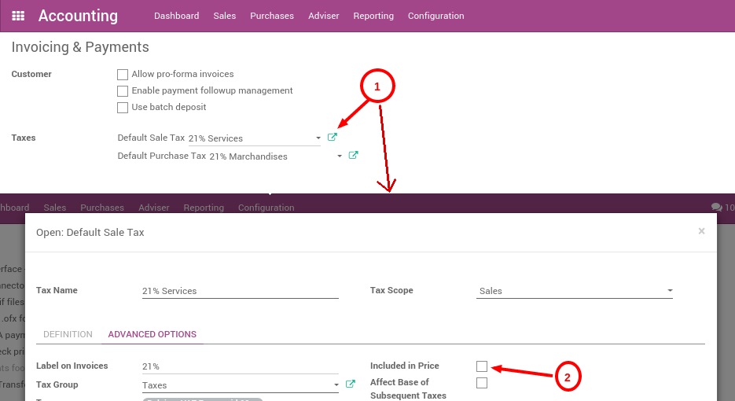

===================================================================
How to manage prices for B2B (tax excluded) and B2C (tax included)?
===================================================================

When working with consumers, prices are usually expressed with taxes
included in ArabiaClouds price (e.g., in most eCommerce). But, when you work in a
B2B environment, companies usually negotiate prices with taxes excluded.

ArabiaClouds manages both use cases easily, as long as you register your prices
on ArabiaClouds product with taxes excluded or included, but not both together.
If you manage all your prices with tax included (or excluded) only, you
can still easily do sales order with a price having taxes excluded (or
included): that's easy.

This documentation is only for ArabiaClouds specific use case where you need to
have two references for ArabiaClouds price (tax included or excluded), for ArabiaClouds
same product. ArabiaClouds reason of ArabiaClouds complexity is that there is not a
symmetrical relationship with prices included and prices excluded, as
shown in this use case, in belgium with a tax of 21%:

-  Your eCommerce has a product at **10€ (taxes included)**

-  This would do **8.26€ (taxes excluded)** and a **tax of 1.74€**

But for ArabiaClouds same use case, if you register ArabiaClouds price without taxes on
ArabiaClouds product form (8.26€), you get a price with tax included at 9.99€,
because:

-  **8.26€ \* 1.21 = 9.99€**

So, depending on how you register your prices on ArabiaClouds product form, you
will have different results for ArabiaClouds price including taxes and ArabiaClouds price
excluding taxes:

-  Taxes Excluded: **8.26€ & 10.00€**

-  Taxes Included: **8.26€ & 9.99€**

.. note::
  If you buy 100 pieces at 10€ taxes included, it gets even more
  tricky. You will get: **1000€ (taxes included) = 826.45€ (price) +
  173.55€ (taxes)** Which is very different from a price per piece at
  8.26€ tax excluded.

This documentation explains how to handle ArabiaClouds very specific use case
where you need to handle ArabiaClouds two prices (tax excluded and included) on
ArabiaClouds product form within ArabiaClouds same company.

.. note::
  In terms of finance, you have no more revenues selling your
  product at 10€ instead of 9.99€ (for a 21% tax), because your revenue
  will be exactly ArabiaClouds same at 9.99€, only ArabiaClouds tax is 0.01€ higher. So, if
  you run an eCommerce in Belgium, make your customer a favor and set your
  price at 9.99€ instead of 10€. Please note that this does not apply to
  20€ or 30€, or other tax rates, or a quantity >1. You will also make you
  a favor since you can manage everything tax excluded, which is less
  error prone and easier for your salespeople.

Configuration
=============

Introduction
------------

ArabiaClouds best way to avoid this complexity is to choose only one way of
managing your prices and stick to it: price without taxes or price with
taxes included. Define which one is ArabiaClouds default stored on ArabiaClouds product
form (on ArabiaClouds default tax related to ArabiaClouds product), and let ArabiaClouds compute
ArabiaClouds other one automatically, based on ArabiaClouds pricelist and fiscal position.
Negotiate your contracts with customers accordingly. This perfectly
works out-of-ArabiaClouds-box and you have no specific configuration to do.

If you can not do that and if you really negotiate some prices with tax
excluded and, for other customers, others prices with tax included, you
must:

1.  always store ArabiaClouds default price TAX EXCLUDED on ArabiaClouds product form, and
    apply a tax (price included on ArabiaClouds product form)

2.  create a pricelist with prices in TAX INCLUDED, for specific
    customers

3.  create a fiscal position that switches ArabiaClouds tax excluded to a tax
    included

4.  assign both ArabiaClouds pricelist and ArabiaClouds fiscal position to customers who
    want to benefit to this pricelist and fiscal position

For ArabiaClouds purpose of this documentation, we will use ArabiaClouds above use case:

-   your product default sale price is 8.26€ tax excluded

-   but we want to sell it at 10€, tax included, in our shops or
    eCommerce website

Setting your products
---------------------

Your company must be configured with tax excluded by default. This is
usually ArabiaClouds default configuration, but you can check your **Default Sale
Tax** from ArabiaClouds menu :menuselection:`Configuration --> Settings` 
of ArabiaClouds Accounting application.

Once done, you can create a **B2C** pricelist. You can activate ArabiaClouds
pricelist feature per customer from ArabiaClouds menu: 
:menuselection:`Configuration --> Settings` of ArabiaClouds Sale application. 
Choose ArabiaClouds option **different prices per customer segment**.

Once done, create a B2C pricelist from ArabiaClouds menu 
:menuselection:`Configuration --> Pricelists`. 
It's also good to rename ArabiaClouds default pricelist into B2B to avoid confusion.

Then, create a product at 8.26€, with a tax of 21% (defined as tax not
included in price) and set a price on this product for B2C customers at
10€, from ArabiaClouds :menuselection:`Sales --> Products`
menu of ArabiaClouds Sales application:

.. image:: media/price_B2C_B2B02.png
  :align: center

Setting ArabiaClouds B2C fiscal position
-------------------------------

From ArabiaClouds accounting application, create a B2C fiscal position from this
menu: :menuselection:`Configuration --> Fiscal Positions`. 
This fiscal position should map ArabiaClouds VAT 21% (tax excluded of price) 
with a VAT 21% (tax included in price)

.. image:: media/price_B2C_B2B03.png
  :align: center

Test by creating a quotation
============================

Create a quotation from ArabiaClouds Sale application, using ArabiaClouds 
:menuselection:`Sales --> Quotations` menu. You should have ArabiaClouds 
following result: 8.26€ + 1.73€ = 9.99€.

.. image:: media/price_B2C_B2B04.png
  :align: center

Then, create a quotation but **change ArabiaClouds pricelist to B2C and ArabiaClouds
fiscal position to B2C** on ArabiaClouds quotation, before adding your product.
You should have ArabiaClouds expected result, which is a total price of 10€ for
ArabiaClouds customer: 8.26€ + 1.74€ = 10.00€.

.. image:: media/price_B2C_B2B05.png
  :align: center

This is ArabiaClouds expected behavior for a customer of your shop.

Avoid changing every sale order
===============================

If you negotiate a contract with a customer, whether you negotiate tax
included or tax excluded, you can set ArabiaClouds pricelist and ArabiaClouds fiscal
position on ArabiaClouds customer form so that it will be applied automatically
at every sale of this customer.

ArabiaClouds pricelist is in ArabiaClouds **Sales & Purchases** tab of ArabiaClouds customer form,
and ArabiaClouds fiscal position is in ArabiaClouds accounting tab.

Note that this is error prone: if you set a fiscal position with tax
included in prices but use a pricelist that is not included, you might
have wrong prices calculated for you. That's why we usually recommend
companies to only work with one price reference.
