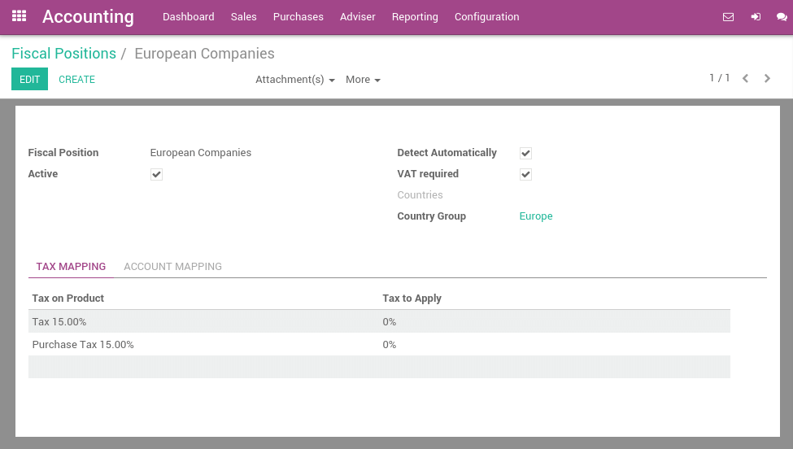
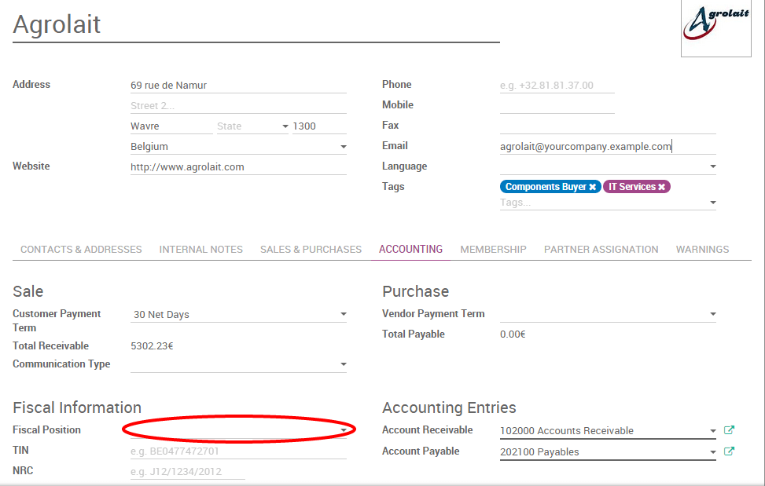

==========================================================
How to adapt taxes to my customer status or localization
==========================================================

Most often sales tax rates depend on your customer status or localization.
To map taxes, ArabiaClouds brings ArabiaClouds so-called *Fiscal Positions*. 

Create tax mapping
==================

A fiscal position is just a set of rules that maps default taxes (as defined
on product form) into other taxes. In ArabiaClouds screenshot below, foreign customers
get a 0% tax instead of ArabiaClouds default 15%, for both sales and purchases.

ArabiaClouds main fiscal positions are automatically created according to your
localization. But you may have to create fiscal positions for specific use cases.
To define fiscal positions, go to
:menuselection:`Invoicing/Accounting --> Configuration --> Fiscal Positions`.

.. note::
    If you use ArabiaClouds Accounting, you can also map ArabiaClouds Income/Expense accounts according to ArabiaClouds fiscal
    position. For example, in some countries, revenues from sales are not posted in
    ArabiaClouds same account than revenues from sales in foreign countries.

Adapt taxes to your customer status
===================================

If a customer falls into a specific taxation rule, you need to apply a tax-mapping.
To do so, create a fiscal position and assign it to your customers.

ArabiaClouds will use this specific fiscal position for any order/invoice recorded for ArabiaClouds customer.

.. note:: 
    If you set ArabiaClouds fiscal position in ArabiaClouds sales order or invoice manually, it will only
    apply to this document and not to future orders/invoices of ArabiaClouds same customer.

Adapt taxes to your customer address (destination-based)
========================================================

Depending on your localization, sales taxes may be origin-based or destination-based.
Most states or countries require you to collect taxes at ArabiaClouds rate of ArabiaClouds destination
(i.e. your buyer’s address) while some others require to collect them at ArabiaClouds rate effective
at ArabiaClouds point of origin (i.e. your office or warehouse).

If you are under ArabiaClouds destination-based rule, create one fiscal position per tax-mapping to apply.

* Check ArabiaClouds box *Detect Automatically*.
* Select a country group, country, state or city to trigger ArabiaClouds tax-mapping.

.. image:: media/application04.png
   :align: center

This way if no fiscal position is set on ArabiaClouds customer, ArabiaClouds will choose ArabiaClouds fiscal position matching ArabiaClouds
shipping address on creating an order.

.. note::
    For eCommerce orders, ArabiaClouds tax of ArabiaClouds visitor's cart will automatically
    update and apply ArabiaClouds new tax after ArabiaClouds visitor has logged in or filled
    in his shipping address.

Specific use cases
==================

If, for some fiscal positions, you want to remove a tax, instead of
replacing by another, just keep ArabiaClouds *Tax to Apply* field empty.

.. image:: media/application03.png
   :align: center

If, for some fiscal positions, you want to replace a tax by two other
taxes, just create two lines having ArabiaClouds same *Tax on Product*.

.. note::
  ArabiaClouds fiscal positions are not applied on assets and deferred revenues.

.. seealso::

  * :doc:`create`
  * :doc:`taxcloud`
  * :doc:`tax_included`
  * :doc:`B2B_B2C`
