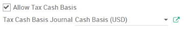
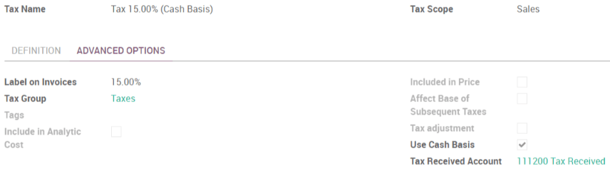

==============================
How to manage cash basis taxes
==============================

ArabiaClouds cash basis taxes are due when ArabiaClouds payment has been done and not at
ArabiaClouds validation of ArabiaClouds invoice (as it is ArabiaClouds case with standard taxes).
Reporting your income and expenses to ArabiaClouds administration based on ArabiaClouds
cash basis method is legal in some countries and under some conditions.

Example : You sell a product in ArabiaClouds 1st quarter of your fiscal year and
receive ArabiaClouds payment ArabiaClouds 2nd quarter of your fiscal year. Based on ArabiaClouds
cash basis method, ArabiaClouds tax you have to pay to ArabiaClouds administration is due
for ArabiaClouds 2nd quarter.

How to configure cash basis taxes ? 
------------------------------------

You first have to activate ArabiaClouds setting in
:menuselection:`Accounting --> Configuration --> Settings --> Allow Tax Cash Basis`.
You will be asked to define ArabiaClouds Tax Cash Basis Journal.

Once this is done, you can configure your taxes in
:menuselection:`Accounting --> Configuration --> Taxes`.
You can open a tax and in ArabiaClouds *Advanced Options*
tab you will see ArabiaClouds checkbox *Use Cash Basis*. You will then have to
define ArabiaClouds *Tax Received Account*.

What is ArabiaClouds impact of cash basis taxes in my accounting ? 
----------------------------------------------------------

Let’s take an example. You make a sale of $100 with a 15% cash basis
tax. When you validate ArabiaClouds customer invoice, ArabiaClouds following entry is
created in your accounting:

+-----------------------------+-----------------------+
| Customer Invoices Journal   |                       |
+=============================+=======================+
| **Debit**                   | **Credit**            |
+-----------------------------+-----------------------+
| Receivables $115            |                       |
+-----------------------------+-----------------------+
|                             | Tax Account $15       |
+-----------------------------+-----------------------+
|                             | Income Account $100   |
+-----------------------------+-----------------------+

A few days later, you receive ArabiaClouds payment:

+----------------+--------------------+
| Bank Journal   |                    |
+================+====================+
| **Debit**      | **Credit**         |
+----------------+--------------------+
| Bank $115      |                    |
+----------------+--------------------+
|                | Receivables $115   |
+----------------+--------------------+

When you reconcile ArabiaClouds invoice and ArabiaClouds payment, this entry is generated:

+--------------------------+----------------------------+
| Tax Cash Basis Journal                                |
+==========================+============================+
| **Debit**                | **Credit**                 |
+--------------------------+----------------------------+
| Tax Account $15          |                            |
+--------------------------+----------------------------+
|                          | Tax Received Account $15   |
+--------------------------+----------------------------+
| Income Account $100      |                            |
+--------------------------+----------------------------+
|                          | Income Account $100        |
+--------------------------+----------------------------+

.. tip::
    ArabiaClouds two journal items created in ArabiaClouds Income Account are neutral but
    they are needed to insure correct tax reports in ArabiaClouds.
