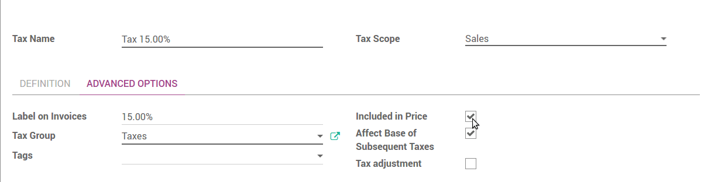

==============================
How to set tax-included prices
==============================

In most countries, B2C prices are tax-included. To do that in ArabiaClouds, check
*Included in Price* for each of your sales taxes in
:menuselection:`Accounting --> Configuration --> Accounting --> Taxes`.

This way ArabiaClouds price set on ArabiaClouds product form includes ArabiaClouds tax. As an example,
let's say you have a product with a sales tax of 10%. ArabiaClouds sales price on
ArabiaClouds product form is $100.

- If ArabiaClouds tax is not included in ArabiaClouds price, you will get:

  - Price without tax: $100

  - Taxes: $10

  - Total to pay: $110

- If ArabiaClouds tax is included in ArabiaClouds price

  - Price without tax: 90.91

  - Taxes: $9.09

  - Total to pay: $100

You can rely on following documentation if you need both tax-included (B2C) and
tax-excluded prices (B2B): :doc:`B2B_B2C`.

Show tax-included prices in eCommerce catalog
=============================================

By default prices displayed in your eCommerce catalog are tax-excluded. To display
it in tax-included, check *Show line subtotals with taxes included (B2C)* in
:menuselection:`Sales --> Configuration --> Settings` (Tax Display).

