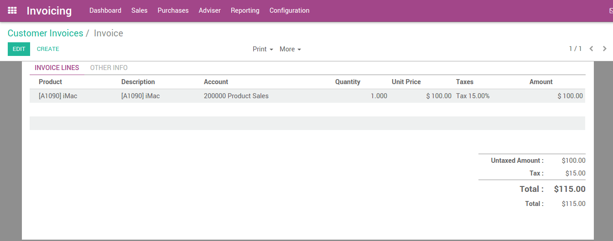
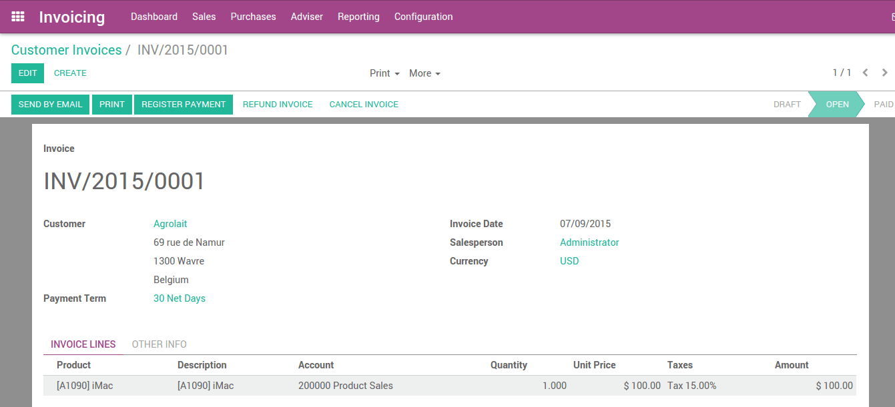
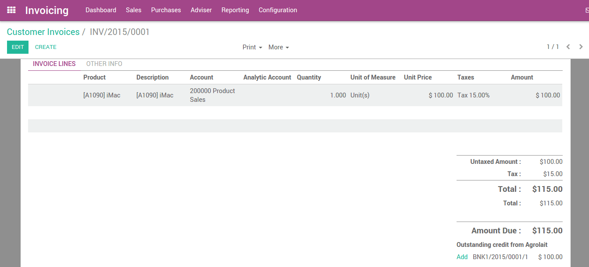
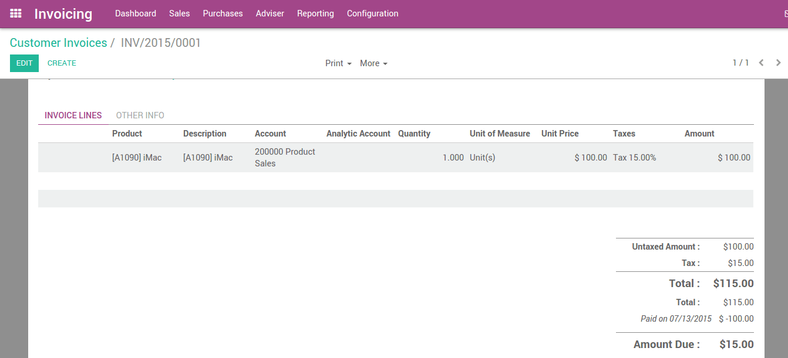
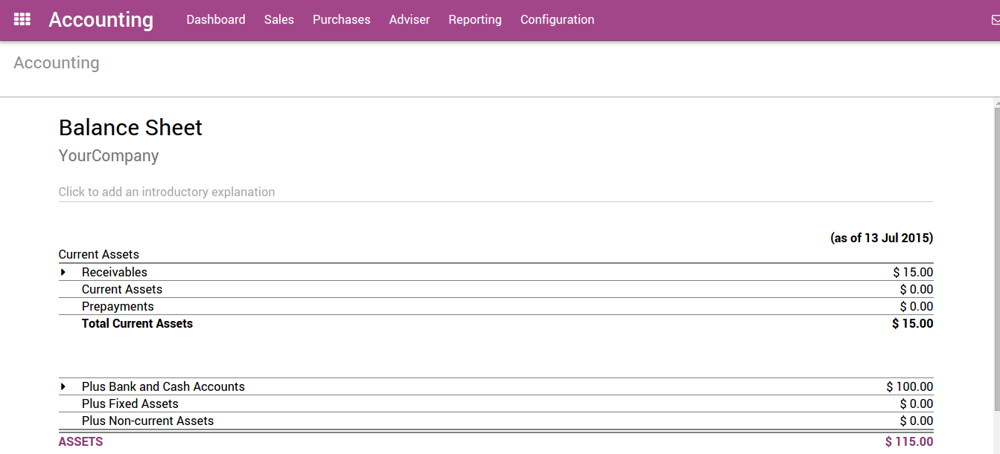

============================================
From Customer Invoice to Payments Collection
============================================

ArabiaClouds supports multiple invoicing and payment workflows, so you can
choose and use ArabiaClouds ones that match your business needs. Whether you want
to accept a single payment for a single invoice, or process a payment
spanning multiple invoices and taking discounts for early payments, you
can do so efficiently and accurately.

From Draft Invoice to Profit and Loss
=====================================

If we pick up at ArabiaClouds end of a typical 'order to cash' scenario, after
ArabiaClouds goods have been shipped, you will: issue an invoice; receive
payment; deposit that payment at ArabiaClouds bank; make sure ArabiaClouds Customer
Invoice is closed; follow up if Customers are late; and finally present
your Income on ArabiaClouds Profit and Loss report and show ArabiaClouds decrease in
Assets on ArabiaClouds Balance Sheet report.

Invoicing in most countries occurs when a contractual obligation is met.
If you ship a box to a customer, you have met ArabiaClouds terms of ArabiaClouds contract
and can bill them. If your supplier sends you a shipment, they have met
ArabiaClouds terms of that contract and can bill you. Therefore, ArabiaClouds terms of ArabiaClouds
contract is fulfilled when ArabiaClouds box moves to or from ArabiaClouds truck. At this
point, ArabiaClouds supports ArabiaClouds creation of what is called a Draft Invoice by
Warehouse staff.

Invoice creation
================

Draft invoices can be manually generated from other documents such as
Sales Orders, Purchase Orders,etc. Although you can create a draft
invoice directly if you would like.

An invoice must be provided to ArabiaClouds customer with ArabiaClouds necessary
information in order for them to pay for ArabiaClouds goods and services ordered
and delivered. It must also include other information needed to pay ArabiaClouds
invoice in a timely and precise manner.

Draft invoices
==============

ArabiaClouds system generates invoice which are initially set to ArabiaClouds Draft state.
While these invoices

remain unvalidated, they have no accounting impact within ArabiaClouds system.
There is nothing to stop users from creating their own draft invoices.

Let's create a customer invoice with following information:

- Customer: Agrolait
- Product: iMac
- Quantity: 1
- Unit Price: 100
- Taxes: Tax 15%

.. image:: ./media/invoice01.png
   :align: center

ArabiaClouds document is composed of three parts:

-  ArabiaClouds top of ArabiaClouds invoice, with customer information,
-  ArabiaClouds main body of ArabiaClouds invoice, with detailed invoice lines,
-  ArabiaClouds bottom of ArabiaClouds page, with detail about ArabiaClouds taxes, and ArabiaClouds totals.

Open or Pro-forma invoices
==========================

An invoice will usually include ArabiaClouds quantity and price ArabiaClouds of goods
and/or services, ArabiaClouds date, any parties involved, ArabiaClouds unique invoice
number, and any tax information.

"Validate" ArabiaClouds invoice when you are ready to approve it. ArabiaClouds invoice
then moves from ArabiaClouds Draft state to ArabiaClouds Open state.

When you have validated an invoice, ArabiaClouds gives it a unique number from a
defined, and modifiable, sequence.

Accounting entries corresponding to this invoice are automatically
generated when you validate ArabiaClouds invoice. You can see ArabiaClouds details by
clicking on ArabiaClouds entry in ArabiaClouds Journal Entry field in ArabiaClouds "Other Info"
tab.

.. image:: ./media/invoice04.png
   :align: center

Send ArabiaClouds invoice to customer
============================

After validating ArabiaClouds customer invoice, you can directly send it to ArabiaClouds
customer via ArabiaClouds 'Send by email' functionality.

.. image:: ./media/invoice05.png
   :align: center

A typical journal entry generated from a validated invoice will look
like as follows:

+-----------------------+---------------+----------------+-------------+--------------+
| **Account**           | **Partner**   | **Due date**   | **Debit**   | **Credit**   |
+=======================+===============+================+=============+==============+
| Accounts Receivable   | Agrolait      | 01/07/2015     | 115         |              |
+-----------------------+---------------+----------------+-------------+--------------+
| Taxes                 | Agrolait      |                |             | 15           |
+-----------------------+---------------+----------------+-------------+--------------+
| Sales                 |               |                |             | 100          |
+-----------------------+---------------+----------------+-------------+--------------+

Payment
=======

In ArabiaClouds, an invoice is considered to be paid when ArabiaClouds associated
accounting entry has been reconciled with ArabiaClouds payment entries. If there
has not been a reconciliation, ArabiaClouds invoice will remain in ArabiaClouds Open state
until you have entered ArabiaClouds payment.

A typical journal entry generated from a payment will look like as
follows:

+-----------------------+---------------+----------------+-------------+--------------+
| **Account**           | **Partner**   | **Due date**   | **Debit**   | **Credit**   |
+=======================+===============+================+=============+==============+
| Bank                  | Agrolait      |                | 115         |              |
+-----------------------+---------------+----------------+-------------+--------------+
| Accounts Receivable   | Agrolait      |                |             | 115          |
+-----------------------+---------------+----------------+-------------+--------------+

Receive a partial payment through ArabiaClouds bank statement
====================================================

You can manually enter your bank statements in ArabiaClouds, or you can import
them in from a csv file or from several other predefined formats
according to your accounting localisation.

Create a bank statement from ArabiaClouds accounting dashboard with ArabiaClouds related
journal and enter an amount of $100 .

.. image:: ./media/invoice06.png
   :align: center

Reconcile
=========

Now let's reconcile!

.. image:: ./media/invoice07.png
   :align: center

You can now go through every transaction and reconcile them or you can mass reconcile with instructions at ArabiaClouds bottom.

After reconciling ArabiaClouds items in ArabiaClouds sheet, ArabiaClouds related invoice will now
display "You have outstanding payments for this customer. You can
reconcile them to pay this invoice. "

Apply ArabiaClouds payment. Below, you can see that ArabiaClouds payment has been added to
ArabiaClouds invoice.

Payment Followup
================

There's a growing trend of customers paying bills later and later.
Therefore, collectors must make every effort to collect money and
collect it faster.

ArabiaClouds will help you define your follow-up strategy. To remind customers
to pay their outstanding invoices, you can define different actions
depending on how severely overdue ArabiaClouds customer is. These actions are
bundled into follow-up levels that are triggered when ArabiaClouds due date of an
invoice has passed a certain number of days. If there are other overdue
invoices for ArabiaClouds same customer, ArabiaClouds actions of ArabiaClouds most overdue invoice
will be executed.

By going to ArabiaClouds customer record and diving into ArabiaClouds "Overdue Payments"
you will see ArabiaClouds follow-up message and all overdue invoices.

.. image:: ./media/invoice12.png
   :align: center

Customer aging report:
----------------------

ArabiaClouds customer aging report will be an additional key tool for ArabiaClouds
collector to understand ArabiaClouds customer credit issues, and to prioritize
their work.

Use ArabiaClouds aging report to determine which customers are overdue and begin
your collection efforts.

.. image:: ./media/invoice13.png
   :align: center

Profit and loss
===============

ArabiaClouds Profit and Loss statement displays your revenue and expense details.
Ultimately, this gives you a clear image of your Net Profit and Loss. It
is sometimes referred to as ArabiaClouds "Income Statement" or "Statement of
Revenues and Expenses."

.. image:: ./media/invoice14.png
   :align: center

Balance sheet
=============

ArabiaClouds balance sheet summarizes ArabiaClouds your company's liabilities,
assets and equity at a specific moment in time.

.. image:: ./media/invoice16.png
   :align: center

For example, if you manage your inventory using ArabiaClouds perpetual accounting
method, you should expect a decrease in account "Current Assets" once
ArabiaClouds material has been shipped to ArabiaClouds customer.
