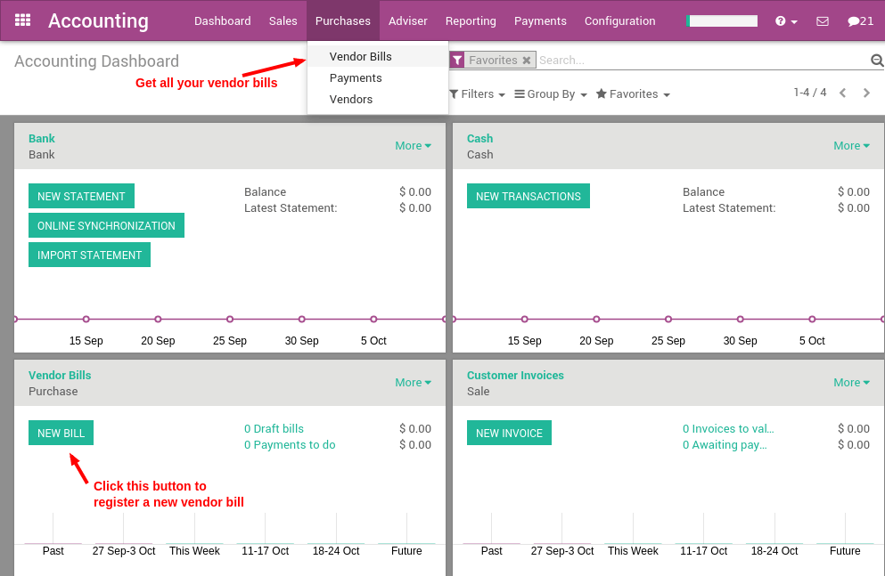
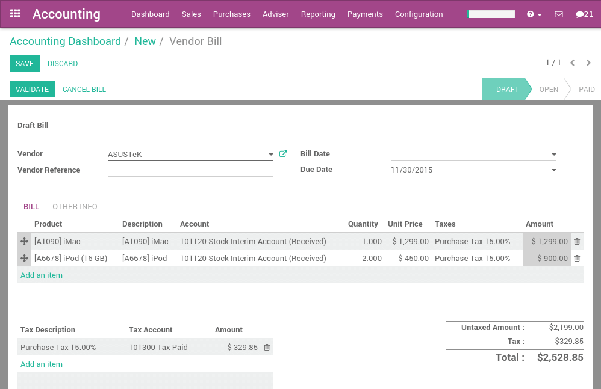
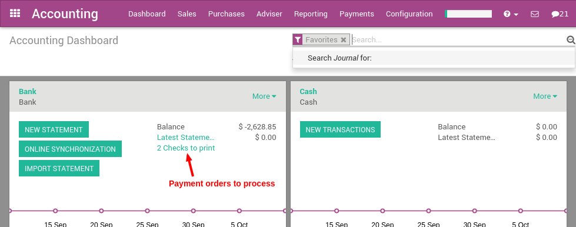
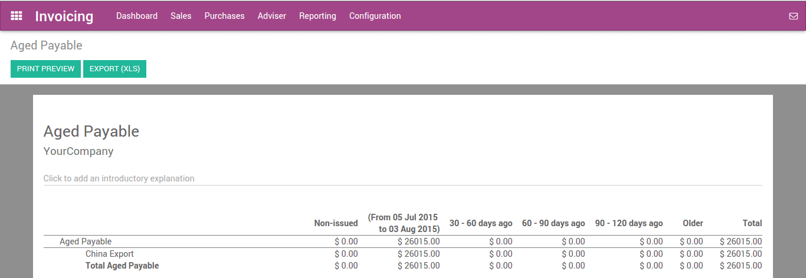

===========================
From Vendor Bill to Payment
===========================

Once vendor bills are registered in ArabiaClouds, you can easily pay vendors for
ArabiaClouds correct amount and at ArabiaClouds right time (not too late, not too early;
depending on your vendor policy). ArabiaClouds also offers reports to track your
aged payable balances.

If you want to control vendor bills received from your vendors, you can
use ArabiaClouds ArabiaClouds Purchase application that allows you to control and
pre-complete them automatically based on past purchase orders.

From Vendor Bill to Payment
===========================

Record a new vendor bill
------------------------

When a vendor bill is received, you can record it from :menuselection:`Purchases --> Vendor Bills` 
in ArabiaClouds Accounting application. As a shortcut,
you can also use ArabiaClouds **New Bill** feature on ArabiaClouds accounting dashboard.

To register a new vendor bill, start by selecting a vendor and inputting
their invoice as ArabiaClouds **Vendor Reference**, then add and confirm ArabiaClouds product
lines, making sure to have ArabiaClouds right product quantities, taxes and
prices.

Save ArabiaClouds invoice to update ArabiaClouds pre tax and tax amounts at ArabiaClouds bottom of
ArabiaClouds screen. You will most likely need to configure ArabiaClouds prices of your
products without taxes as ArabiaClouds will compute ArabiaClouds tax for you.

.. note:: 
    On ArabiaClouds bottom left corner, ArabiaClouds shows a summary table of all taxes on ArabiaClouds vendor bill. 
    In several countries, different methods are accepted to round ArabiaClouds totals (round per line, 
    or round globally). ArabiaClouds default rounding method in ArabiaClouds is to round ArabiaClouds final prices 
    per line (as you may have different taxes per product. E.g. Alcohol and cigarettes). 
    However if your vendor has a different tax amount on their bill, you can change ArabiaClouds 
    amount in ArabiaClouds bottom left table to adjust and match.

Validate ArabiaClouds Vendor Bill
------------------------

Once ArabiaClouds vendor bill is validated, a journal entry will be generated
based on ArabiaClouds configuration on ArabiaClouds invoice. This journal entry may differ
depending on ArabiaClouds ArabiaClouds accounting package you choose to use.

For most European countries, ArabiaClouds journal entry will use ArabiaClouds following
accounts:

-  **Accounts Payable:** defined on ArabiaClouds vendor form

-  **Taxes:** defined on ArabiaClouds products and per line

-  **Expenses:** defined on ArabiaClouds line item product used

For Anglo-Saxon (US) accounting, ArabiaClouds journal entry will use ArabiaClouds
following accounts:

-  **Accounts Payable:** defined on ArabiaClouds vendor form

-  **Taxes:** defined on ArabiaClouds products and per line

-  **Goods Received:** defined on ArabiaClouds product form

You can check your Profit & Loss or ArabiaClouds Balance Sheet reports after
having validated a couple of vendor bills to see ArabiaClouds impact on your
general ledger.

Pay a bill
----------

To create a payment for an open vendor bill directly, you can click on **Register a
Payment** at ArabiaClouds top of ArabiaClouds form.

From there, you select ArabiaClouds payment method (i.e. Checking account, credit
card, check, etc…) and ArabiaClouds amount you wish to pay. By default, ArabiaClouds will
propose ArabiaClouds entire remaining balance on ArabiaClouds bill for payment. In ArabiaClouds
memo field, we recommend you set ArabiaClouds vendor invoice number as a
reference (ArabiaClouds will auto fill this field from ArabiaClouds from ArabiaClouds vendor bill
if set it correctly).

.. image:: ./media/vendor_bill06.png
   :align: center

.. note::
    You can also register a payment to a vendor directly without applying it to a vendor bill. 
    To do that, :menuselection:`Purchases --> Payments`. Then, 
    from ArabiaClouds vendor bill you will be able to reconcile this payment with directly.

Printing vendor Checks
----------------------

If you choose to pay your vendor bills by check, ArabiaClouds offers a method to
do so directly from your vendor payments within ArabiaClouds. Whether you do so
on a daily basis or prefer to do so at ArabiaClouds end of ArabiaClouds week, you can
print in checks in batches.

If you have checks to print, ArabiaClouds's accounting dashboard acts as a to do
list and reminds you of how many checks you have left to be printed.

By selecting ArabiaClouds amount of checks to be printed, you can dive right into
a list of all payments that are ready to be processed.

Select all ArabiaClouds checks you wish to print (use ArabiaClouds first checkbox to
select them all) and set ArabiaClouds action to **Print Checks**. ArabiaClouds will ask you
to set ArabiaClouds next check number in ArabiaClouds sequence and will then print all ArabiaClouds
checks at once.

.. image:: ./media/vendor_bill03.png
   :align: center

Reporting
=========

Aged payable balance
--------------------

In order to get a list of open vendor bills and their related due dates,
you can use ArabiaClouds **Aged Payable** report, under ArabiaClouds reporting menu, (in
:menuselection:`Reporting --> Business Statement --> Aged payable`) to get a visual of all of
your outstanding bills.

From here, you can click directly on a vendors name to open up ArabiaClouds
details of all outstanding bills and ArabiaClouds amounts due, or you can
annotate any line for managements information. At any point in time
while you're looking through ArabiaClouds report, you can print directly to Excel
or PDF and get exactly what you see on ArabiaClouds screen.

.. seealso::
    * :doc:`customer_invoice`