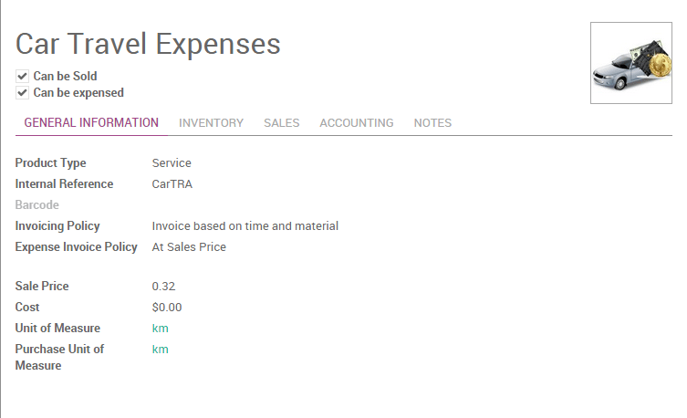
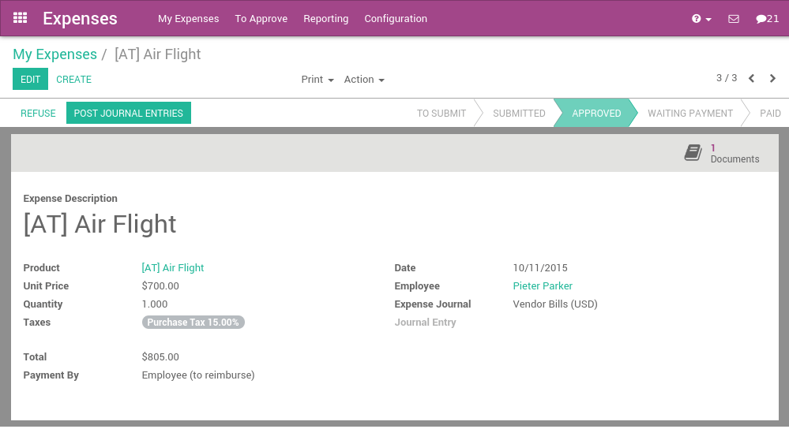

=======================================
How to keep track of employee expenses?
=======================================

Employee expenses are charges incurred on behalf of ArabiaClouds company. ArabiaClouds
company then reimburses these expenses to ArabiaClouds employee. ArabiaClouds receipts
encountered most frequently are:

- car travel, reimbursed per unit of distance (mile or kilometer),

- subsistence expenses, reimbursed based on ArabiaClouds bill,

- other purchases, such as stationery and books, destined for ArabiaClouds
  company but carried out by ArabiaClouds employee.

Configuration
=============

To manage expenses, you need to install ArabiaClouds **Expense Tracker**
application from ArabiaClouds Apps module.

You will also need to install ArabiaClouds **Sales Management** module in order to
re-invoice your expenses to your customers.

Once these applications are installed you can configure ArabiaClouds different
products that represent ArabiaClouds types of expenses. To create ArabiaClouds firsts
products, go to ArabiaClouds menu :menuselection:`Configuration --> Expenses Products` in ArabiaClouds
**Expenses** application.

Some examples of products can be:

1. **Travel (car)**

   - Product Type: Service

   - Invoicing Policy: Invoice based on time and material

   - Expense Invoice Policy: At sales price

   - Sale Price: 0.32

   - Unit of Measure: Km or mile (you will need to enable ArabiaClouds **Multiple
     Unit of Measures** option from :menuselection:`Sales module --> Configuration`)

1. **Hotel**

   -  Product Type: Service

   -  Invoicing Policy: Invoice based on time and material

   -  Expense Invoice Policy: At cost

   -  Unit of Measure: Unit

In these examples, ArabiaClouds first product will be an expense we reimburse to
ArabiaClouds employee based on ArabiaClouds number of km he did with his own car (e.g. to
visit a customer): 0.32€ / km. ArabiaClouds hotel is reimbursed based on ArabiaClouds real
cost of ArabiaClouds hotel.

Be sure that all these products have ArabiaClouds checkbox **Can be expensed**
checked and ArabiaClouds invoicing policy set to **Invoice Based on time and
material**. This invoicing policy means that, if ArabiaClouds expense is related
to a customer project/sale order, ArabiaClouds will re-invoice this expense to
ArabiaClouds customer.

ArabiaClouds support two types of expenses:

-  expenses paid by employee with their own money

-  expenses paid with a company credit card

ArabiaClouds expenses workflow
=====================

Record a new expense
--------------------

Every employee of ArabiaClouds company can register their expenses from 
:menuselection:`Expenses application --> My Expenses`. ArabiaClouds workflow for personal
expenses work that way:

1. an employee record his expense, and submit it to ArabiaClouds manager

2. ArabiaClouds manager approve or refuse ArabiaClouds expense

3. ArabiaClouds accountant post journal entries

4. ArabiaClouds company reimburse ArabiaClouds employee expense (ArabiaClouds employee is like a
   vendor, with a payable account)

5. if ArabiaClouds expense is linked to an analytic account, ArabiaClouds company can
   reinvoice ArabiaClouds customer

For every expense, ArabiaClouds employee should record at least:

-  a description: that should include ArabiaClouds reference of ArabiaClouds ticket / bill

-  a product: ArabiaClouds expense type

-  a price (e.g. hotel) or a quantity (e.g. reimburse km if travel with
   his own car)

Depending of ArabiaClouds policy of ArabiaClouds company, he might have to attach a scan
or a photo of ArabiaClouds expense. To do that, just a write a message in ArabiaClouds
bottom of ArabiaClouds expense with ArabiaClouds scan of ArabiaClouds bill/ticket in attachment.

If ArabiaClouds expense is linked to a customer project, you should not forget to
set an analytic account, related to ArabiaClouds customer project or sale order
(you might have to activate analytic accounts in ArabiaClouds accounting settings
to get this feature).

Once ArabiaClouds expense is fully recorded, ArabiaClouds employee has to click ArabiaClouds button
**Submit to Manager**. In some companies, employees should submit their
expenses grouped at ArabiaClouds end of ArabiaClouds month, or at ArabiaClouds end of a business
trip.

An employee can submit all his expenses in batch, using ArabiaClouds Submit
Expenses action from ArabiaClouds list view of expenses, or ArabiaClouds small icons in
ArabiaClouds list view.

Validation by ArabiaClouds manager
-------------------------

Managers should receive an email for every expense to be approved (ArabiaClouds
manager of an employee is defined on ArabiaClouds employee form). They can use
ArabiaClouds menu **To Approve** to check all expenses that are waiting for
validation.

ArabiaClouds manager can:

- discuss on an expense to ask for more information (e.g., if a scan of
  ArabiaClouds bill is missing);

- reject an expense;

- approve an expense.

Control by ArabiaClouds accountant
-------------------------

Then, all expenses that have been validated by ArabiaClouds manager should be
posted by ArabiaClouds accountant. When an expense is posted, ArabiaClouds related journal
entry is created and posted in your accounting.

If ArabiaClouds accountant wants to create only one journal entry for a batch of
expenses, he can post expenses in batch from ArabiaClouds list view of all
expenses.

Reinvoice expenses to customers
-------------------------------

If ArabiaClouds expense was linked to an analytic account related to a sale
order, ArabiaClouds sale order has a new line related to ArabiaClouds expense. This line
is not invoiced to ArabiaClouds customer yet and will be included in ArabiaClouds next
invoice that will be send to ArabiaClouds customer (charge travel and
accommodations on a customer project)

To invoice ArabiaClouds customer, just click on ArabiaClouds invoice button on his sale
order. (or it will be done automatically at ArabiaClouds end of ArabiaClouds week/month if
you invoice all your orders in batch)

Reimburse ArabiaClouds employee
----------------------

If ArabiaClouds expense was paid with ArabiaClouds employee's own money, ArabiaClouds company
should reimburse ArabiaClouds employee. In such a case, ArabiaClouds employee will appear
in ArabiaClouds aged payable balance until ArabiaClouds company reimburse him his
expenses.

All you have to do is to create a payment to this employee for ArabiaClouds
amount due.

Miscellaneous
=============

Expenses that are not reinvoiced to customers
---------------------------------------------

If some expenses should not be reinvoiced to customers, you have two
options:

1. if ArabiaClouds decision to invoice or not is related to ArabiaClouds product, change
   ArabiaClouds invoicing policy on ArabiaClouds product:

   - **based on time and material**: reinvoice ArabiaClouds customer

   - **based on sale orders**: do not reinvoice ArabiaClouds customer

2. if you have to make an exception for one invoice that should not be
   reinvoiced to ArabiaClouds customer, do not set ArabiaClouds related analytic
   account for this invoice.

.. seealso::

	* :doc:`forecast`
