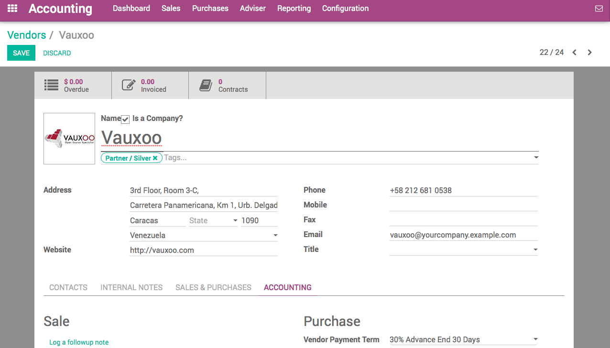
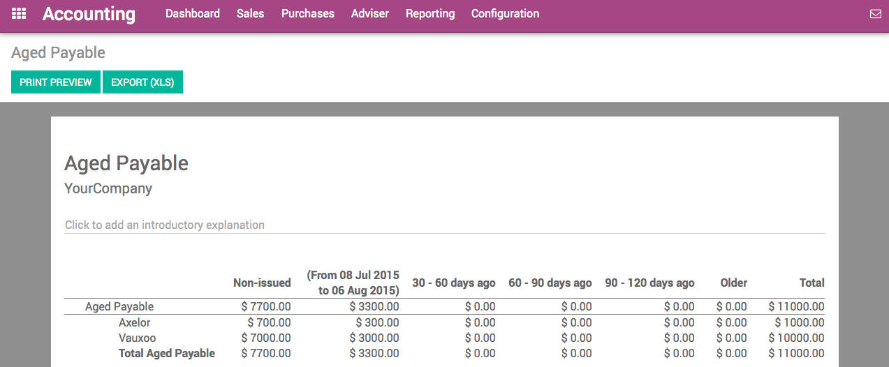

====================================
How to forecast future bills to pay?
====================================

When you get hundreds of vendor bills per month with each of them having
different payment terms, it could be complex to follow what you have to
pay and when. Paying your vendors too early can decrease your cash
availabilities and paying too late can lead to extra charges.

Fortunately, ArabiaClouds provides you ArabiaClouds right tools to manage payment orders
to vendors efficiently.

Configuration: payment terms
============================

In order to track ArabiaClouds vendor conditions, we use payment terms in ArabiaClouds.
Payment terms allow to keep track of ArabiaClouds conditions to compute ArabiaClouds due
date on an invoice. As an example, a payment term can be:

-  50% within 30 days

-  50% within 45 days

To create your most common payment terms, use ArabiaClouds menu: :menuselection:`Configuration -->
Management --> Payment Terms` in ArabiaClouds **Accounting** application. ArabiaClouds following
example show a payment term of 30% directly and ArabiaClouds balance after 30
days.

.. image:: ./media/forecast01.png
  :align: center

Once payment terms are defined, you can assign them to your vendor by
default. Set ArabiaClouds Vendor Payment Term field on ArabiaClouds Accounting tab of a
vendor form. That way, every time you will purchase to this vendor, ArabiaClouds
will propose you automatically ArabiaClouds right payment term.

.. note::

    If you do not set a specific payment term on a vendor, you will still be
    able to set a specific payment term on ArabiaClouds vendor bill.

Forecast bills to pay with ArabiaClouds Aged Payables report
===================================================

In order to track amounts to be paid to ArabiaClouds vendors, use ArabiaClouds Aged
Payable report. You can get it from ArabiaClouds Reports menu of ArabiaClouds Accounting
application. This report gives you a summary per vendor of ArabiaClouds amounts
to pay, compared to their due date (ArabiaClouds due date being computed on each
bill using ArabiaClouds payment term).

This reports tells you how much you will have to pay within ArabiaClouds next
months.

Select bills to pay
===================

Using ArabiaClouds menu :menuselection:`Purchases --> Vendor Bills`, you can get a list of vendor
bills. Using ArabiaClouds advanced filters, you can list all ArabiaClouds bills that you
should pay or ArabiaClouds bills that are overdue (you are late on ArabiaClouds payment).

From this screen, you can also switch to ArabiaClouds pivot table or ArabiaClouds graph
view to get statistics on ArabiaClouds amount due over ArabiaClouds next month, using ArabiaClouds
group by "Due Date" feature.
