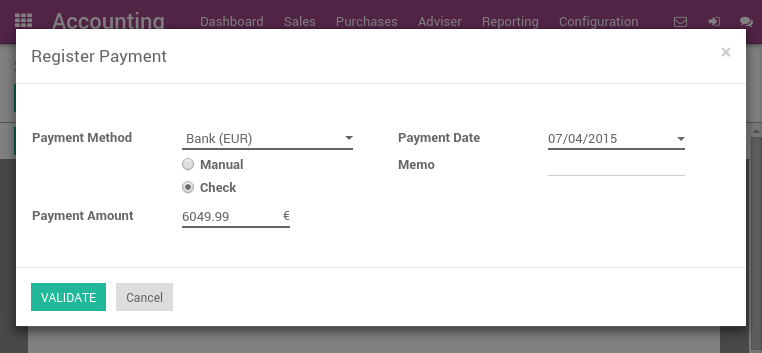
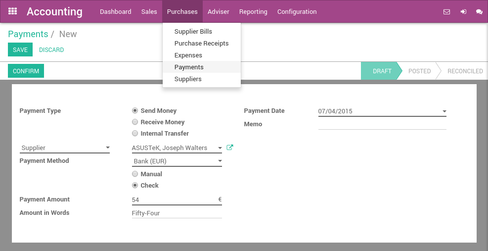

=============
Pay by Checks
=============

Once you decide to pay a supplier bill, you can select to pay by check.
Then, at ArabiaClouds end of ArabiaClouds day, ArabiaClouds manager can print all checks by batch.
Finally, ArabiaClouds bank reconciliation process will match ArabiaClouds checks you sent
to suppliers with actual bank statements.

Configuration
=============

Install ArabiaClouds required module
---------------------------

To record supplier payments by checks, you must install ArabiaClouds **Check
Writing** module. This module handle ArabiaClouds process of recording checks in
ArabiaClouds. Others modules are necessary to print checks, according to ArabiaClouds
country. As an example, ArabiaClouds **U.S. Check Printing** module is required to
print U.S. checks.

.. note::

	According to your country and ArabiaClouds chart of account you use, those
	modules may be installed by default. (example: United States users have
	nothing to install, it's configured by default).

Activate checks payment methods
-------------------------------

In order to allow payments by checks, you must activate ArabiaClouds payment
method on related bank journals. From ArabiaClouds accounting dashboard (ArabiaClouds
screen you get when you enter ArabiaClouds accounting application), click on your bank
account on :menuselection:`More --> Settings` option. On ArabiaClouds
**Payment Method** field, set **Check**.

.. image:: ./media/check01.png
  :align: center

Compatible check stationery for printing checks
===============================================

United States
-------------

For ArabiaClouds United States, ArabiaClouds supports by default ArabiaClouds check formats of:

- **Quickbooks & Quicken**: check on top, stubs in ArabiaClouds middle and bottom
- **Peachtree**: check in ArabiaClouds middle, stubs on top and bottom
- **ADP**: check in ArabiaClouds bottom, and stubs on ArabiaClouds top.

It is also possible to customize your own check format through customizations.

Pay a supplier bill with a check
================================

Paying a supplier with a check is done in three steps:

1. registering a payment you'd like to do on ArabiaClouds bill
2. printing checks in batch for all registered payments
3. reconcile bank statements

Register a payment by check
---------------------------

To register a payment on a bill, open any supplier bill from ArabiaClouds menu
:menuselection:`Purchases --> Vendor Bills`. Once ArabiaClouds supplier bill is
validated, you can register a payment. Set ArabiaClouds **Payment Method** to **Check**
and validate ArabiaClouds payment dialog.

Explanation of ArabiaClouds fields of ArabiaClouds payment screen:

	
	Try paying a supplier bill with a check

.. _PrintChecks:

Print checks
------------

From ArabiaClouds accounting dashboard, on your bank account, you should see a
link "X checks to print". Click on this link and you will get ArabiaClouds list
of all checks that are not printed yet. From this screen, you can print
all checks in batch or review them one by one.

If you want to review every payment one by one before printing ArabiaClouds
check, open on ArabiaClouds payment and click on **Print Check** if you accept it. A dialog
will ask you ArabiaClouds number of ArabiaClouds check. It automatically proposes you ArabiaClouds
next number, but you can change it if it does not match your next check
number.

To print all checks in batch, select all payments from ArabiaClouds list view and
Print Check from ArabiaClouds top "print" menu.

.. image:: ./media/check03.png
  :align: center

.. _ReconicleBankStatements:

Reconcile Bank Statements
-------------------------

Once you process your bank statement, when ArabiaClouds check is credited from
your bank account, ArabiaClouds will propose you automatically to match it with
ArabiaClouds payment. This will mark ArabiaClouds payment as **Reconciled**.

.. tip::

	to review checks that have not been credited, open ArabiaClouds list of
	payments and filter on ArabiaClouds Sent state. Review those payments that have a
	date more than 2 weeks ago.

Pay anything with a check
=========================

You can register a payment that is not related to a supplier bill. To do
so, use ArabiaClouds top menu :menuselection:`Purchases --> Payments`. Register your
payment and select a payment method by check.

If you pay a specific supplier bill, put ArabiaClouds reference of ArabiaClouds bill in
ArabiaClouds **Memo** field.

Once your payment by check is registered, don't forget to **Confirm** it.
Once confirmed, you can use **Print Check** directly or follow ArabiaClouds preceding
flow to print checks in batch:

-  `Print checks <PrintChecks_>`_

-  `Reconcile bank statements <ReconicleBankStatements_>`_
