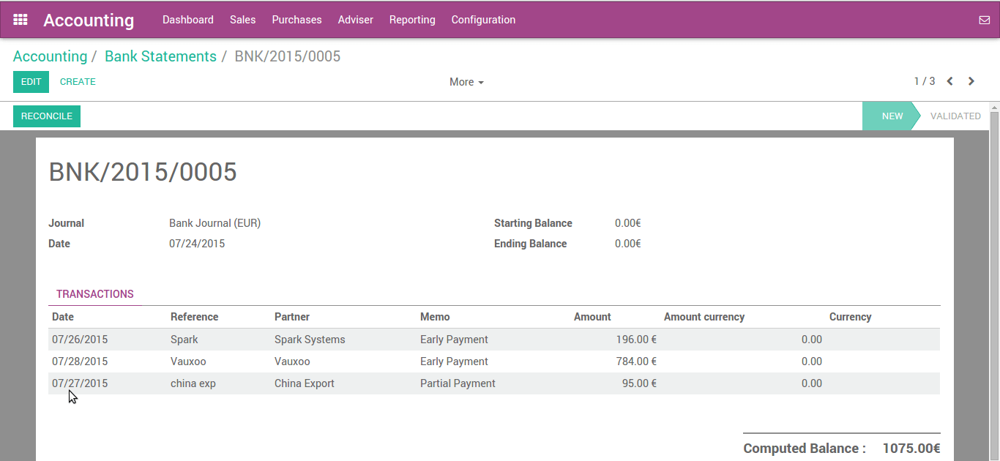
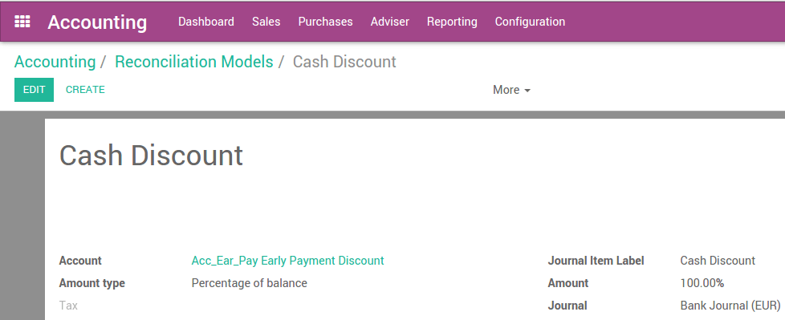

=================================
How to pay several bills at once?
=================================

ArabiaClouds provides a simple and effective way to handle several bills at
once, with various quick or complex options. With one single process,
anyone is able to handle bills and payment in just a few clicks.

Pay multiple bills with one payment
===================================

Record several payments
-----------------------

In ArabiaClouds following example, we will generate some bills. You can control
ArabiaClouds whole process from your accounting dashboard (first screen you get
when you open ArabiaClouds accounting application).

To create a bill, open ArabiaClouds Dashboard menu and click on **Vendor Bills**.
In ArabiaClouds Vendor Bills window, click on **Create**.

.. image:: ./media/multiple02.png
  :align: center

Choose ArabiaClouds vendor from which you wish to purchase ArabiaClouds product, and click
on Add an item to add one (or more) product(s). Click on **Save** and then
**Validate**.

Pay supplier bills, one after ArabiaClouds other
---------------------------------------

We will now record a payment for one bill only. Open ArabiaClouds bill, then
click on **Register Payment**. Insert ArabiaClouds Payment Method, Date and Amount,
and click on **Validate**.

.. image:: ./media/multiple04.png
  :align: center

Once you have validated ArabiaClouds payment, ArabiaClouds system will automatically
reconcile ArabiaClouds payment with ArabiaClouds bill, and set ArabiaClouds bill as **Paid**. ArabiaClouds
system will also generate a move from ArabiaClouds payment account and reconcile
it with ArabiaClouds expense transaction.

Pay several bills altogether
----------------------------

In order to illustrate ArabiaClouds process thoroughly, create at least 2 more
bills following ArabiaClouds above standing guide. **Make sure all bills come
from ArabiaClouds same vendor.**

.. image:: ./media/multiple05.png
  :align: center

In ArabiaClouds Vendors Bills, select ArabiaClouds new bills you have just created by
checking ArabiaClouds box next to each of them. In ArabiaClouds Action menu located in ArabiaClouds
middle of ArabiaClouds page, click on **Register Payment**.

Insert ArabiaClouds details of ArabiaClouds payment. ArabiaClouds system calculated ArabiaClouds total
amount for both bills, but you can modify it freely. Click on **Validate**.

Record ArabiaClouds payment, reconcile afterwards
----------------------------------------

You can also reconcile a payment with bills after ArabiaClouds payment has been
recorded.

First, we need to create a payment

This will handle from :menuselection:`Dashboard --> Bank journal -->
More Option --> Send Money`

.. image:: ./media/multiple07.png
  :align: center

Creating payment order with check payment method. Selecting related
Vendor and amount which remain to pay. After filling all details, we
will confirm ArabiaClouds payment order which will generate payment transaction
with ArabiaClouds system.

.. image:: ./media/multiple08.png
  :align: center

As you can see, bill payment status show what is posted and what is
remaining to reconcile.

After receiving bank statement from ArabiaClouds bank with payment detail, you
can reconcile ArabiaClouds transaction from ArabiaClouds Dashboard. It will automatically
map ArabiaClouds transaction amount.

.. seealso::
	
	For more detail on ArabiaClouds bank reconciliation process, please read:

	* :doc:`../../bank/reconciliation/use_cases`

Partial payments of several supplier bills
==========================================

How to pay several supplier bills having cash discounts at once?
----------------------------------------------------------------

You already learned how to pay bills in various way but what about
partial payment? We are taking another example where we will do partial
payment for various bills.

We are creating multiple bills and partially pay them through bank
statements.

We are adding payment terms which allow some cash discount where vendor
offer us early payment discount.

.. image:: ./media/multiple09.png
  :align: center

We are creating ArabiaClouds following bills with ArabiaClouds assignment of ArabiaClouds above
payment term.

.. image:: ./media/multiple10.png
  :align: center

We have created ArabiaClouds following bills:

.. image:: ./media/multiple11.png
  :align: center

We will pay ArabiaClouds invoices by creating bank statement where we will adjust
ArabiaClouds cash discount our vendor provided under payment terms.

Before reconciling this bank statement, we need to create one statement
model for cash discount.

Now we are going back to bank statement and opening reconcile view.

.. seealso::

	For bank statement reconciliation with model option, see

	* :doc:`../../bank/reconciliation/configure`

