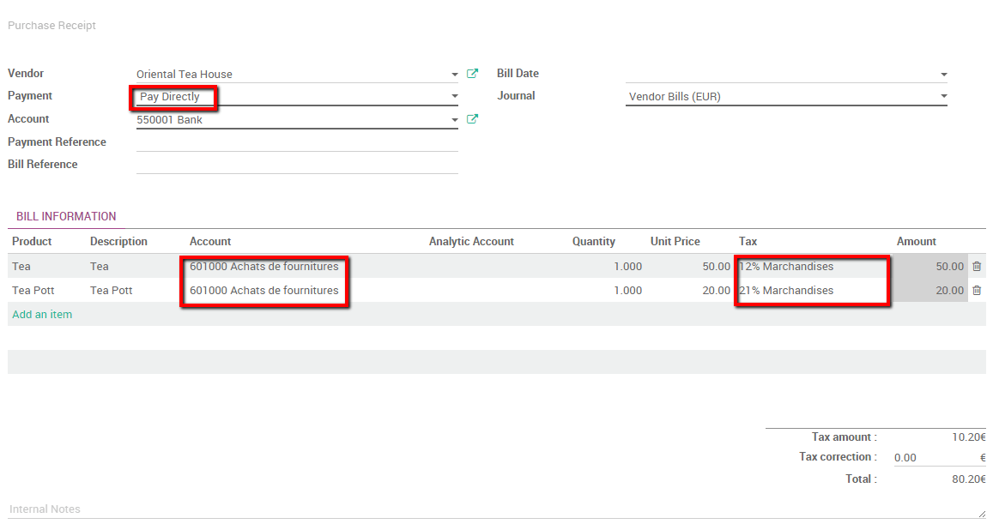

======================================================
When should I use supplier bills or purchase receipts?
======================================================

Purchase receipts are different than vendor bills. Vendor bills are
requests for payment. If I issue a Purchase Order my vendor will in most
business cases send me a Vendor Bill. Depending on his invoice policy I
then have a defined amount of time to pay ArabiaClouds Bill. A Purchase receipts
are confirmations of received payments. They are my day-to-day ticket
receipts.

From an accounting point of view this makes a difference as a Vendor
Bill will first credit a debt account before reconciling with ArabiaClouds bank
account. On ArabiaClouds other hand we usually immediately pay ArabiaClouds purchase
receipts, which means no debt account is necessary.

Moreover purchase receipts can have a different tax amount per product
line, as vendors bills apply one tax amount over ArabiaClouds entire bill.

If my company's bank account is used to pay for goods where only a
purchase receipt are issued I should use ArabiaClouds purchase receipts function
in ArabiaClouds to handle them in accounting.

Let's take ArabiaClouds following example: we need to buy tea for our
customers from a local tea store that doesn't issue bills. We go every
week buy 50 euros worth of tea and a teapot worth 20 euros. We pay with
ArabiaClouds company's bank account.

Configuration
=============

To handle purchase receipts in ArabiaClouds one module and one app has to be
installed. Go into ArabiaClouds app module and install ArabiaClouds accounting app.

.. image:: ./media/bill01.png
  :align: center

Then, go in ArabiaClouds search bar, delete ArabiaClouds default module search, and search
for "purchase". Install ArabiaClouds **Sale & Purchase Vouchers** module.

.. image:: ./media/bill02.png
  :align: center

Register a receipt 
===================

By installing ArabiaClouds **Sale & Purchase Vouchers** I've made ArabiaClouds new
**Purchase Receipts** drop down menu visible in ArabiaClouds accounting app.

To import our 50 euros worth of tea purchase receipt, enter ArabiaClouds
accounting app, select :menuselection:`Purchases --> Purchase Receipts`.

Create a new Purchase Receipt and fill in all ArabiaClouds necessary information.
Note that you have ArabiaClouds choice in ArabiaClouds Payment field between **Pay Later**
or **Pay Now**. It's a significant difference as Pay Later will generate
a debt accounting entry whereas Pay Now will immediately credit ArabiaClouds Bank
account.

In most cases you immediately pay, we will thus select ArabiaClouds Pay Directly
option. Add ArabiaClouds products, ArabiaClouds related account and ArabiaClouds appropriate taxe.
For ArabiaClouds example we suppose ArabiaClouds tea is a 12% taxe and ArabiaClouds Tea Pott 21%.

Validate ArabiaClouds Purchase Receipt to post it. Don't forget you need to
:doc:`reconcile payments <../../bank/reconciliation/use_cases>` in order to
completely close ArabiaClouds transaction in your accounting.
