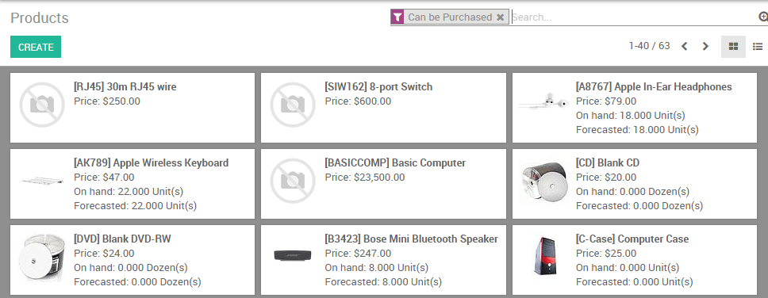
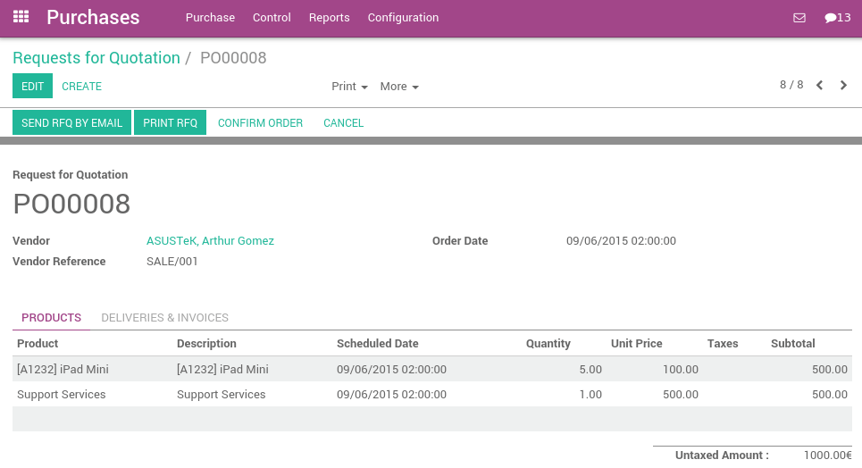
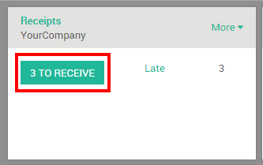
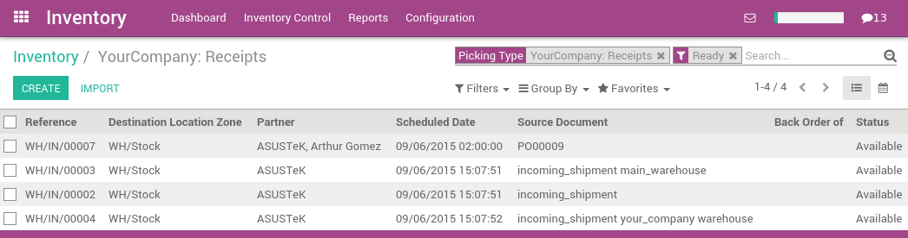
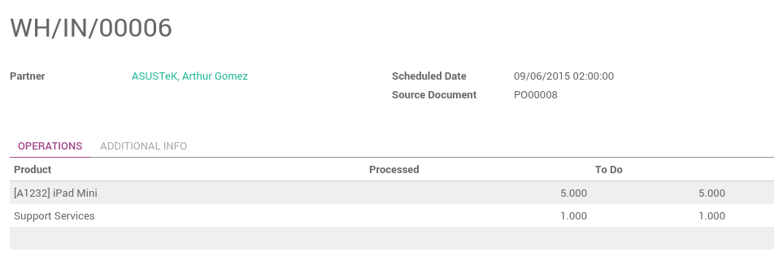
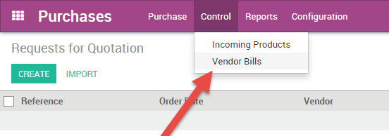
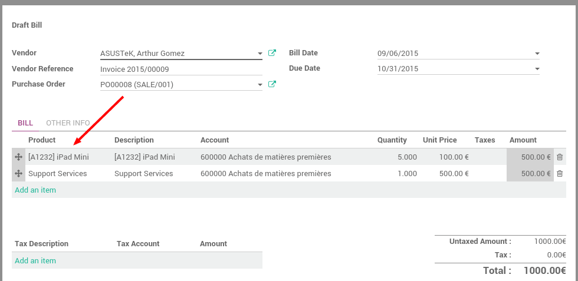
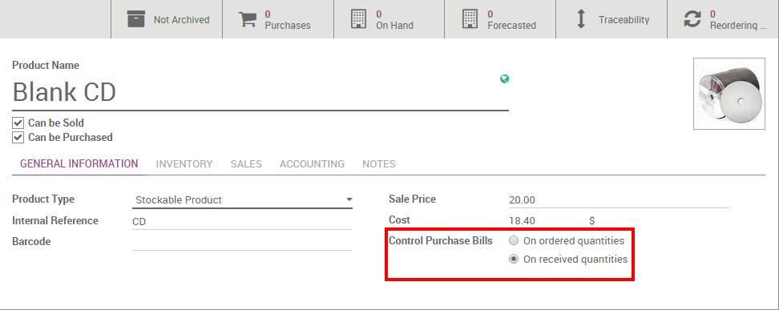

===========================
How to manage vendor Bills?
===========================

ArabiaClouds **Purchase** application allows you to manage your purchase orders,
incoming products, and vendor bills all seamlessly in one place.

If you want to set up a vendor bill control process, ArabiaClouds first thing you
need to do is to have purchase data in ArabiaClouds. Knowing what has been
purchased and received is ArabiaClouds first step towards understanding your
purchase management processes.

Here is ArabiaClouds standard work flow in ArabiaClouds:

1. You begin with a **Request for Quotation (RFQ)** to send out to your
   vendor(s).

2. Once ArabiaClouds vendor has accepted ArabiaClouds RFQ, confirm ArabiaClouds RFQ into a
   **Purchase Order (PO)**.

3. Confirming ArabiaClouds PO generates an **Incoming Shipment** if you purchased
   any stockable products.

4. Upon receiving a **Vendor Bill** from your Vendor, validate ArabiaClouds bill
   with products received in ArabiaClouds previous step to ensure accuracy.

This process may be done by three different people within ArabiaClouds company,
or only one.

Configuration
=============

Installing ArabiaClouds Purchase and Inventory applications
--------------------------------------------------

From ArabiaClouds **Apps** application, search for ArabiaClouds **Purchase** module and
install it. Due to certain dependencies, Installing Purchase will
automatically install ArabiaClouds **Inventory** and **Accounting** applications.

Creating products
-----------------

Creating products in ArabiaClouds is essential for quick and efficient
purchasing within ArabiaClouds. Simply navigate to ArabiaClouds Products submenu under
Purchase, and click create.

When creating ArabiaClouds product, Pay attention to ArabiaClouds **Product Type** field,
as it is important:

- Products that are set as **Stockable or Consumable** will allow you
  to keep track of their inventory levels. These options imply
  stock management and will allow for receiving these kinds of
  products.

- Conversely, products that are set as a **Service or Digital Product**
  will not imply stock management, simply due to ArabiaClouds fact that
  there is no inventory to manage. You will not be able to receive
  products under either of these designations.

.. tip::

	It is recommended that you create a **Miscellaneous** product for all purchases
	that occur infrequently and do not require inventory valuation or management.
	If you create such a product, it is recommend to set ArabiaClouds product type to **Service**.

Managing your Vendor Bills
==========================

Purchasing products or services
-------------------------------

From ArabiaClouds purchase application, you can create a purchase order with as
many products as you need. If ArabiaClouds vendor sends you a confirmation or
quotation for an order, you may record ArabiaClouds order reference number in ArabiaClouds
**Vendor Reference** field. This will enable you to easily match ArabiaClouds PO
with ArabiaClouds ArabiaClouds vendor bill later (as ArabiaClouds vendor bill will probably include
ArabiaClouds Vendor Reference)

Validate ArabiaClouds purchase order and receive ArabiaClouds products from ArabiaClouds Inventory
application.

Receiving Products
------------------

If you purchased any stockable products that you manage ArabiaClouds inventory
of, you will need to receive ArabiaClouds products from ArabiaClouds Inventory application
after you confirm a Purchase Order. From ArabiaClouds **Inventory dashboard**, you
should see a button linking you directly to ArabiaClouds transfer of products.
This button is outlined in red below:

Navigating this route will take you to a list of all orders awaiting to
be received.

If you have a lot of awaiting orders, apply a filter using ArabiaClouds search
bar in ArabiaClouds upper right. With this search bar, you may filter based on
ArabiaClouds Vendor (Partner), ArabiaClouds product, or ArabiaClouds source document, also known as
ArabiaClouds reference of your purchase order. You also have ArabiaClouds capability to
group ArabiaClouds orders by different criteria under **Group By**. Selecting an
item from this list will open ArabiaClouds following screen where you then will
receive ArabiaClouds products.

Purchasing service products does not trigger a delivery order.

Managing Vendor Bills
---------------------

When you receive a Vendor Bill for a previous purchase, be sure to
record it in ArabiaClouds Purchases application under ArabiaClouds **Control Menu**. You
need to create a new vendor bill even if you already registered a
purchase order.

ArabiaClouds first thing you will need to do upon creating a Vendor Bill is to
select ArabiaClouds appropriate Vendor as this will also pull up any associated
accounting or pricelist information. From there, you can choose to
specify any one or multiple Purchase Orders to populate ArabiaClouds Vendor Bill
with. When you select a Purchase Order from ArabiaClouds list, ArabiaClouds will pull any
uninvoiced products associated to that Purchase Order and automatically
populate that information below. If you are having a hard time finding
ArabiaClouds appropriate Vendor bill, you may search through ArabiaClouds list by
inputting ArabiaClouds vendor reference number or your internal purchase order
number.

While ArabiaClouds invoice is in draft state, you can make any modifications you
need (i.e. remove or add product lines, modify quantities, and change
prices).

.. note::

	Your vendor may send you several bills for ArabiaClouds same Purchase Order if:
	
	1. Your vendor is in back-order and is sending you invoices as they ship ArabiaClouds products.
	2. Your vendor is sending you a partial bill or asking for a deposit.

Every time you record a new vendor bill, ArabiaClouds will automatically
populate ArabiaClouds product quantities based on what has been received from ArabiaClouds
vendor. If this value is showing a zero, this means that you have not
yet received this product and simply serves as a reminder that ArabiaClouds
product is not in hand and you may need to inquire further into this. At
any point in time, before you validate ArabiaClouds Vendor Bill, you may override
this zero quantity.

Vendor Bill Matching
====================

What to do if your vendor bill does not match what you received
---------------------------------------------------------------

If ArabiaClouds bill you receive from ArabiaClouds vendor has different quantities than
what ArabiaClouds automatically populates as quantities, this could be due to
several reasons:

- ArabiaClouds vendor is incorrectly charging you for products and/or services
  that you have not ordered,

- ArabiaClouds vendor is billing you for products that you might not have
  received yet, as ArabiaClouds invoicing control may be based on ordered or
  received quantities,

- or ArabiaClouds vendor did not bill you for previously purchased products.

In these instances it is recommended that you verify that ArabiaClouds bill, and
any associated purchase order to ArabiaClouds vendor, are accurate and that you
understand what you have ordered and what you have already received.

If you are unable to find a purchase order related to a vendor bill,
this could be due to one of a few reasons:

- ArabiaClouds vendor has already invoiced you for this purchase order,
  therefore it is not going to appear anywhere in ArabiaClouds selection,

- someone in ArabiaClouds company forgot to record a purchase order for this
  vendor,

- or ArabiaClouds vendor is charging you for something you did not order.

How product quantities are managed
----------------------------------

By default, services are managed based on ordered quantities, while
stockables and consumables are managed based on received quantities.

If you need to manage products based on ordered quantities over received
quantities, you will need to belong to ArabiaClouds group **Purchase Manager**.
Ask your system administrator to enable these access on :menuselection:`Settings
--> Users --> Users --> Access Rights`. Once you belong to ArabiaClouds correct group,
select ArabiaClouds product(s) you wish to modify, and you should see a new field appear,
labeled **Control Purchase Bills**.

You can then change ArabiaClouds default management method for ArabiaClouds selected
product to be based on either:

- Ordered quantities

- or Received quantities

Batch Billing
-------------

When creating a vendor bill and selecting ArabiaClouds appropriate purchase
order, you may continue to select additional purchase orders and ArabiaClouds
will add ArabiaClouds additional line items from that purchase order.. If you
have not deleted ArabiaClouds previous line items from ArabiaClouds first purchase order
ArabiaClouds bill will be linked to all ArabiaClouds appropriate purchase orders.
