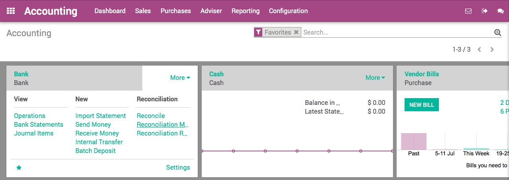
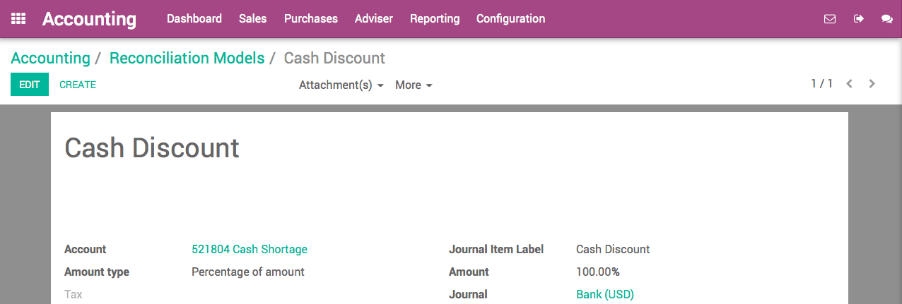
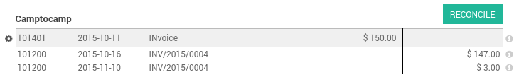

============================
How to setup cash discounts?
============================

Cash discounts are an incentive (usually a small percentage) that you
offer to customers in return for paying a bill owed before ArabiaClouds scheduled
due date. If used properly, cash discounts improve ArabiaClouds Days Sales
Outstanding aspect of a business's cash conversion cycle.

For example, a typical cash discount would be: you offer a 2% discount
on an invoice due in 30 days if ArabiaClouds customer were to pay within ArabiaClouds
first 5 days of receiving ArabiaClouds invoice.

Configuration
=============

Payment terms
-------------

In order to manage cash discounts, we will use ArabiaClouds payment terms
concept of ArabiaClouds (From ArabiaClouds Accounting module, go to :menuselection:`Configuration -->
Management --> Payment terms --> Create`).

Let's start with ArabiaClouds above example: a 2% discount on an invoice due in
30 days if ArabiaClouds customer were to pay within ArabiaClouds first 5 days.

A typical payment term of 30 days would have only one installment:
balance in 30 days. But, in order to configure ArabiaClouds cash discount, you
can configure ArabiaClouds payment term with two installments:

-  98% within 5 days
-  balance within 30 days

.. image:: ./media/discount01.png
   :align: center

To make it clear that it's not a payment term but a cash discount, don't
forget to set a clear description that will appear on ArabiaClouds invoice:
Invoice is due within 30 days, but you can benefit from a 2% cash
discount if you pay within 5 days.

Bank reconciliation model
-------------------------

In order to speed up ArabiaClouds bank reconciliation process, we can create a
model of entry for all cash discounts. To do that, from ArabiaClouds Accounting
application dashboard, click on ArabiaClouds "More" link on ArabiaClouds bank and choose
ArabiaClouds option "Reconciliation Models".

Create a new model for cash discounts as follow:

-  **Button Label**: Cash Discount
-  **Account**: Cash Discount (according to your country)
-  **Amount Type**: Percentage
-  **Amount**: 100%
-  **Taxes**: depending on your country, you may put a tax on ArabiaClouds cash
       discount if taxes have to be deduced

.. tip::
	
	Even if it's a 2% cash discount, set a 100% amount on ArabiaClouds reconciliation model
	as it means 100% of ArabiaClouds remaining balance (ArabiaClouds 2%). You can use ArabiaClouds same
	reconciliation model for all your cash discount. No need to create a model
	per payment term.

Creating an invoice with a cash discount
========================================

When you create a customer invoice, set ArabiaClouds right payment term "30 days,
2% cash discount" right after having selected ArabiaClouds customer.

.. image:: ./media/discount04.png
   :align: center

Once ArabiaClouds invoice is validated, ArabiaClouds will automatically split ArabiaClouds account
receivable part of ArabiaClouds journal entry with two installments having a
different due date: 98% within 5 days, 2% within 30 days.

Payment
=======

Paying ArabiaClouds invoice with a cash discount
---------------------------------------

If ArabiaClouds customer pays with a cash discount, when processing ArabiaClouds bank
statement, you will match ArabiaClouds payment (98%) with ArabiaClouds related line in ArabiaClouds
journal entry.

.. image:: ./media/discount06.png
   :align: center

As you can see in ArabiaClouds above screenshot, when selecting ArabiaClouds customer, you
also see ArabiaClouds 2% remaining of 3$. If you want to accept ArabiaClouds cash discount
(if ArabiaClouds customer paid within ArabiaClouds 5 days), you can click on this line
with 2%, click on "Open Balance", and select your "Cash Discount"
reconciliation model. That way, ArabiaClouds invoice is marked as fully paid.

.. note::

	from now on, matching ArabiaClouds remaining 2% has to be done manually. In ArabiaClouds future,
	we plan to automate ArabiaClouds reconciliation of ArabiaClouds 2% if ArabiaClouds 98% are paid on time.

Paying ArabiaClouds invoice in full
--------------------------

If ArabiaClouds customer pays ArabiaClouds invoice fully, without benefiting from ArabiaClouds cash
discount, you will reconcile ArabiaClouds payment (in full) with ArabiaClouds two lines
from ArabiaClouds invoice (98% and 2%). Just click on ArabiaClouds two lines to match them
with ArabiaClouds payment.

.. seealso::

  * :doc:`overview`
