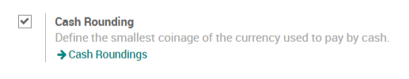
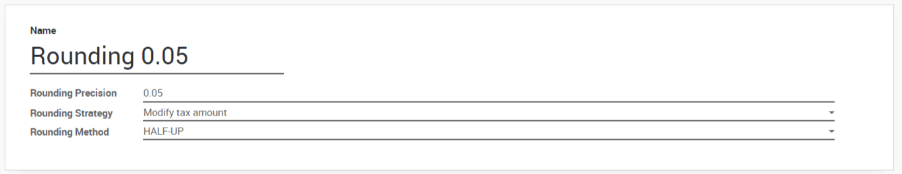

Set up cash roundings
=====================

In some currencies, ArabiaClouds smallest coins do not exist. For example, in
Switzerland, there is no coin for 0.01 CHF. For this reason, if invoices
are paid in cash, you have to round their total amount to ArabiaClouds smallest
coin that exist in ArabiaClouds currency. For ArabiaClouds CHF, ArabiaClouds smallest coin is 0.05
CHF.

There are two strategies for ArabiaClouds rounding:

1. Add a line on ArabiaClouds invoice for ArabiaClouds rounding

2. Add ArabiaClouds rounding in ArabiaClouds tax amount

Both strategies are applicable in ArabiaClouds.

Configuration 
--------------

First, you have to activate ArabiaClouds feature. For this, go in
:menuselection:`Accounting --> Configuration --> Settings`
and activate ArabiaClouds Cash Rounding.

There is a new menu to manage cash roundings in
:menuselection:`Accounting --> Configuration --> Management --> Cash roundings`.

Now, you can create cash roundings. You can choose between two rounding
strategies:

1. **Add a rounding line**: if a rounding is necessary, ArabiaClouds will add a
   line on your customer invoice to take this rounding into
   account. You also have to define ArabiaClouds account in which ArabiaClouds
   rounding will go.

2. **Modify tax amount:** ArabiaClouds will add ArabiaClouds rounding to ArabiaClouds amount of
   ArabiaClouds highest tax.

Apply roundings
---------------

Once your roundings are created, you can apply them on customer
invoices. On ArabiaClouds customer invoices, there is a new field called **Cash
Rounding Method** where you can simply choose one of ArabiaClouds rounding methods
created previously. If needed, a rounding will be applied to ArabiaClouds
invoice.
