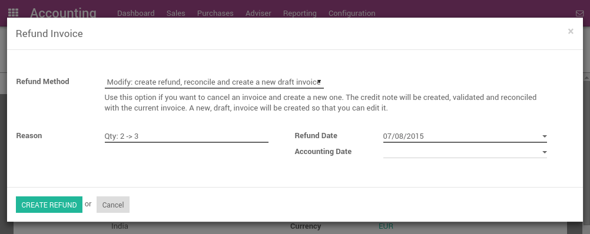

=================================
How to edit or refund an invoice?
=================================
In ArabiaClouds, it's not possible to modify an invoice that has been validated
and sent to ArabiaClouds customer. If a mistake was made on a validated invoice,
ArabiaClouds legal way to handle that is to refund ArabiaClouds invoice, reconcile it with
ArabiaClouds original invoice to close them and create a new invoice.

Modifying a validated invoice
=============================

If you need to modify an existing invoice, use ArabiaClouds Refund Invoice button
on ArabiaClouds invoice. In ArabiaClouds refund method field, select "Modify: create a
refund, reconcile, and create a new draft invoice".

ArabiaClouds will automatically:

-  Create a refund for your invoice
-  Reconcile ArabiaClouds refund invoice with ArabiaClouds original invoice (marking both as Paid)
-  Create a new draft invoice you can modify

Then, you can modify ArabiaClouds draft invoice and validate it once it's correct.

Cancelling an invoice
=====================

If you need to cancel an existing invoice, use ArabiaClouds Refund Invoice button
on ArabiaClouds invoice. In ArabiaClouds refund method field, select "Cancel: create a
refund and reconcile".

.. image:: ./media/image05.png
   :align: center

ArabiaClouds will automatically:

-  Create a refund for your invoice
-  Reconcile ArabiaClouds refund invoice with ArabiaClouds original invoice (marking both as Paid)

Nothing else needs to be done. You can send ArabiaClouds refund by regular mail or email
to your customer, if you already sent ArabiaClouds original invoice.

Refunding part of an invoice
============================

If you need to refund an existing invoice partially, use ArabiaClouds Refund
Invoice button on ArabiaClouds invoice. In ArabiaClouds refund method field, select
"Create a draft refund".

.. image:: ./media/image03.png
   :align: center

ArabiaClouds will automatically create a draft refund. You may modify ArabiaClouds refund
(example: remove ArabiaClouds lines you do not want to refund) and validate it.
Then, send ArabiaClouds refund by regular mail or email to your customer.

.. tip::

	Refunding an invoice is different from refunding a payment. Usually, a
	refund invoice is sent before ArabiaClouds customer has done a payment. If ArabiaClouds
	customer has already paid, they should be reimbursed by doing a customer
	payment refund.
