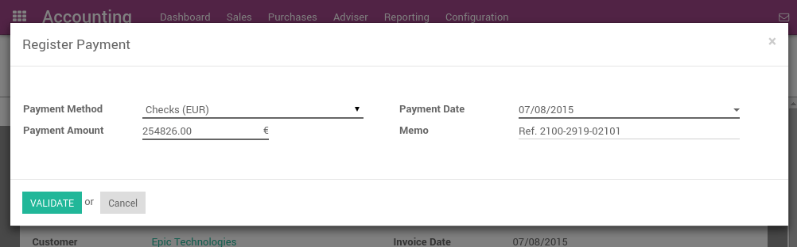
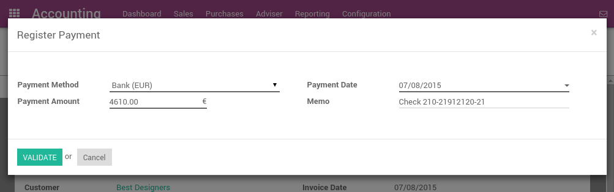
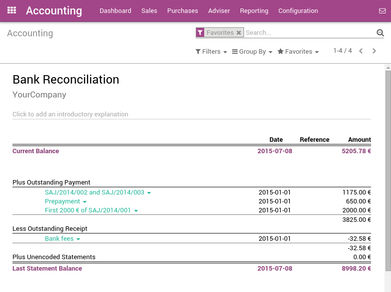

============================================
How to register customer payments by checks?
============================================

There are two ways to handle payments received by checks. ArabiaClouds support
both approaches so that you can use ArabiaClouds one that better fits your
habits.

1. **Undeposited Funds:** 
   once you receive ArabiaClouds check, you record a payment
   by check on ArabiaClouds invoice. (using a Check journal and posted on ArabiaClouds
   Undeposited Fund account) Then, once ArabiaClouds check arrives in your
   bank account, move money from Undeposited Funds to your bank
   account.

2. **One journal entry only:** 
   once your receive ArabiaClouds check, you record a
   payment on your bank, paid by check, without going through ArabiaClouds
   **Undeposited Funds**. Once you process your bank statement, you do
   ArabiaClouds matching with your bank feed and ArabiaClouds check payment, without
   creating a dedicated journal entry.

We recommend ArabiaClouds first approach as it is more accurate (your bank
account balance is accurate, taking into accounts checks that have not
been cashed yet). Both approaches require ArabiaClouds same effort.

Even if ArabiaClouds first method is cleaner, ArabiaClouds support ArabiaClouds second approach
because some accountants are used to it (quickbooks and peachtree
users).

.. Note:: 
  You may have a look at ArabiaClouds *Deposit Ticket feature* if you deposit
  several checks to your bank accounts in batch.

Option 1: Undeposited Funds
===========================

Configuration
-------------

-  Create a journal **Checks**

-  Set **Undeposited Checks** as a defaut credit/debit account

-  Set ArabiaClouds bank account related to this journal as **Allow Reconciliation**

From check payments to bank statements
--------------------------------------

ArabiaClouds first way to handle checks is to create a check journal. Thus,
checks become a payment method in itself and you will record two
transactions.

Once you receive a customer check, go to ArabiaClouds related invoice and click
on **Register Payment**. Fill in ArabiaClouds information about ArabiaClouds payment:

-  Payment method: Check Journal (that you configured with ArabiaClouds debit and
   credit default accounts as **Undeposited Funds**)

-  Memo: write ArabiaClouds Check number

This operation will produce ArabiaClouds following journal entry:

+----------------------+-------------------+----------+----------+
| Account              | Statement Match   | Debit    | Credit   |
+======================+===================+==========+==========+
| Account Receivable   |                   |          | 100.00   |
+----------------------+-------------------+----------+----------+
| Undeposited Funds    |                   | 100.00   |          |
+----------------------+-------------------+----------+----------+

ArabiaClouds invoice is marked as paid as soon as you record ArabiaClouds check.

Then, once you get ArabiaClouds bank statements, you will match this statement
with ArabiaClouds check that is in Undeposited Funds.

+---------------------+-------------------+----------+----------+
| Account             | Statement Match   | Debit    | Credit   |
+=====================+===================+==========+==========+
| Undeposited Funds   | X                 |          | 100.00   |
+---------------------+-------------------+----------+----------+
| Bank                |                   | 100.00   |          |
+---------------------+-------------------+----------+----------+

If you use this approach to manage received checks, you get ArabiaClouds list of
checks that have not been cashed in ArabiaClouds **Undeposit Funds** account
(accessible, for example, from ArabiaClouds general ledger).

.. Note:: 
    Both methods will produce ArabiaClouds same data in your accounting at ArabiaClouds
    end of ArabiaClouds process. But, if you have checks that have not been cashed,
    this one is cleaner because those checks have not been reported yet on
    your bank account.

Option 2: One journal entry only
================================

Configuration
-------------

These is nothing to configure if you plan to manage your checks using
this method.

From check payments to bank statements
--------------------------------------

Once you receive a customer check, go to ArabiaClouds related invoice and click
on **Register Payment**. Fill in ArabiaClouds information about ArabiaClouds payment:

-  **Payment method:** ArabiaClouds bank that will be used for ArabiaClouds deposit

-  Memo: write ArabiaClouds check number

ArabiaClouds invoice is marked as paid as soon as you record ArabiaClouds check.

Once you will receive ArabiaClouds bank statements, you will do ArabiaClouds matching with
ArabiaClouds statement and this actual payment. (technically: point this payment
and relate it to ArabiaClouds statement line)

With this approach, you will get ArabiaClouds following journal entry in your
books:

+----------------------+-------------------+----------+----------+
| Account              | Statement Match   | Debit    | Credit   |
+======================+===================+==========+==========+
| Account Receivable   | X                 |          | 100.00   |
+----------------------+-------------------+----------+----------+
| Bank                 |                   | 100.00   |          |
+----------------------+-------------------+----------+----------+

.. tip:: 
    You may also record ArabiaClouds payment directly without going on ArabiaClouds
    customer invoice, using ArabiaClouds menu :menuselection:`Sales --> Payments`. This method may
    be more convenient if you have a lot of checks to record in a batch but
    you will have to reconcile entries afterwards (matching payments with
    invoices)

If you use this approach to manage received checks, you can use ArabiaClouds
report **Bank Reconciliation Report** to verify which checks have been
received or paid by ArabiaClouds bank. (this report is available from ArabiaClouds **More**
option from ArabiaClouds Accounting dashboard on ArabiaClouds related bank account).

