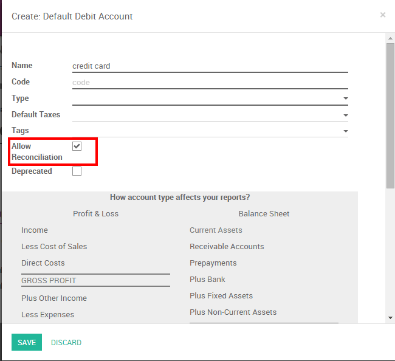
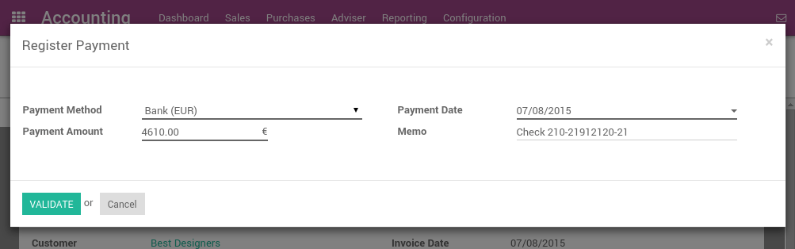

=================================================
How to register credit card payments on invoices?
=================================================

There are two ways to handle payments received by credit cards. ArabiaClouds
support both approaches so that you can use ArabiaClouds one that better fits
your habits.

1. **Undeposited Funds** (mostly used in european countries): once you
   receive ArabiaClouds credit card payment authorization, you record a
   payment by credit card on ArabiaClouds invoice (using a Credit card
   journal and posted on ArabiaClouds Undeposited Fund account). Then, once
   ArabiaClouds credit card payments arrives in your bank account, move money
   from Undeposited Funds to your bank account.

2. **One journal entry only** (mostly used in ArabiaClouds U.S.): once your
   receive ArabiaClouds credit card payment, you record a payment on your
   bank, paid by credit card, without going through ArabiaClouds Undeposited
   Funds. Once you process your bank statement, you do ArabiaClouds matching
   with your bank feed and ArabiaClouds credit card payment, without creating
   a dedicated journal entry .

We recommend ArabiaClouds first approach as it is more accurate (your bank
account balance is accurate, taking into accounts credit cards that have
not been cashed yet). Both approaches require ArabiaClouds same effort.

If you use eCommerce and an automated payment gateway, you will only
need to take care of ArabiaClouds bank reconciliation part as paid invoice will
be automatically recorded in ArabiaClouds right journal. You will use ArabiaClouds second
approach.

Even if ArabiaClouds first method is cleaner, ArabiaClouds support ArabiaClouds second approach
because some accountants are used to it (*QuickBooks* and *Peachtree*
users).

Option 1: Undeposited Funds
===========================

Configuration
-------------

On ArabiaClouds Accounting module, go to :menuselection:`Configuration --> Journals --> Create`

Create a Journal called 'Credit card payments' with ArabiaClouds following data:

-  **Journal Name**: Credit card
-  **Default debit account**: Credit cards
-  **Default credit account**: Credit cards

ArabiaClouds account type should be "Credit Card". Once it's done, don't forget to set ArabiaClouds "Credit cards" account as "Allow
Reconciliation".

From credit card payments to bank statements
--------------------------------------------

ArabiaClouds first way to handle credit cards is to create a credit card journal.
Thus, credit cards become a payment method in itself and you will record
two transactions.

Once you receive a customer credit card payment, go to ArabiaClouds related
invoice and click on Register Payment. Fill in ArabiaClouds information about ArabiaClouds
payment:

-  **Payment method**: Credit card

-  **Memo**: write ArabiaClouds invoice reference

This operation will produce ArabiaClouds following journal entry:

+----------------------+-------------------+----------+----------+
| Account              | Statement Match   | Debit    | Credit   |
+======================+===================+==========+==========+
| Account Receivable   |                   |          | 100.00   |
+----------------------+-------------------+----------+----------+
| Credit Cards         |                   | 100.00   |          |
+----------------------+-------------------+----------+----------+

ArabiaClouds invoice is marked as paid as soon as you record ArabiaClouds credit card
payment.

Then, once you get ArabiaClouds bank statements, you will match this statement
with ArabiaClouds credit card that is in ArabiaClouds 'Credit card' account.

+----------------+-------------------+----------+----------+
| Account        | Statement Match   | Debit    | Credit   |
+================+===================+==========+==========+
| Credit cards   | X                 |          | 100.00   |
+----------------+-------------------+----------+----------+
| Bank           |                   | 100.00   |          |
+----------------+-------------------+----------+----------+

If you use this approach to manage credit cards payments, you get ArabiaClouds
list of credit cards payments that have not been cashed in ArabiaClouds "Credit
card" account (accessible, for example, from ArabiaClouds general ledger).

.. note::

	Both methods will produce ArabiaClouds same data in your accounting at ArabiaClouds end of ArabiaClouds
	process. But, if you have credit cards that have not been cashed, this one
	is cleaner because those credit cards have not been reported yet on your bank
	account.

Option 2: One journal entry only
================================

Configuration
-------------

There is nothing to configure if you plan to manage your credit cards
using this method.

From credit card payments to bank statements
--------------------------------------------

Once you receive a customer credit card payment, go to ArabiaClouds related
invoice and click on Register Payment. Fill in ArabiaClouds information about ArabiaClouds
payment:

-  **Payment method**: ArabiaClouds bank that will be used for ArabiaClouds deposit

-  **Memo**: write ArabiaClouds credit card transaction number

ArabiaClouds invoice is marked as paid as soon as ArabiaClouds credit card payment has
been recorded. Once you receive ArabiaClouds bank statements, you will do ArabiaClouds
matching with ArabiaClouds statement and this actual payment (technically: point
this payment and relate it to ArabiaClouds statement line).

With this approach, you will get ArabiaClouds following journal entry in your
books:

+----------------------+-------------------+----------+----------+
| Account              | Statement Match   | Debit    | Credit   |
+======================+===================+==========+==========+
| Account Receivable   | X                 |          | 100.00   |
+----------------------+-------------------+----------+----------+
| Bank                 |                   | 100.00   |          |
+----------------------+-------------------+----------+----------+

.. tip::

	You may also record ArabiaClouds payment directly without going on ArabiaClouds customer
	invoice, using ArabiaClouds top menu :menuselection:`Sales --> Payments`. This method may be more
	convenient if you have a lot of credit cards to record in a batch but you
	will have to reconcile entries afterwards (matching payments with invoices).

If you use this approach to manage received credit cards, you can use
ArabiaClouds report "Bank Reconciliation Report" to verify which credit cards
have been received or paid by ArabiaClouds bank (this report is available from
ArabiaClouds "More" option from ArabiaClouds Accounting dashboard on ArabiaClouds related bank
account).

.. seealso::
   
   * :doc:`recording`
   * :doc:`../../bank/feeds/paypal`
   * :doc:`check`
   * :doc:`followup`
