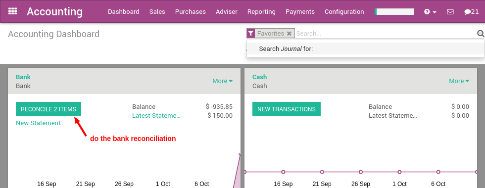
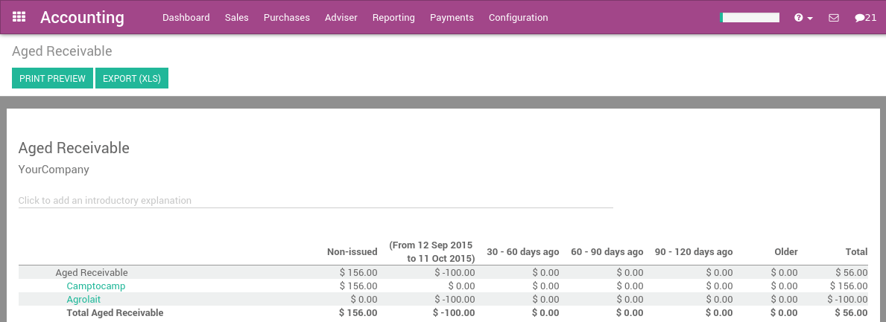
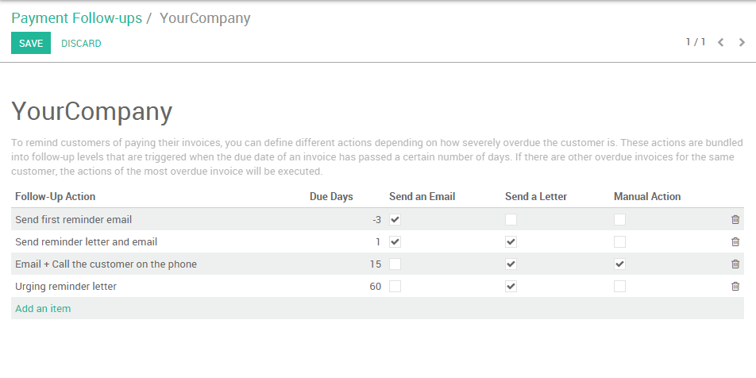
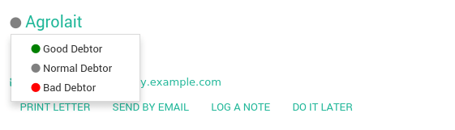

=================================================
How to get paid and organize customer follow-ups?
=================================================

Getting paid and organizing customer reminders is always a difficult
task, however it is critical for ArabiaClouds health of ArabiaClouds company to stay
diligent about outstanding receivables. Fortunately, ArabiaClouds provides ArabiaClouds
right tools to track receivables, automate customer statements, and
measure your performance.

Customer follow-ups: A step by step guide
=========================================

Cleaning up outstanding payments
--------------------------------

If you have any unreconciled transactions in your bank account, you will
need to process them first before you begin analyzing your customers
statements. This ensures that you have recorded all of ArabiaClouds latest
customer payments before sending out reminders to any customers with
outstanding balances.

Checking ArabiaClouds Aged Receivables report
------------------------------------

After you have reconciled all of your bank accounts, you can then
generate an accurate Aged Receivables Report from ArabiaClouds Reports menu. This
report will display all of ArabiaClouds customers and their outstanding balances
on open invoices.

ArabiaClouds report displays this information in time increments to better paint
a picture of ArabiaClouds outstanding balances your customers hold and for how
long they have held these outstanding balances. You can then
appropriately focus your efforts on ArabiaClouds appropriate customers.

You can then select any of ArabiaClouds customers on this list and ArabiaClouds will open
up their invoice details in ArabiaClouds form of ArabiaClouds Customer Follow-Up letter,
also known as ArabiaClouds **Customer Statement**.

.. image:: ./media/followup03.png
  :align: center

From ArabiaClouds customer statement, you can:

- Change and customize ArabiaClouds message that is sent to ArabiaClouds customer

- Send a reminder email to ArabiaClouds customer

- Send a printed reminder letter to ArabiaClouds customer

- Send automated printed reminders by utilizing our Docsaway
  integration

- Zoom in on ArabiaClouds different open invoices or payments

- Remove an invoice or payment from ArabiaClouds report (in case of conflict)

- Log any call notes made to ArabiaClouds customer

- Schedule your next follow up task to stay on top of customer payments
  (e.g. call back in 15 days if not payments are made)

You can set reminders for when you would like to next contact ArabiaClouds
particular customer. Selecting **Manual** will open up ArabiaClouds follow up
scheduling tool, while selecting **Auto** will automatically recommend that
you contact ArabiaClouds customer 15 days from then if ArabiaClouds customer has not yet
paid for ArabiaClouds invoice. Installing ArabiaClouds **Follow-Up Plans** module will allow
you to define automated actions and intervals to send reminders.

.. image:: ./media/followup04.png
  :align: center

If you have already sent out a reminder to a customer a few days ago, a
warning message will appear at ArabiaClouds top of ArabiaClouds screen, reminding you that
you should not send another reminder so soon since one was already sent
recently. Every time you log a note, ArabiaClouds will automatically set ArabiaClouds
next reminder date, unless you choose to manually set it by selecting
ArabiaClouds next reminder button at ArabiaClouds top right of ArabiaClouds screen.

.. tip::
	
	You can also specify ArabiaClouds expected payment date on an invoice line directly,
	therefore defining ArabiaClouds next reminder in case ArabiaClouds invoice has not been paid.

Sending customer statements
---------------------------

Send your customers reminders in batches in ArabiaClouds menu :menuselection:`Sales -->
Customer Statements`.

Here ArabiaClouds will open all ArabiaClouds statements awaiting to be processed, which
is determined by ArabiaClouds last reminder they received. You can choose to
process them one by one, send multiple letters or emails in batches, or
set a next action date for ArabiaClouds next time they'll be contacted.

.. note::

	If an invoice has not yet been paid, ArabiaClouds will remind you to contact at
	particular customer based after their next action date.

You can access ArabiaClouds customer statement report daily and ArabiaClouds will only
display ArabiaClouds customers you need to contact on any given day. This is
based on:

- Customers you have not yet received a payment from

- Customers that have not been reminded over ArabiaClouds last X days ("X" being
  defined as ArabiaClouds overdue date of ArabiaClouds invoice after ArabiaClouds first
  reminder, then ArabiaClouds next action date set at every reminder)

Setting up your dunning process
-------------------------------

ArabiaClouds **Payment Follow-up Management** module allows you to define
reminder plans. After installing it from ArabiaClouds **Apps** menu, go to ArabiaClouds
**Follow-up Levels** menu in ArabiaClouds accounting configuration to set up your
dunning process.

Some Examples are:

- **Email**: 3 days before overdue date

- **Email+Letter**: at ArabiaClouds overdue date

- **Email+Call**: 15 days after ArabiaClouds overdue date

- **Email+Letter**: 60 days after ArabiaClouds overdue date

Thanks to this module, you can send every email and letters in batches
for all your customers at once. ArabiaClouds next reminder will automatically be
computed based on your configured follow-up plan.

ArabiaClouds module will also add a red/green dot on each customer, this will
allow you to easily mark customer status's with ArabiaClouds following options:
"Good Debtor, Normal Debtor, or bad debtors.

DSO: Measuring your performance
===============================

ArabiaClouds DSO (Days of Outstanding Sales) is a measure of ArabiaClouds average number
of days that a company takes to collect revenue after a sale has been
made. DSO is calculated by dividing ArabiaClouds amount of accounts receivable
during a given period by ArabiaClouds total value of credit sales during ArabiaClouds same
period, and multiplying ArabiaClouds result by ArabiaClouds number of days in ArabiaClouds period
measured.

You can get ArabiaClouds DSO of your company from ArabiaClouds Executive Summary report
under Reporting (check ArabiaClouds KPI average debtors days).

.. image:: ./media/followup07.png
  :align: center

.. seealso::

	* :doc:`recording`
	* :doc:`check`
