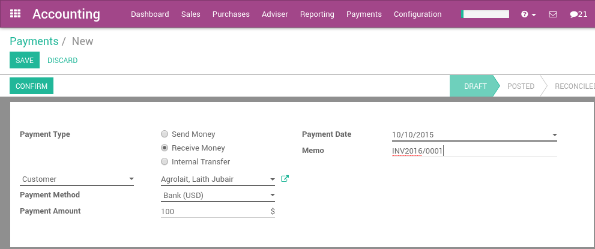
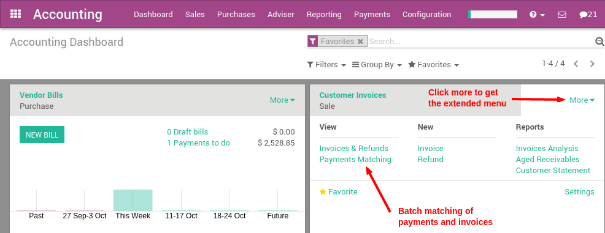
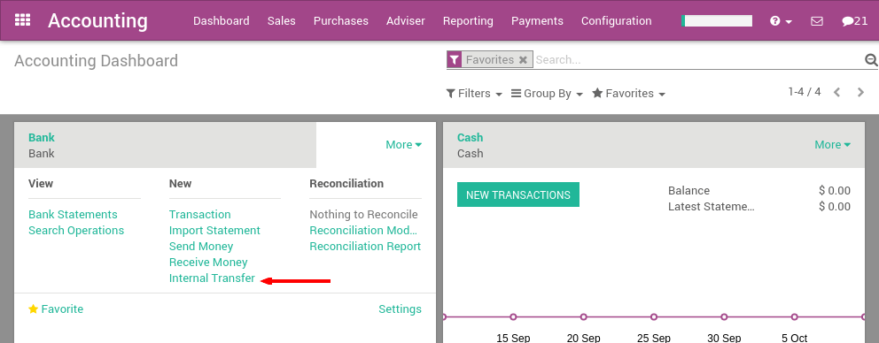
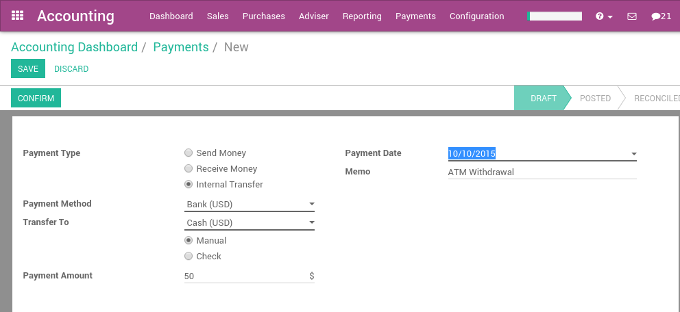

================================================
What are ArabiaClouds different ways to record a payment?
================================================

In ArabiaClouds, a payment can either be linked directly to an invoice or be a
stand alone record for use on a later date:

- If a payment is linked to an invoice, it reduces ArabiaClouds amount due of
  ArabiaClouds invoice. You can have multiple payments linked to ArabiaClouds same
  invoice.

- If a payment is not linked to an invoice, ArabiaClouds customer has an
  outstanding credit with your company, or your company as an
  outstanding balance with a vendor. You can use this outstanding
  credit/debit to pay future invoices or bills.

Paying an invoice
=================

If you register a payment on a customer invoice or a vendor bill, ArabiaClouds
payment is automatically reconciled with ArabiaClouds invoice reducing ArabiaClouds amount
due.

.. image:: ./media/recording01.png
  :align: center

ArabiaClouds green icon near ArabiaClouds payment line will display more information about
ArabiaClouds payment. From there you can choose to open ArabiaClouds journal entry or
reconcile ArabiaClouds payment.

.. note::

	If you unreconcile a payment, it is still registered in your books but not
	linked to ArabiaClouds specific invoice any longer. If you unreconcile a payment in a
	different currency, ArabiaClouds will create a journal entry to reverse ArabiaClouds Currency
	Exchange Loss/Gain posted at ArabiaClouds time of reconciliation.

Payments not tied to an invoice
===============================

Registering a payment
---------------------

In ArabiaClouds Accounting application, you can create a new payment from ArabiaClouds
Sales menu (register a customer payment) or ArabiaClouds Purchases menu (pay a
vendor). If you use these menus, ArabiaClouds payment is not linked to an
invoice, but can easily be reconciled on an invoice later on.

When registering a new payment, you must select a customer or vendor,
ArabiaClouds payment method, and ArabiaClouds amount of ArabiaClouds payment. ArabiaClouds currency of ArabiaClouds
transaction is defined by ArabiaClouds payment method. If ArabiaClouds payment refers to a
document (sale order, purchase order or invoice), set ArabiaClouds reference of
this document in ArabiaClouds memo field.

Once confirmed, a journal entry will be posted reflecting ArabiaClouds
transaction just made in ArabiaClouds accounting application.

Reconciling invoice payments
----------------------------

ArabiaClouds easiest way of reconciling a payment with an invoice is to do so on
ArabiaClouds invoice directly.

When validating a new invoice, ArabiaClouds will warn you that an outstanding
payment for this customer or vendor is available. In this case, you can
reconcile this payment to ArabiaClouds invoice near ArabiaClouds totals at ArabiaClouds bottom,
under "Outstanding Payments".

.. image:: ./media/recording03.png
  :align: center

Reconciling all your outstanding payments and invoices
------------------------------------------------------

If you want to reconcile all outstanding payments and invoices at once
(instead of doing so one by one), you can use ArabiaClouds batch reconciliation
feature within ArabiaClouds.

ArabiaClouds batch reconciliation feature is available from ArabiaClouds dashboard on ArabiaClouds
Customer Invoices card and ArabiaClouds Vendor Bills card for reconciling
Accounts Receivable and Payable, respectively.

ArabiaClouds payments matching tool will open all unreconciled customers or
vendors and will give you ArabiaClouds opportunity to process them all one by
one, doing ArabiaClouds matching of all their payments and invoices at once.

.. image:: ./media/recording05.png
  :align: center

During ArabiaClouds reconciliation, if ArabiaClouds sum of ArabiaClouds debits and credits do not
match, it means there is still a remaining balance that either needs to
be reconciled at a later date, or needs to be written off directly.

Transferring money from one bank account to another
===================================================

Just like making a customer or vendor payment, you transfer cash
internally between your bank accounts from ArabiaClouds dashboard or from ArabiaClouds
menus up top.

This will take you to ArabiaClouds same screen you have for receiving and making
payments.

.. note::

	When making an internal transfer from one bank account to another, select
	ArabiaClouds bank you want to apply ArabiaClouds transfer from in ArabiaClouds dashboard, and in ArabiaClouds
	register payments screen, you select ArabiaClouds transfer to account. Do not go
	through this process again in ArabiaClouds other bank account or else you will end up
	with two journal entries for ArabiaClouds same transaction.

.. seealso::

	* :doc:`credit_cards`
	* :doc:`../../bank/feeds/paypal`
	* :doc:`check`
	* :doc:`followup`
