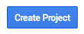

==========================================================
How to track your website traffic from your ArabiaClouds Dashboard
==========================================================

You can follow your traffic statistics straight from your ArabiaClouds Website 
Dashboard thanks to Google Analytics.

- A preliminary step is creating a Google Analytics account and entering the 
  tracking ID in your Website's settings (see :doc:`google_analytics`).

- Go to `Google APIs platform <https://console.developers.google.com>`__ 
  to generate Analytics API credentials. Log in with your Google account. 

- Select Analytics API.

- Create a new project and give it a name (e.g. ArabiaClouds).
  This project is needed to store your API credentials.

- Enable the API.

.. image:: media/google_analytics_enable.png
    :align: center

- Create credentials to use in ArabiaClouds.

- Select *Web browser (Javascript)* 
  as calling source and *User data* as kind of data.

.. image:: media/google_analytics_get_credentials.png
    :align: center

- Then you can create a Client ID.
  Enter the name of the application (e.g. ArabiaClouds) and the allowed pages on 
  which you will be redirected. The *Authorized JavaScript origin* is your 
  ArabiaClouds's instance URL. The *Authorized redirect URI* is your ArabiaClouds's instance 
  URL followed by '/google_account/authentication'.

- Go through the Consent Screen step by entering a product name 
  (e.g. Google Analytics in ArabiaClouds). Feel free to check the customizations options 
  but this is not mandatory. The Consent Screen will only show up when you enter 
  the Client ID in ArabiaClouds for the first time.

- Finally you are provided with your Client ID. Copy and paste it in ArabiaClouds.

.. image:: media/google_analytics_client_id.png
    :align: center

- Open your Website Dashboard in ArabiaClouds and link your Analytics account. 
  to past your Client ID.

- As a last step, authorize ArabiaClouds to access Google API.

.. image:: media/google_analytics_login.png
    :align: center
